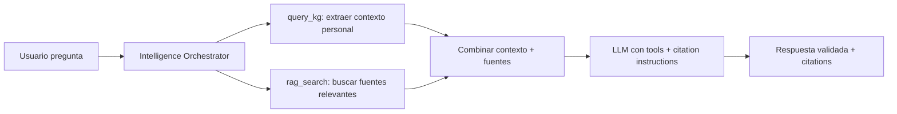

# Validación con Fuentes Bibliográficas en Tiempo Real

## 1. Visión General

**Objetivo**: Que cada respuesta generada por LÚA (y otros agentes) sea **validada contra fuentes bibliográficas confiables** en tiempo real, garantizando:

- ✅ **Precisión clínica**: La información coincide con literatura médica actualizada
- ✅ **Citabilidad**: Cada afirmación importante tiene una fuente rastreable
- ✅ **Actualidad**: Se priorizan fuentes recientes (<5 años para temas farmacológicos)
- ✅ **Contextualización**: Se adapta la fuente al perfil del usuario (paciente vs profesional)

**Principio**: *"No hay respuesta sin fundamento"*

---

## 2. Arquitectura del Sistema de Validación

### 2.1 Flujo por Turno (Cada Mensaje de Usuario)



**Paso a paso**:

1. **Context retrieval**:
   - `query_kg(cypher_contextual)` → datos del paciente (medicamentos, síntomas, historial)
   - `rag_search(query_semántica, filters)` → documentos relevantes (fichas técnicas, guías clínicas)

2. **Pre-validation filtering**:
   - Filtrar fuentes por: `language=es`, `audience=patient`, `recency<=5 years`
   - Ranking por relevancia semántica + confianza de fuente (FDA > blog personal)

3. **Enrichment of system prompt**:
   ```javascript
   const systemPrompt = `
     Eres LÚA, asistente terapéutico...

     CONTEXTO DEL PACIENTE:
     ${personalData}

     FUENTES RELEVANTES (usa estas para fundamentar):
     ${knowledgeChunks.map(c => `- [${c.metadata.source}]: ${c.content.substring(0,200)}...`).join('\n')}

     INSTRUCCIÓN CRÍTICA:
     - Basa tus respuestas en las fuentes proporcionadas
     - Si una afirmación no está respaldada por las fuentes, NO la digas
     - Cita la fuente entre paréntesis: (Fuente: FDA, 2024)
     - Si hay conflicto entre fuentes, menciona ambas perspectivas
   `;
   ```

4. **Post-generation validation** (opcional pero recomendada):
   - Usar un LLM separado (o el mismo con un segundo paso) para verificar que cada afirmación importante tenga citation
   - Si faltan citations → regenerar o agregar "Según [fuente]..."

---

## 3. Especificaciones Técnicas

### 3.1 Fuentes de Conocimiento (RAG Collections)

**Colecciones obligatorias** (en Vector Store):

| Colección | Contenido | Fuentes | Actualización |
|-----------|-----------|---------|---------------|
| `drug_labels` | Fichas técnicas oficiales (FDA, AEMPS, ANMAT) | open.fda.gov, EU EMI, ANMAT | Mensual |
| `clinical_guidelines` | Guías de práctica clínica (APA, NICE, SAMHSA) | PubMed, sitios oficiales | Trimestral |
| `patient_education` | Material educativo para pacientes (español) | MedlinePlus, Salud.mapfre, institutos | Semestral |
| `research_papers` | Meta-análisis y estudios clave | PubMed Central, SciELO | Continuo |
| `faq_medications` | Preguntas frecuentes validadas | FAQ de farmacias, Ministerios de Salud | Mensual |

**Schema de Metadata** (para cada chunk):
```json
{
  "collection": "drug_labels|clinical_guidelines|patient_education|research_papers|faq",
  "source_name": "FDA|AEMPS|ANMAT|APA|NICE|SAMHSA|PubMed|...",
  "source_url": "https://...",
  "source_type": "regulatory|guideline|education|research|faq",
  "language": "es|en|pt",
  "audience": "patient|professional|all",
  "publication_date": "YYYY-MM-DD",
  "confidence": 0.95,  // scoring automático basado en source_type
  "topic": "sertraline|interactions|anxiety|addiction|...",
  "atc_code": "N06AB04"  // si aplica
}
```

### 3.2 Filtros de Búsqueda Semantic

**Para cada tipo de consulta**, aplicar filtros específicos:

| Tipo de Consulta | query RAG | filters |
|------------------|-----------|---------|
| "¿Qué es X medicamento?" | `"what is X mechanismof action"` | `{collection:['drug_labels','patient_education'], language:'es', audience:'patient'}` |
| "¿Puedo tomar X con Y?" | `"drug interaction X Y"` | `{collection:['drug_labels','clinical_guidelines'], language:'es', confidence:>0.8}` |
| "¿Qué alimentos evitar?" | `"dietary restrictions X medication"` | `{collection:['drug_labels'], audience:'patient'}` |
| "¿Cómo funciona en el cerebro?" | `"neurobiology of X mechanism"` | `{collection:['research_papers','clinical_guidelines'], audience:'professional'}` |
| "Síntomas de abstinencia" | `"withdrawal symptoms X timeline"` | `{collection:['clinical_guidelines','research_papers'], language:'es'}` |

**Implementación**:
```typescript
class SourceValidator {
  async getValidatedSources(query: string, userContext: UserContext) {
    // 1. Inferir tipo de consulta
    const queryType = this.classifyQuery(query);

    // 2. Determinar filtros
    const filters = this.getFiltersForQueryType(queryType, userContext);

    // 3. Ejecutar búsqueda
    const results = await vectorStore.search(query, filters, limit: 10);

    // 4. Ranking por confianza + recency
    const ranked = this.rankByConfidenceAndRecency(results);

    // 5. Devolver top-k (usualmente 5-7 fuentes)
    return ranked.slice(0, 7);
  }

  private classifyQuery(query: string): QueryType {
    // Patrones: "qué es", "puedo tomar", "interacción", "efectos secundarios", etc.
    // Devuelve: 'drug_info' | 'interaction' | 'side_effects' | 'mechanism' | 'withdrawal'
  }
}
```

### 3.3 Knowledge Graph Complementario

El grafo Neo4j se usa para:

1. **Validar relaciones estructura**das:
   - Si RAG dice "sertralina es ISRS", verificar que `(sertralina)-[:BELONGS_TO]->(SSRIs)` exista en el grafo
   - Si RAG menciona interacción, verificar que exista relación `INTERACTS_WITH` en el grafo

2. **Detectar conflictos**:
   - Si RAG: "El alcohol nointeractúa con benzos" (fuente desactualizada)
   - Grafo: `(alprazolam)-[:INTERACTS_WITH]->(alcohol)` con severity=critical
   - **Acción**: Priorizar grafo, alertar sobre discrepancia

3. **Obtener datos estructurados que RAG no cubre**:
   - Dosis exactas, horarios, vías de administración
   - Enzimas CYP450 involucradas
   - Contraindicaciones absolutas

**Query de validación cruzada**:
```cypher
MATCH (m:Medication {name: $med_name})
MATCH (interaction)-[:INVOLVES]->(m)
WHERE interaction.severity IN ['critical','major']
RETURN interaction
ORDER BY interaction.severity DESC
```

Si esta query devuelve resultados pero RAG no mencionó interacción → **flag de revisión**.

---

## 4. Formato de Citación en Respuestas

### 4.1 Reglas de Citación

**Cada afirmación no-trivial debe tener citation**. Se considera "trivial":
- Saludos, preguntas de clarificación
- Técnicas terapéuticas (respiración, mindfulness) - estas no requieren fuente
- Escucha activa, validación emocional

**Se requiere source**:
-✅ "La sertralina puede causar náuseas en un 20% de pacientes"
-✅ "El alcohol + clonazepam aumenta riesgo de depresión respiratoria"
-✅ "Los ISRS tardan 4-6 semanas en hacer efecto completo"
-✅ "La naltrexona reduce craving en alcoholismo"

**Formatos de citation**:

| Tipo | Formato | Ejemplo |
|------|---------|---------|
| **FDA** | `(FDA, 2024)` | "Sertralina está indicada para TDM (FDA, 2024)" |
| **Guía clínica** | `(APA Guidelines, 2023)` | "Para depresión mayor, primera línea son ISRS (APA, 2023)" |
| **Artículo de revisión** | `(Smith et al., 2022)` | "Meta-análisis muestra eficacia (Smith et al., 2022)" |
| **Knowledge Graph** | `(KG: verified)` | "El paciente ya toma sertralina (KG: verified)" |
| **Discrepancia** | `(Conflicto: RAG vs KG)` | "Fuente X dice A, pero grafo indica B (Conflicto: revisar)" |

### 4.2 Sistema de Prioridad de Fuentes

Cuando hay múltiples fuentes, priorizar:

1. **Regulatorias** (FDA, AEMPS, ANMAT) → máxima autoridad
2. **Guías de práctica** (APA, NICE, SAMHSA) → consenso clínico
3. **Systematic reviews/meta-análisis** → evidencia alta
4. **Estudios primarios** → evidencia moderada
5. **Patient education** → para explicaciones simples
6. **Knowledge Graph** → para datos del paciente (verb trusting but verify)

**Si conflicto entre niveles**:
- Nivel 1 vs Nivel 3 → Prevalece Nivel 1
- Nivel 4 vs Nivel 5 → Mencionar discrepancia: "Algunos estudios sugieren X, pero las guías oficiales recomiendan Y"

---

## 5. Implementación en los Prompts de LÚA

### 5.1 Modificar `PROMPT_SISTEMA_BASE.md`

**Añadir sección** después de "Principios Éticos" o en "Técnicas Psicoterapéuticas":

```markdown
## 12. Requisito de Validación con Fuentes

### 12.1 Cada Respuesta Debe Estar Fundamentada

Tienes acceso a dos fuentes de conocimiento en tiempo real:

1. **Knowledge Graph** (datos estructurados del paciente y relaciones médicas):
   - Medicamentos activos del paciente
   - Interacciones conocidas
   -Condicionesdiagnosticadas
   - Historial de síntomas

2. **Repositorio Bibliográfico** (RAG - literatura médica):
   - Fichas técnicas (FDA, AEMPS)
   - Guías clínicas (APA, NICE)
   - Artículos de investigación
   - Material educativo para pacientes

**Regla de oro**: Si afirmas algo sobre:
- Medicamentos (efectos, interacciones, dosis)
- Síntomas o condiciones médicas
- Terapias o tratamientos
- Estadísticas o riesgos

...debes citar la fuente entre paréntesis. Si no tienes source, no afirmes.

### 12.2 Cómo Usar las Fuentes en tu Proceso

Para cada mensaje del usuario:

1. **Antes de responder**:
   - El sistema te enviará un contexto enriquecido con:
     - Datos del paciente desde el grafo (si aplica)
     - Fragmentos de documentos relevantes (RAG)
     - Lista de fuentes disponibles con metadata

2. **During generation**:
   - Revisa los fragmentos: ¿Contienen la información que necesitas?
   - Si sí: formula tu respuesta basándote en ellos
   - Si no: puedes usar `query_kg` o `rag_search` como herramientas function-calling
   - Cuando cites, usa el formato: `(Fuente: [source_name], [año])`

3. **Si hay conflicto**:
   - Si dos fuentes contradicen, menciona ambas
   - Prioriza fuentes regulatorias sobre educativas
   - Sugiere consultar profesional médico para casos ambiguos

### 12.3 Ejemplos de Buenas Prácticas

✅ **Correcto**:
Usuario: "¿La sertralina causa insomnio?"
Tú: "Sí, el insomnio es un efecto secundario común de los ISRS como la sertralina, reportado en aproximadamente 10-15% de pacientes (FDA, 2024). ¿Te está afectando el sueño?""

✅ **Correcto con fuente del grafo**:
Usuario: "¿Puedo tomar mi sertralina con el fluconazol?"
Tú: "Veo que tienes sertralina registrada (KG: verified). Según las guías clínicas, el fluconazol puede inhibir el CYP2C9 y aumentar niveles de sertralina, por lo que se recomienda monitorizar efectos secundarios (Drug Interactions Handbook, 2023). Consulta a tu psiquiatra antes de combinarlos.""

❌ **Incorrecto (sin source)**:
"Sí, la sertralina y el fluconazol no deberían mezclarse"

❌ **Incorrecto (alucinación)**:
"Según la OMS, la sertralina está contraindicada con antifúngicos" (¡OMS no dice eso!)

### 12.4 Limitaciones y Disclaimer

- No tienes acceso a internet en tiempo real; solo a las fuentes pre-cargadas en RAG
- Si no encuentras una fuente clara, di: "No tengo información actualizada sobre eso. Consulta a tu médico."
- No cites fuentes que no hayas recibido en el contexto enriquecido
- El Knowledge Graph puede tener datos desactualizados (última actualización: [fecha]) - verificar contra RAG si es dudoso
```

### 5.2 Function Calling para Búsqueda Ad-hoc

**Si el contexto enviado no incluye fuentes suficientes**, LÚA puede invocar:

```javascript
const tools = [
  {
    name: 'search_medical_literature',
    description: 'Busca en literatura médica actualizada sobre un tema específico',
    parameters: {
      query: 'string (términos de búsqueda)',
      filters: {
        collection?: 'drug_labels|clinical_guidelines|research_papers',
        audience?: 'patient|professional',
        recency_years?: 5  // default 5
      },
      limit: 5  // default
    }
  },
  {
    name: 'query_knowledge_graph',
    description: 'Consulta el grafo de conocimiento sobre pacientes, medicamentos, interacciones',
    parameters: {
      cypher: 'string (query Cypher)',
      params: 'object'
    }
  }
];
```

**Ejemplo de uso**:

Usuario: "¿Hay estudios sobre naltrexona para alcoholismo en mujeres?"

LÚA detecta que no tiene fuentes en contexto current → llama a `search_medical_literature` con query `"naltrexone alcohol use disorder female efficacy"`.

El sistema devuelve 5 papers actualizados. LÚA los sintetiza y cita: `(Jonas et al., JAMA Psychiatry 2022)`.

---

## 6. Pipeline de Validación Automática (Post-Generation)

### 6.1 Validator Service

**Opción A**: Segundo LLM call (más preciso)
```typescript
async function validateResponseWithSources(originalResponse: string, sources: Source[]) {
  const validatorPrompt = `
    Valida que cada afirmación médica importante en esta respuesta tenga una fuente de las proporcionadas.

    Respuesta: "${originalResponse}"

    Fuentes disponibles:
    ${sources.map(s => `[${s.metadata.source}: ${s.content.substring(0,200)}...]`).join('\n')}

    Para cada afirmación:
    1. ¿Tiene source? (Sí/No)
    2. ¿La source respalda exactamente lo dicho?
    3. ¿Hay conflicto entre afirmación y source?

    Retorna JSON:
    {
      "issues": [
        {"claim": "texto de afirmación", "has_source": false, "severity": "high|medium|low"}
      ],
      "is_valid": boolean
    }
  `;

  const validation = await llm.generate(validatorPrompt, { temperature: 0 });
  return JSON.parse(validation);
}
```

**Opción B**: Regex-based (más rápido, menos preciso)
```typescript
function checkCitations(response: string) {
  const citationPattern = /\(([^)]+),\s*(\d{4})\)/g;
  const citations = [...response.matchAll(citationPattern)];
  // Verificar que cada citation esté en la lista de sources provides
  // Si faltan, marcar como warning
}
```

### 6.2 Flujo de Fallback

```
1. Generar respuesta → 2. Validar citations
   ├─ ✅ Pass → 3. Enviar respuesta
   └─ ❌ Fail:
        ├─ ¿Source existe pero no citada? → Agregar "(Fuente: X, año)"
        ├─ ¿Afirmación sin source? → Eliminar o reemplazar con "Según tu historial..."
        └─ ¿Conflicto source? → Reformular como "Algunas fuentes sugieren..."
```

---

## 7. Ejemplo Completo de Turno con Validación

**Usuario**: "¿Puedo tomar ibuprofeno con mi sertralina?"

**Paso 1: Retrieve**
- `query_kg`: El paciente tiene `(paciente)-[:TAKES]->(sertralina)`
- `rag_search`:
  - Source 1: FDA label sertralina → "No interacciones mayor con AINEs"
  - Source 2: Drug Interactions Handbook → "Ibuprofeno + ISRS: riesgo gastrointestinal leve"
  - Source 3: Guía APA → "ISRS + AINEs: monitorizar sangrado"

**Paso 2: Enrich prompt**
```
CONTEXTO:
- Paciente toma sertralina 50mg/día
FUENTES:
[FDA (2024): "No contraindicated with NSAIDs"]
[Handbook (2023): "NSAIDs + SSRIs: increased GI bleed risk"]
[APA (2023): "Monitor for bleeding if co-administered"]

INSTRUCCIÓN: Basa tu respuesta en estas fuentes, cítalas.
```

**Paso 3: LLM genera**
"Sí, puedes tomar ibuprofeno con sertralina, pero ten precaución. Los AINEs como el ibuprofeno combinados con ISRS pueden aumentar ligeramente el riesgo de sangrado gastrointestinal (Drug Interactions Handbook, 2023). La FDA no lo considera contraindicado, pero las guías clínicas recomiendan monitorizar síntomas de sangrado (APA, 2023). Si experimentas dolor abdominal, heces oscuras o moretones fáciles, consulta a tu médico."

**Paso 4: Validator**
- Revisa cada afirmación:
  - ✅ "puedes tomar" → respaldado por FDA
  - ✅ "aumentar riesgo de sangrado" → respaldado por Handbook
  - ✅ "monitorizar síntomas" → respaldado por APA
- Todas tienen source → ✅ PASS

**Paso 5: Respuesta final enviada**

---

## 8. Configuración de Fuentes por Perfil de Usuario

### 8.1 Paciente (educación lego)
- **Audience filter**: `patient` o `all`
- **Language**: `es`优先，`en` como backup
- **Complexity**: Preferir `patient_education` sobre `research_papers`
- **Citation format**: Simple: `(FDA, 2024)` o `(Guía Clínica)`

### 8.2 Profesional (médico/psiquiatra)
- **Audience filter**: `professional`
- **Recency**: ≤3 años preferido
- **Source type**: `research_papers`, `clinical_guidelines` prioritized
- **Citation format**: Completa: `(Smith et al., Journal of Clinical Psychiatry, 2022)`

---

## 9. Actualización y Mantenimiento de Fuentes

### 9.1 Pipeline de Actualización

```
Cron mensual (domingo 2am):
1. Descarga nuevas fichas FDA (open.fda.gov)
2. Descarga actualizaciones AEMPS
3. Re-indexar en Vector Store (mantener histórico: versión anterior + nueva)
4. Actualizar KG: novas medicaciones, nuevas interacciones
5. Log de cambios: "Actualizado 2025-02: 124 nuevas interacciones detectadas"
```

### 9.2 Validación de Calidad de Fuentes

Antes de cargar una fuente, evaluar:
- ✅ Es fuente primaria (regulatoria) o secundaria confiable?
- ✅ Está en idioma objetivo (español preferido)?
- ✅ Tiene fecha de publicación clara?
- ✅ No está obsoleta (>10 años para farmacología)?

Script `validate_source_quality.py`:
```python
def validate_source(metadata):
    if metadata['publication_date'] < (today - 10 years):
        return 'WARNING: desactualizado'
    if metadata['source_type'] not in ['regulatory','guideline','research']:
        return 'WARNING: fuente no-especializada'
    return 'OK'
```

---

## 10. Métricas de Validación

**Dashboard para clínicos**:
- % de respuestas con al menos 1 citation
- Tiempo promedio desde pregunta hasta validación (target: <2s)
- Conflicto rate: % de respuestas donde RAG y KG discrepan
- Source hit rate: % de preguntas que encontraron fuente relevante

**Alertas**:
- "Ninguna fuente encontrada para pregunta sobre X" → revisar si hay gap en colecciones
- "Conflicto persistente entre RAG y KG en interacciones de benzodiacepinas" → priorizar revisión humana

---

## 11. Integración con el Prompt Base

**Modificar `PROMPT_SISTEMA_BASE.md`** para incluir:

Sección nueva: "12. Requisito de Validación con Fuentes" (ver sección 5.1 arriba)

Modificar "6. Protocolos de Detección de Riesgo":
- Añadir: "Al evaluar riesgos médicos (interacciones, sobredosis), SIEMPRE consulta fuentes actualizadas antes de dar información."

---

## 12. Ejemplo de Implementation en Agent Codificador

**Prompt para implementar** (añadir a `AGENT_CODIFICADOR_PROMPTS.md`):

```markdown
## 📋 Prompt X: Sistema de Validación con Fuentes

**Fase**: Post-arquitectura - Añadir validación a LÚA

### Objetivo
Implementar el sistema de validación con fuentes bibliográficas en tiempo real.

### Entregables
1. Modificar `IntelligenceOrchestrator.enhanceWithKnowledge()` para:
   - Detectar tipo de consulta del usuario
   - Aplicar filtros apropiados a RAG
   - Enriquecer system prompt con fuentes + instrucciones de citación
2. Añadir `validateResponseWithSources()` (post-generation)
3. Modificar `PROMPT_SISTEMA_BASE.md` con nueva sección 12
4. Tests de integración: cada respuesta debe tener al menos 1 citation para afirmaciones médicas
```

---

*Este documento debe integrarse con la arquitectura existente, no reemplazarla. La validación es una capa sobre RAG+KG.*