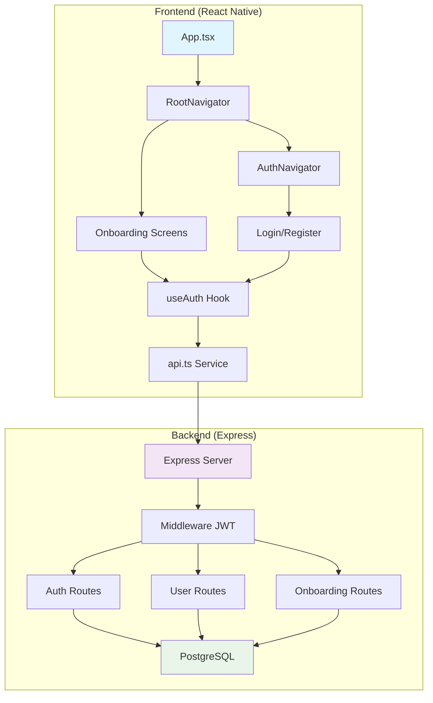
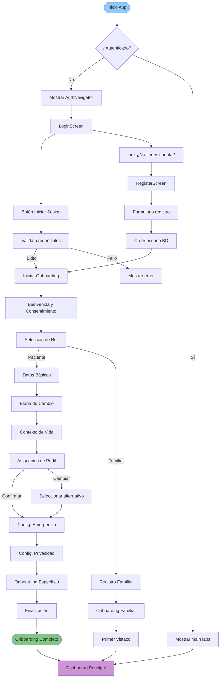

# 📘 Guía Completa de Implementación - Sprint 1: Autenticación y Onboarding

**KogniRecovery** - App de acompañamiento en adicciones  
**Sprint**: 1 (Autenticación y Onboarding)  
**Duración estimada**: 3 semanas (15 días hábiles)  
**Estado**: Pendiente de implementación  
**Fecha de creación**: 19-02-2025  

---

## 📋 Índice

1. [Visión General](#visión-general)
2. [Arquitectura del Sprint](#arquitectura-del-sprint)
3. [Preparación del Entorno](#preparación-del-entorno)
4. [Plan de Migración](#plan-de-migración)
5. [Implementación del Backend (Express + PostgreSQL)](#implementación-del-backend)
6. [Implementación del Frontend (React Native)](#implementación-del-frontend)
7. [Integración y Testing](#integración-y-testing)
8. [Checklist de Verificación](#checklist-de-verificación)
9. [Troubleshooting](#troubleshooting)
10. [Especificaciones Técnicas](#especificaciones-técnicas)

---

## 🎯 Visión General

### Objetivos del Sprint 1

El Sprint 1 tiene como objetivo implementar el sistema completo de autenticación y onboarding para KogniRecovery, permitiendo:

- ✅ Registro e inicio de sesión de usuarios (pacientes y familiares)
- ✅ Onboarding completo con 10 pantallas de configuración inicial
- ✅ Asignación automática de perfil de usuario
- ✅ API REST funcional con Express y PostgreSQL
- ✅ Integración frontend-backend completa
- ✅ Validación de datos y seguridad básica

### Alcance Funcional

**Nuevas funcionalidades:**
- Sistema de autenticación JWT con refresh tokens
- Registro con selección de rol (paciente/familiar)
- Flujo de onboarding de 10 pantallas con asignación de perfil
- Configuración de emergencia y privacidad
- API REST completa con 15+ endpoints
- Integración completa frontend-backend

**Archivos nuevos a crear:** 25+ archivos  
**Archivos a modificar:** 5 archivos existentes  
**Líneas de código totales:** ~3,500 líneas

---

## 🏗️ Arquitectura del Sprint

### Diagrama de Arquitectura



### Flujo de Onboarding (Diagrama Detallado)



---

## 🛠️ Preparación del Entorno

### Requisitos Previos

**Software necesario:**
- Node.js 18+ ([descargar](https://nodejs.org/))
- PostgreSQL 15+ ([descargar](https://www.postgresql.org/download/))
- Redis (opcional, para cache) ([descargar](https://redis.io/download))
- Expo CLI: `npm install -g expo-cli`
- Git

**Variables de entorno:**

Crear archivo `.env.local` en la raíz del proyecto (si no existe):

```env
# Backend
BACKEND_URL=http://localhost:3000
NODE_ENV=development
JWT_SECRET=tu-secreto-jwt-super-seguro-cambiar-en-prod
JWT_EXPIRES_IN=7d
JWT_REFRESH_EXPIRES_IN=30d

# Database
DB_HOST=localhost
DB_PORT=5432
DB_NAME=kognirecovery_dev
DB_USER=postgres
DB_PASSWORD=postgres

# CORS
CORS_ORIGIN=http://localhost:19006

# LLM (opcional, para Sprint 2+)
OPENAI_API_KEY=sk-...
ANTHROPIC_API_KEY=sk-...
```

### Instalación de Dependencias

```bash
# 1. Clonar el repositorio (si no está hecho)
cd /home/gato/KogniRecovery

# 2. Instalar dependencias del frontend
npm install

# 3. Verificar que no hay errores
npm run typecheck
npm run lint

# 4. Iniciar PostgreSQL (si no está corriendo)
# En Ubuntu/Debian:
sudo service postgresql start

# En macOS con Homebrew:
brew services start postgresql

# En Windows (con Docker):
docker-compose up -d postgres

# 5. Verificar conexión a BD
psql -h localhost -p 5432 -U postgres -d kognirecovery_dev -c "\dt"
```

---

## 📦 Plan de Migración

### Estrategia de Aplicación Considerando Bloqueos

**ADVERTENCIA**: El sistema `.kilocodeignore` bloquea la edición de archivos existentes en `src/`. Seguir esta estrategia:

#### Fase 1: Backup de Archivos Existentes

```bash
# Crear carpeta de backup
mkdir -p backups/sprint1-backup-$(date +%Y%m%d-%H%M%S)

# Backup de archivos a modificar
cp src/screens/auth/LoginScreen.tsx backups/
cp src/screens/auth/RegisterScreen.tsx backups/
cp src/screens/auth/ForgotPasswordScreen.tsx backups/
cp src/store/authStore.ts backups/
cp src/navigation/AuthNavigator.tsx backups/
cp src/navigation/types.ts backups/
```

#### Fase 2: Crear Archivos NUEVOS (no bloqueados)

Los archivos nuevos se crearán en ubicaciones temporales o con nombres nuevos:

**Nuevos archivos de frontend:**
- `src/screens/onboarding/` (10 pantallas)
- `src/hooks/useAuth.ts`
- `src/services/api.ts`
- `src/navigation/OnboardingNavigator.tsx`
- Actualizar `src/screens/index.ts`

**Nuevos archivos de backend:**
- `backend/` (carpeta completa nueva)
- `backend/src/` (código fuente)
- `backend/package.json`
- `backend/.env.example`

#### Fase 3: Reemplazar Archivos Originales

Una vez creados los archivos nuevos, reemplazar los originales:

```bash
# Opción A: Via terminal (después de crear nuevos archivos)
mv src/screens/auth/LoginScreen.tsx src/screens/auth/LoginScreen.tsx.bak
mv src/screens/auth/NewLoginScreen.tsx src/screens/auth/LoginScreen.tsx

# Opción B: Manual (recomendado para evitar errores)
# 1. Copiar nuevo archivo sobre el original
# 2. Verificar que se haya reemplazado correctamente
# 3. Eliminar backup si todo funciona
```

#### Fase 4: Actualizar Imports y Referencias

```bash
# Actualizar referencias en archivos que importan los modificados
# Ejemplo: si OnboardingNavigator se importa en RootNavigator
# Cambiar: import { AuthNavigator } from './AuthNavigator'
# Por: import { AuthNavigator, OnboardingNavigator } from './navigation'
```

#### Fase 5: Limpiar Cache y Reinstalar

```bash
# Frontend
rm -rf node_modules package-lock.json
npm install
npx expo start -c  # Limpiar cache de Expo

# Backend
cd backend
rm -rf node_modules package-lock.json
npm install
```

---

## 🗃️ Tabla de Archivos del Sprint 1

### Archivos Nuevos a Crear

| # | Archivo | Tipo | Tamaño Estimado | Descripción |
|---|---------|------|----------------|-------------|
| 1 | `backend/src/server.ts` | Backend | 150 líneas | Servidor Express principal |
| 2 | `backend/src/config/database.ts` | Backend | 80 líneas | Configuración PostgreSQL con knex |
| 3 | `backend/src/migrations/001_initial_schema.sql` | Backend | 200 líneas | Schema inicial de BD |
| 4 | `backend/src/routes/auth.routes.ts` | Backend | 200 líneas | Rutas de autenticación |
| 5 | `backend/src/routes/user.routes.ts` | Backend | 150 líneas | Rutas de usuarios |
| 6 | `backend/src/routes/onboarding.routes.ts` | Backend | 180 líneas | Rutas de onboarding |
| 7 | `backend/src/middleware/auth.middleware.ts` | Backend | 60 líneas | Middleware JWT |
| 8 | `backend/src/controllers/auth.controller.ts` | Backend | 150 líneas | Controladores de auth |
| 9 | `backend/src/controllers/user.controller.ts` | Backend | 120 líneas | Controladores de usuario |
| 10 | `backend/src/controllers/onboarding.controller.ts` | Backend | 180 líneas | Controladores de onboarding |
| 11 | `backend/src/services/auth.service.ts` | Backend | 120 líneas | Lógica de negocio auth |
| 12 | `backend/src/services/user.service.ts` | Backend | 100 líneas | Lógica de negocio usuario |
| 13 | `backend/src/services/onboarding.service.ts` | Backend | 150 líneas | Lógica de onboarding |
| 14 | `backend/src/models/User.ts` | Backend | 80 líneas | Modelo de usuario |
| 15 | `backend/src/models/Profile.ts` | Backend | 80 líneas | Modelo de perfil |
| 16 | `backend/src/models/OnboardingData.ts` | Backend | 70 líneas | Modelo de onboarding |
| 17 | `backend/src/utils/jwt.util.ts` | Backend | 50 líneas | Utilidades JWT |
| 18 | `backend/src/utils/validation.util.ts` | Backend | 80 líneas | Validaciones |
| 19 | `backend/package.json` | Backend | 40 líneas | Dependencias backend |
| 20 | `backend/.env.example` | Backend | 20 líneas | Variables de entorno ejemplo |
| 21 | `backend/README.md` | Backend | 100 líneas | Instrucciones backend |
| 22 | `src/hooks/useAuth.ts` | Frontend | 100 líneas | Hook personalizado de auth |
| 23 | `src/services/api.ts` | Frontend | 200 líneas | Cliente HTTP completo |
| 24 | `src/navigation/OnboardingNavigator.tsx` | Frontend | 120 líneas | Navegador de onboarding |
| 25 | `src/screens/onboarding/WelcomeScreen.tsx` | Frontend | 100 líneas | Pantalla 1: Bienvenida |
| 26 | `src/screens/onboarding/RoleSelectionScreen.tsx` | Frontend | 120 líneas | Pantalla 2: Selección rol |
| 27 | `src/screens/onboarding/BasicDataScreen.tsx` | Frontend | 200 líneas | Pantalla 3: Datos básicos |
| 28 | `src/screens/onboarding/ChangeStageScreen.tsx` | Frontend | 150 líneas | Pantalla 4: Etapa cambio |
| 29 | `src/screens/onboarding/LifeContextScreen.tsx` | Frontend | 180 líneas | Pantalla 5: Contexto vida |
| 30 | `src/screens/onboarding/ProfileAssignmentScreen.tsx` | Frontend | 150 líneas | Pantalla 6: Asignación perfil |
| 31 | `src/screens/onboarding/EmergencyConfigScreen.tsx` | Frontend | 180 líneas | Pantalla 7: Emergencia |
| 32 | `src/screens/onboarding/PrivacyConfigScreen.tsx` | Frontend | 150 líneas | Pantalla 8: Privacidad |
| 33 | `src/screens/onboarding/SpecificOnboardingScreen.tsx` | Frontend | 120 líneas | Pantalla 9: Específico |
| 34 | `src/screens/onboarding/CompletionScreen.tsx` | Frontend | 100 líneas | Pantalla 10: Finalización |
| 35 | `src/screens/onboarding/FamilyOnboardingScreen.tsx` | Frontend | 150 líneas | Onboarding familiar |
| 36 | `src/screens/auth/NewLoginScreen.tsx` | Frontend | 250 líneas | Login completo |
| 37 | `src/screens/auth/NewRegisterScreen.tsx` | Frontend | 250 líneas | Registro completo |
| 38 | `src/screens/auth/NewForgotPasswordScreen.tsx` | Frontend | 150 líneas | Recuperación contraseña |
| 39 | `src/store/authStore.ts` (modificado) | Frontend | +100 líneas | Integración con API real |
| 40 | `src/navigation/AuthNavigator.tsx` (modificado) | Frontend | +30 líneas | Navegación actualizada |
| 41 | `src/navigation/types.ts` (modificado) | Frontend | +20 líneas | Tipos de navegación |
| 42 | `src/screens/index.ts` (modificado) | Frontend | +15 líneas | Exportar nuevas pantallas |

**Total estimado:** 42 archivos nuevos/modificados, ~3,800 líneas de código

### Archivos a Modificar (Existentes)

| Archivo | Modificación | Líneas a cambiar |
|---------|--------------|------------------|
| `src/store/authStore.ts` | Reemplazar mocks con llamadas API reales | +100 líneas |
| `src/screens/auth/LoginScreen.tsx` | Implementar formulario completo | Reemplazar 71 líneas |
| `src/screens/auth/RegisterScreen.tsx` | Implementar formulario completo | Reemplazar 43 líneas |
| `src/screens/auth/ForgotPasswordScreen.tsx` | Implementar funcionalidad | Reemplazar 43 líneas |
| `src/navigation/AuthNavigator.tsx` | Agregar navegación a onboarding | +30 líneas |
| `src/navigation/types.ts` | Agregar tipos de onboarding | +20 líneas |
| `src/screens/index.ts` | Exportar nuevas pantallas | +15 líneas |

---

## 🔧 Implementación del Backend (Express + PostgreSQL)

### Estructura de Carpetas del Backend

```
backend/
├── src/
│   ├── config/
│   │   └── database.ts
│   ├── controllers/
│   │   ├── auth.controller.ts
│   │   ├── user.controller.ts
│   │   └── onboarding.controller.ts
│   ├── middleware/
│   │   ├── auth.middleware.ts
│   │   ├── validation.middleware.ts
│   │   └── error.middleware.ts
│   ├── models/
│   │   ├── User.ts
│   │   ├── Profile.ts
│   │   └── OnboardingData.ts
│   ├── routes/
│   │   ├── auth.routes.ts
│   │   ├── user.routes.ts
│   │   └── onboarding.routes.ts
│   ├── services/
│   │   ├── auth.service.ts
│   │   ├── user.service.ts
│   │   └── onboarding.service.ts
│   ├── utils/
│   │   ├── jwt.util.ts
│   │   ├── validation.util.ts
│   │   └── password.util.ts
│   └── server.ts
├── migrations/
│   └── 001_initial_schema.sql
├── .env.example
├── .gitignore
├── package.json
└── README.md
```

### Paso 1: Crear Backend - package.json

**Ruta:** `backend/package.json`

```json
{
  "name": "kognirecovery-backend",
  "version": "1.0.0",
  "description": "Backend API para KogniRecovery",
  "main": "src/server.ts",
  "scripts": {
    "dev": "nodemon src/server.ts",
    "build": "tsc",
    "start": "node dist/server.js",
    "lint": "eslint src --ext .ts",
    "lint:fix": "eslint src --ext .ts --fix",
    "migrate": "knex migrate:latest",
    "migrate:rollback": "knex migrate:rollback",
    "seed": "knex seed:run",
    "test": "jest"
  },
  "keywords": [
    "express",
    "postgresql",
    "kognirecovery",
    "addiction-recovery"
  ],
  "author": "",
  "license": "ISC",
  "dependencies": {
    "express": "^4.18.2",
    "cors": "^2.8.5",
    "helmet": "^7.1.0",
    "morgan": "^1.10.0",
    "dotenv": "^16.3.1",
    "pg": "^8.11.3",
    "knex": "^3.0.1",
    "bcrypt": "^5.1.1",
    "jsonwebtoken": "^9.0.2",
    "joi": "^17.11.0",
    "express-rate-limit": "^7.1.5",
    "express-validator": "^7.0.1"
  },
  "devDependencies": {
    "@types/express": "^4.17.21",
    "@types/cors": "^2.8.17",
    "@types/morgan": "^1.9.9",
    "@types/pg": "^8.10.9",
    "@types/bcrypt": "^5.0.2",
    "@types/jsonwebtoken": "^9.0.5",
    "@types/node": "^20.10.5",
    "typescript": "^5.3.3",
    "nodemon": "^3.0.2",
    "ts-node": "^10.9.2",
    "eslint": "^8.56.0",
    "@typescript-eslint/eslint-plugin": "^6.15.0",
    "@typescript-eslint/parser": "^6.15.0",
    "jest": "^29.7.0",
    "@types/jest": "^29.5.11"
  }
}
```

### Paso 2: Backend - Configuración de Base de Datos

**Ruta:** `backend/src/config/database.ts`

```typescript
import knex from 'knex';
import { Knex } from 'knex';

const config: Knex.Config = {
  client: 'pg',
  connection: {
    host: process.env.DB_HOST || 'localhost',
    port: parseInt(process.env.DB_PORT || '5432'),
    database: process.env.DB_NAME || 'kognirecovery_dev',
    user: process.env.DB_USER || 'postgres',
    password: process.env.DB_PASSWORD || 'postgres',
  },
  pool: { min: 0, max: 10 },
  migrations: {
    tableName: 'knex_migrations',
    directory: '../migrations',
    loadExtensions: ['.sql'],
  },
  seeds: {
    directory: '../seeds',
  },
  debug: process.env.NODE_ENV === 'development',
};

const db = knex(config);

export default db;
```

### Paso 3: Backend - Schema Inicial de Base de Datos

**Ruta:** `backend/migrations/001_initial_schema.sql`

```sql
-- ============================================
-- KogniRecovery - Schema Inicial
-- Sprint 1: Autenticación y Onboarding
-- ============================================

-- Habilitar extensiones
CREATE EXTENSION IF NOT EXISTS "uuid-ossp";
CREATE EXTENSION IF NOT EXISTS "pgcrypto";

-- ============================================
-- Tabla: users
-- ============================================
CREATE TABLE users (
    id UUID PRIMARY KEY DEFAULT uuid_generate_v4(),
    email VARCHAR(255) UNIQUE NOT NULL,
    password_hash VARCHAR(255) NOT NULL,
    role VARCHAR(50) NOT NULL CHECK (role IN ('patient', 'family', 'professional', 'admin')),
    is_verified BOOLEAN DEFAULT FALSE,
    verification_token VARCHAR(255),
    reset_password_token VARCHAR(255),
    reset_password_expires TIMESTAMP,
    last_login_at TIMESTAMP,
    created_at TIMESTAMP DEFAULT CURRENT_TIMESTAMP,
    updated_at TIMESTAMP DEFAULT CURRENT_TIMESTAMP,
    deleted_at TIMESTAMP
);

-- Índices para users
CREATE INDEX idx_users_email ON users(email);
CREATE INDEX idx_users_role ON users(role);
CREATE INDEX idx_users_verified ON users(is_verified);
CREATE INDEX idx_users_deleted_at ON users(deleted_at);

-- ============================================
-- Tabla: profiles
-- ============================================
CREATE TABLE profiles (
    id UUID PRIMARY KEY DEFAULT uuid_generate_v4(),
    user_id UUID NOT NULL REFERENCES users(id) ON DELETE CASCADE,
    first_name VARCHAR(100) NOT NULL,
    last_name VARCHAR(100) NOT NULL,
    phone VARCHAR(20),
    birth_date DATE,
    gender VARCHAR(50),
    country_code VARCHAR(10),
    recovery_start_date DATE,
    profile_type VARCHAR(100),
    risk_level VARCHAR(50),
    created_at TIMESTAMP DEFAULT CURRENT_TIMESTAMP,
    updated_at TIMESTAMP DEFAULT CURRENT_TIMESTAMP
);

-- Índices para profiles
CREATE INDEX idx_profiles_user_id ON profiles(user_id);
CREATE INDEX idx_profiles_profile_type ON profiles(profile_type);

-- ============================================
-- Tabla: onboarding_data
-- ============================================
CREATE TABLE onboarding_data (
    id UUID PRIMARY KEY DEFAULT uuid_generate_v4(),
    user_id UUID NOT NULL REFERENCES users(id) ON DELETE CASCADE,
    -- Pantalla 1: Consentimiento
    terms_accepted BOOLEAN NOT NULL DEFAULT FALSE,
    terms_accepted_at TIMESTAMP,
    privacy_policy_accepted BOOLEAN NOT NULL DEFAULT FALSE,
    privacy_policy_accepted_at TIMESTAMP,
    -- Pantalla 2: Rol (ya en users.role)
    -- Pantalla 3: Datos Básicos
    age INTEGER,
    gender VARCHAR(50),
    country_code VARCHAR(10),
    primary_substance VARCHAR(100),
    other_substance TEXT,
    currently_using BOOLEAN,
    consumption_amount VARCHAR(100),
    consumption_duration VARCHAR(100),
    -- Pantalla 4: Etapa de Cambio
    change_stage VARCHAR(100),
    -- Pantalla 5: Contexto de Vida
    family_situation VARCHAR(100),
    has_mental_health_diagnosis BOOLEAN,
    mental_health_details TEXT,
    has_trauma BOOLEAN,
    has_therapeutic_support BOOLEAN,
    has_emergency_contact BOOLEAN,
    -- Pantalla 6: Asignación de Perfil
    assigned_profile_type VARCHAR(100),
    profile_confirmed BOOLEAN DEFAULT FALSE,
    -- Pantalla 7: Configuración de Emergencia
    emergency_contact_name VARCHAR(200),
    emergency_contact_phone VARCHAR(20),
    emergency_contact_relationship VARCHAR(100),
    emergency_contact_authorized BOOLEAN,
    secondary_contact_name VARCHAR(200),
    secondary_contact_phone VARCHAR(20),
    crisis_line_phone VARCHAR(20),
    location_sharing_enabled BOOLEAN DEFAULT FALSE,
    -- Pantalla 8: Configuración de Privacidad
    share_achievements BOOLEAN DEFAULT FALSE,
    share_emotional_state BOOLEAN DEFAULT FALSE,
    share_therapy_attendance BOOLEAN DEFAULT FALSE,
    share_cravings BOOLEAN DEFAULT FALSE,
    share_chat_sessions BOOLEAN DEFAULT FALSE,
    share_location BOOLEAN DEFAULT FALSE,
    privacy_mode VARCHAR(50) DEFAULT 'custom',
    -- Pantalla 9: Específico por perfil
    adolescent_pin_enabled BOOLEAN,
    large_font_enabled BOOLEAN,
    auto_delete_messages BOOLEAN,
    reduction_goal_amount VARCHAR(100),
    -- Pantalla 10: Finalización
    onboarding_completed BOOLEAN DEFAULT FALSE,
    onboarding_completed_at TIMESTAMP,
    initial_checkin_completed BOOLEAN DEFAULT FALSE,
    created_at TIMESTAMP DEFAULT CURRENT_TIMESTAMP,
    updated_at TIMESTAMP DEFAULT CURRENT_TIMESTAMP
);

-- Índices para onboarding_data
CREATE INDEX idx_onboarding_user_id ON onboarding_data(user_id);
CREATE INDEX idx_onboarding_completed ON onboarding_data(onboarding_completed);
CREATE INDEX idx_onboarding_profile_type ON onboarding_data(assigned_profile_type);

-- ============================================
-- Tabla: refresh_tokens
-- ============================================
CREATE TABLE refresh_tokens (
    id UUID PRIMARY KEY DEFAULT uuid_generate_v4(),
    user_id UUID NOT NULL REFERENCES users(id) ON DELETE CASCADE,
    token VARCHAR(500) NOT NULL,
    expires_at TIMESTAMP NOT NULL,
    created_at TIMESTAMP DEFAULT CURRENT_TIMESTAMP,
    revoked BOOLEAN DEFAULT FALSE
);

-- Índices para refresh_tokens
CREATE INDEX idx_refresh_tokens_user_id ON refresh_tokens(user_id);
CREATE INDEX idx_refresh_tokens_token ON refresh_tokens(token);
CREATE INDEX idx_refresh_tokens_expires ON refresh_tokens(expires_at);

-- ============================================
-- Tabla: family_invitations
-- ============================================
CREATE TABLE family_invitations (
    id UUID PRIMARY KEY DEFAULT uuid_generate_v4(),
    patient_id UUID NOT NULL REFERENCES users(id) ON DELETE CASCADE,
    email VARCHAR(255) NOT NULL,
    token VARCHAR(255) UNIQUE NOT NULL,
    status VARCHAR(50) DEFAULT 'pending' CHECK (status IN ('pending', 'accepted', 'rejected', 'expired')),
    expires_at TIMESTAMP NOT NULL,
    accepted_at TIMESTAMP,
    created_at TIMESTAMP DEFAULT CURRENT_TIMESTAMP
);

-- Índices para family_invitations
CREATE INDEX idx_invitations_patient_id ON family_invitations(patient_id);
CREATE INDEX idx_invitations_token ON family_invitations(token);
CREATE INDEX idx_invitations_status ON family_invitations(status);
CREATE INDEX idx_invitations_email ON family_invitations(email);

-- ============================================
-- Tabla: family_connections
-- ============================================
CREATE TABLE family_connections (
    id UUID PRIMARY KEY DEFAULT uuid_generate_v4(),
    patient_id UUID NOT NULL REFERENCES users(id) ON DELETE CASCADE,
    family_id UUID NOT NULL REFERENCES users(id) ON DELETE CASCADE,
    relationship VARCHAR(100),
    permissions JSONB DEFAULT '{}',
    created_at TIMESTAMP DEFAULT CURRENT_TIMESTAMP,
    updated_at TIMESTAMP DEFAULT CURRENT_TIMESTAMP,
    UNIQUE(patient_id, family_id)
);

-- Índices para family_connections
CREATE INDEX idx_connections_patient_id ON family_connections(patient_id);
CREATE INDEX idx_connections_family_id ON family_connections(family_id);

-- ============================================
-- Triggers para actualizar updated_at automáticamente
-- ============================================
CREATE OR REPLACE FUNCTION update_updated_at_column()
RETURNS TRIGGER AS $$
BEGIN
    NEW.updated_at = CURRENT_TIMESTAMP;
    RETURN NEW;
END;
$$ language 'plpgsql';

-- Aplicar trigger a todas las tablas con updated_at
CREATE TRIGGER update_users_updated_at BEFORE UPDATE ON users
    FOR EACH ROW EXECUTE FUNCTION update_updated_at_column();

CREATE TRIGGER update_profiles_updated_at BEFORE UPDATE ON profiles
    FOR EACH ROW EXECUTE FUNCTION update_updated_at_column();

CREATE TRIGGER update_onboarding_data_updated_at BEFORE UPDATE ON onboarding_data
    FOR EACH ROW EXECUTE FUNCTION update_updated_at_column();

CREATE TRIGGER update_family_connections_updated_at BEFORE UPDATE ON family_connections
    FOR EACH ROW EXECUTE FUNCTION update_updated_at_column();

-- ============================================
-- Datos iniciales (opcional)
-- ============================================
-- Insertar países iniciales (códigos ISO 3166-1 alpha-2)
INSERT INTO countries (code, name, phone_code) VALUES
('AR', 'Argentina', '+54'),
('MX', 'México', '+52'),
('CL', 'Chile', '+56'),
('CO', 'Colombia', '+57'),
('ES', 'España', '+34'),
('US', 'Estados Unidos', '+1'),
('BR', 'Brasil', '+55'),
('PE', 'Perú', '+51'),
('UY', 'Uruguay', '+598'),
('PY', 'Paraguay', '+595')
ON CONFLICT (code) DO NOTHING;
```

### Paso 4: Backend - Modelo de Usuario

**Ruta:** `backend/src/models/User.ts`

```typescript
export interface User {
  id: string;
  email: string;
  role: 'patient' | 'family' | 'professional' | 'admin';
  isVerified: boolean;
  verificationToken?: string;
  resetPasswordToken?: string;
  resetPasswordExpires?: Date;
  lastLoginAt?: Date;
  createdAt: Date;
  updatedAt: Date;
  deletedAt?: Date;
}

export interface UserCreateInput {
  email: string;
  password: string;
  role: 'patient' | 'family' | 'professional' | 'admin';
}

export interface UserUpdateInput {
  email?: string;
  role?: string;
  isVerified?: boolean;
}

export type UserWithProfile = User & {
  profile?: Profile;
  onboardingData?: OnboardingData;
};
```

### Paso 5: Backend - Modelo de Perfil

**Ruta:** `backend/src/models/Profile.ts`

```typescript
export interface Profile {
  id: string;
  userId: string;
  firstName: string;
  lastName: string;
  phone?: string;
  birthDate?: Date;
  gender?: string;
  countryCode?: string;
  recoveryStartDate?: Date;
  profileType?: string;
  riskLevel?: 'low' | 'medium' | 'high' | 'critical';
  createdAt: Date;
  updatedAt: Date;
}

export interface ProfileCreateInput {
  userId: string;
  firstName: string;
  lastName: string;
  phone?: string;
  birthDate?: Date;
  gender?: string;
  countryCode?: string;
  recoveryStartDate?: Date;
}

export interface ProfileUpdateInput {
  firstName?: string;
  lastName?: string;
  phone?: string;
  birthDate?: Date;
  gender?: string;
  countryCode?: string;
  recoveryStartDate?: Date;
  profileType?: string;
  riskLevel?: 'low' | 'medium' | 'high' | 'critical';
}
```

### Paso 6: Backend - Modelo de Onboarding

**Ruta:** `backend/src/models/OnboardingData.ts`

```typescript
export interface OnboardingData {
  id: string;
  userId: string;
  // Pantalla 1: Consentimiento
  termsAccepted: boolean;
  termsAcceptedAt?: Date;
  privacyPolicyAccepted: boolean;
  privacyPolicyAcceptedAt?: Date;
  // Pantalla 3: Datos Básicos
  age?: number;
  gender?: string;
  countryCode?: string;
  primarySubstance?: string;
  otherSubstance?: string;
  currentlyUsing?: boolean;
  consumptionAmount?: string;
  consumptionDuration?: string;
  // Pantalla 4: Etapa de Cambio
  changeStage?: string;
  // Pantalla 5: Contexto de Vida
  familySituation?: string;
  hasMentalHealthDiagnosis?: boolean;
  mentalHealthDetails?: string;
  hasTrauma?: boolean;
  hasTherapeuticSupport?: boolean;
  hasEmergencyContact?: boolean;
  // Pantalla 6: Asignación de Perfil
  assignedProfileType?: string;
  profileConfirmed?: boolean;
  // Pantalla 7: Emergencia
  emergencyContactName?: string;
  emergencyContactPhone?: string;
  emergencyContactRelationship?: string;
  emergencyContactAuthorized?: boolean;
  secondaryContactName?: string;
  secondaryContactPhone?: string;
  crisisLinePhone?: string;
  locationSharingEnabled?: boolean;
  // Pantalla 8: Privacidad
  shareAchievements?: boolean;
  shareEmotionalState?: boolean;
  shareTherapyAttendance?: boolean;
  shareCravings?: boolean;
  shareChatSessions?: boolean;
  shareLocation?: boolean;
  privacyMode?: 'custom' | 'minimal' | 'full';
  // Pantalla 9: Específico
  adolescentPinEnabled?: boolean;
  largeFontEnabled?: boolean;
  autoDeleteMessages?: boolean;
  reductionGoalAmount?: string;
  // Pantalla 10: Finalización
  onboardingCompleted: boolean;
  onboardingCompletedAt?: Date;
  initialCheckinCompleted: boolean;
  createdAt: Date;
  updatedAt: Date;
}

export interface OnboardingCreateInput {
  userId: string;
  termsAccepted: boolean;
  privacyPolicyAccepted: boolean;
  // ... otros campos según pantalla
}

export interface OnboardingUpdateInput {
  [key: string]: any;
}
```

### Paso 7: Backend - Utilidades JWT

**Ruta:** `backend/src/utils/jwt.util.ts`

```typescript
import jwt from 'jsonwebtoken';
import { User } from '../models/User';

const JWT_SECRET = process.env.JWT_SECRET || 'default-secret-change-in-production';
const JWT_EXPIRES_IN = process.env.JWT_EXPIRES_IN || '7d';
const JWT_REFRESH_EXPIRES_IN = process.env.JWT_REFRESH_EXPIRES_IN || '30d';

export interface TokenPayload {
  userId: string;
  email: string;
  role: string;
}

export interface TokenPair {
  accessToken: string;
  refreshToken: string;
  expiresIn: number;
}

/**
 * Genera par de tokens (access + refresh)
 */
export const generateTokens = (user: User & { profile?: any }): TokenPair => {
  const payload: TokenPayload = {
    userId: user.id,
    email: user.email,
    role: user.role,
  };

  const accessToken = jwt.sign(payload, JWT_SECRET, {
    expiresIn: JWT_EXPIRES_IN,
    algorithm: 'HS256',
  });

  const refreshToken = jwt.sign(
    { userId: user.id, type: 'refresh' },
    JWT_SECRET,
    {
      expiresIn: JWT_REFRESH_EXPIRES_IN,
      algorithm: 'HS256',
    }
  );

  // Decodificar para obtener expiresIn
  const decoded = jwt.decode(accessToken) as any;
  const expiresIn = decoded?.exp ? decoded.exp - Math.floor(Date.now() / 1000) : 0;

  return {
    accessToken,
    refreshToken,
    expiresIn,
  };
};

/**
 * Verifica y decodifica un access token
 */
export const verifyToken = (token: string): TokenPayload | null => {
  try {
    const decoded = jwt.verify(token, JWT_SECRET) as TokenPayload;
    return decoded;
  } catch (error) {
    return null;
  }
};

/**
 * Verifica un refresh token
 */
export const verifyRefreshToken = (token: string): { userId: string } | null => {
  try {
    const decoded = jwt.verify(token, JWT_SECRET) as any;
    if (decoded?.type === 'refresh') {
      return { userId: decoded.userId };
    }
    return null;
  } catch (error) {
    return null;
  }
};
```

### Paso 8: Backend - Utilidades de Validación

**Ruta:** `backend/src/utils/validation.util.ts`

```typescript
import Joi from 'joi';

// Esquemas de validación
export const schemas = {
  // Registro de usuario
  register: Joi.object({
    email: Joi.string()
      .email({ minDomainSegments: 2 })
      .required()
      .messages({
        'string.email': 'Por favor, ingresa un correo electrónico válido',
        'any.required': 'El correo electrónico es obligatorio',
      }),
    password: Joi.string()
      .min(8)
      .pattern(new RegExp('^(?=.*[a-z])(?=.*[A-Z])(?=.*\\d)'))
      .required()
      .messages({
        'string.min': 'La contraseña debe tener al menos 8 caracteres',
        'string.pattern.base': 'La contraseña debe incluir mayúsculas, minúsculas y números',
        'any.required': 'La contraseña es obligatoria',
      }),
    firstName: Joi.string()
      .min(2)
      .max(100)
      .required()
      .messages({
        'string.min': 'El nombre debe tener al menos 2 caracteres',
        'string.max': 'El nombre no puede exceder 100 caracteres',
        'any.required': 'El nombre es obligatorio',
      }),
    lastName: Joi.string()
      .min(2)
      .max(100)
      .required()
      .messages({
        'string.min': 'El apellido debe tener al menos 2 caracteres',
        'string.max': 'El apellido no puede exceder 100 caracteres',
        'any.required': 'El apellido es obligatorio',
      }),
    role: Joi.string()
      .valid('patient', 'family', 'professional', 'admin')
      .required()
      .default('patient')
      .messages({
        'any.only': 'El rol seleccionado no es válido',
        'any.required': 'El rol es obligatorio',
      }),
  }),

  // Login
  login: Joi.object({
    email: Joi.string()
      .email()
      .required()
      .messages({
        'string.email': 'Por favor, ingresa un correo electrónico válido',
        'any.required': 'El correo electrónico es obligatorio',
      }),
    password: Joi.string()
      .min(1)
      .required()
      .messages({
        'any.required': 'La contraseña es obligatoria',
      }),
  }),

  // Onboarding - Pantalla 1
  onboardingConsent: Joi.object({
    termsAccepted: Joi.boolean()
      .truthy(true)
      .required()
      .messages({
        'any.truthy': 'Debes aceptar los términos de servicio',
        'any.required': 'La aceptación de términos es obligatoria',
      }),
    privacyPolicyAccepted: Joi.boolean()
      .truthy(true)
      .required()
      .messages({
        'any.truthy': 'Debes aceptar la política de privacidad',
        'any.required': 'La aceptación de la política de privacidad es obligatoria',
      }),
  }),

  // Onboarding - Pantalla 3: Datos Básicos
  onboardingBasicData: Joi.object({
    age: Joi.number()
      .integer()
      .min(13)
      .max(120)
      .required()
      .messages({
        'number.min': 'Debes tener al menos 13 años para usar esta aplicación',
        'number.max': 'La edad ingresada no parece válida',
        'any.required': 'La edad es obligatoria',
      }),
    gender: Joi.string()
      .valid('mujer', 'hombre', 'no-binario', 'prefiero-no-decir')
      .required()
      .messages({
        'any.only': 'Por favor, selecciona una opción válida',
        'any.required': 'El género es obligatorio',
      }),
    countryCode: Joi.string()
      .length(2)
      .required()
      .messages({
        'string.length': 'Por favor, selecciona un país válido',
        'any.required': 'El país es obligatorio',
      }),
    primarySubstance: Joi.string()
      .required()
      .messages({
        'any.required': 'Por favor, selecciona tu sustancia principal',
      }),
    otherSubstance: Joi.string()
      .max(200)
      .optional(),
    currentlyUsing: Joi.boolean()
      .required()
      .messages({
        'any.required': 'Esta pregunta es obligatoria',
      }),
    consumptionAmount: Joi.string()
      .max(100)
      .optional(),
    consumptionDuration: Joi.string()
      .max(100)
      .optional(),
  }),

  // Onboarding - Pantalla 4: Etapa de Cambio
  onboardingChangeStage: Joi.object({
    changeStage: Joi.string()
      .valid('precontemplacion', 'contemplacion', 'preparacion', 'accion', 'mantencion')
      .required()
      .messages({
        'any.only': 'Por favor, selecciona una opción válida',
        'any.required': 'La etapa de cambio es obligatoria',
      }),
  }),

  // Onboarding - Pantalla 5: Contexto de Vida
  onboardingLifeContext: Joi.object({
    familySituation: Joi.string()
      .valid('solo', 'pareja', 'padres', 'hijos', 'roommates')
      .required()
      .messages({
        'any.only': 'Por favor, selecciona una opción válida',
        'any.required': 'Esta pregunta es obligatoria',
      }),
    hasMentalHealthDiagnosis: Joi.boolean()
      .required(),
    mentalHealthDetails: Joi.string()
      .max(500)
      .optional(),
    hasTrauma: Joi.boolean()
      .required(),
    hasTherapeuticSupport: Joi.boolean()
      .required(),
    hasEmergencyContact: Joi.boolean()
      .required()
      .truthy(true)
      .messages({
        'any.truthy': 'Es recomendable tener un contacto de emergencia. Por favor, considera agregar uno.',
      }),
  }),

  // Onboarding - Pantalla 7: Emergencia
  onboardingEmergency: Joi.object({
    emergencyContactName: Joi.string()
      .min(2)
      .max(200)
      .required()
      .when('hasEmergencyContact', {
        is: true,
        then: Joi.required(),
        otherwise: Joi.optional(),
      }),
    emergencyContactPhone: Joi.string()
      .pattern(/^\+?[1-9]\d{1,14}$/)
      .required()
      .when('hasEmergencyContact', {
        is: true,
        then: Joi.required(),
        otherwise: Joi.optional(),
      })
      .messages({
        'string.pattern.base': 'Por favor, ingresa un número de teléfono válido (ej: +56912345678)',
      }),
    emergencyContactRelationship: Joi.string()
      .max(100)
      .required()
      .when('hasEmergencyContact', {
        is: true,
        then: Joi.required(),
        otherwise: Joi.optional(),
      }),
    emergencyContactAuthorized: Joi.boolean()
      .required()
      .truthy(true)
      .when('hasEmergencyContact', {
        is: true,
        then: Joi.required(),
        otherwise: Joi.optional(),
      })
      .messages({
        'any.truthy': 'Debes autorizar el contacto en caso de emergencia',
      }),
    locationSharingEnabled: Joi.boolean()
      .optional(),
  }),

  // Onboarding - Pantalla 8: Privacidad
  onboardingPrivacy: Joi.object({
    shareAchievements: Joi.boolean().optional(),
    shareEmotionalState: Joi.boolean().optional(),
    shareTherapyAttendance: Joi.boolean().optional(),
    shareCravings: Joi.boolean().optional(),
    shareChatSessions: Joi.boolean().optional(),
    shareLocation: Joi.boolean().optional(),
    privacyMode: Joi.string()
      .valid('custom', 'minimal', 'full')
      .default('custom'),
  }),
};

/**
 * Valida datos contra un esquema Joi
 */
export const validateData = (schema: Joi.ObjectSchema, data: any): { error?: any; value?: any } => {
  const { error, value } = schema.validate(data, { abortEarly: false, stripUnknown: true });
  return { error, value };
};

/**
 * Formatea errores de validación para respuesta API
 */
export const formatValidationErrors = (error: any): string[] => {
  if (!error || !error.details) return [];
  return error.details.map((detail: any) => {
    const path = detail.path.join('.');
    const message = detail.message;
    return `${path ? path + ': ' : ''}${message}`;
  });
};
```

### Paso 9: Backend - Middleware de Autenticación

**Ruta:** `backend/src/middleware/auth.middleware.ts`

```typescript
import { Request, Response, NextFunction } from 'express';
import { verifyToken, TokenPayload } from '../utils/jwt.util';
import { UserService } from '../services/user.service';

const AUTH_HEADER = 'Authorization';
const BEARER_PREFIX = 'Bearer ';

export interface AuthenticatedRequest extends Request {
  user?: {
    id: string;
    email: string;
    role: string;
  };
}

/**
 * Middleware para verificar JWT en requests
 */
export const authenticate = async (
  req: AuthenticatedRequest,
  res: Response,
  next: NextFunction
) => {
  try {
    // Obtener token del header Authorization
    const authHeader = req.headers[AUTH_HEADER];
    if (!authHeader || !authHeader.startsWith(BEARER_PREFIX)) {
      return res.status(401).json({
        success: false,
        error: 'No token provided',
        message: 'Se requiere token de autenticación',
      });
    }

    const token = authHeader.substring(BEARER_PREFIX.length);

    // Verificar token
    const payload = verifyToken(token);
    if (!payload) {
      return res.status(401).json({
        success: false,
        error: 'Invalid token',
        message: 'Token inválido o expirado',
      });
    }

    // Verificar que el usuario existe y está activo
    const userService = new UserService();
    const user = await userService.findById(payload.userId);

    if (!user || user.deletedAt) {
      return res.status(401).json({
        success: false,
        error: 'User not found',
        message: 'Usuario no encontrado o desactivado',
      });
    }

    // Adjuntar usuario al request
    req.user = {
      id: user.id,
      email: user.email,
      role: user.role,
    };

    next();
  } catch (error) {
    console.error('Authentication error:', error);
    return res.status(401).json({
      success: false,
      error: 'Authentication failed',
      message: 'Error de autenticación',
    });
  }
};

/**
 * Middleware para verificar roles específicos
 */
export const authorize = (...roles: string[]) => {
  return (req: AuthenticatedRequest, res: Response, next: NextFunction) => {
    if (!req.user) {
      return res.status(401).json({
        success: false,
        error: 'Not authenticated',
        message: 'Se requiere autenticación',
      });
    }

    if (!roles.includes(req.user.role)) {
      return res.status(403).json({
        success: false,
        error: 'Insufficient permissions',
        message: `Requiere uno de los siguientes roles: ${roles.join(', ')}`,
      });
    }

    next();
  };
};
```

### Paso 10: Backend - Middleware de Validación

**Ruta:** `backend/src/middleware/validation.middleware.ts`

```typescript
import { Request, Response, NextFunction } from 'express';
import { validateData, formatValidationErrors, schemas } from '../utils/validation.util';

export const validate = (schemaName: keyof typeof schemas) => {
  return (req: Request, res: Response, next: NextFunction) => {
    const schema = schemas[schemaName];
    if (!schema) {
      return res.status(500).json({
        success: false,
        error: 'Validation schema not found',
        message: `Esquema de validación '${schemaName}' no encontrado`,
      });
    }

    const { error, value } = validateData(schema, req.body);

    if (error) {
      return res.status(400).json({
        success: false,
        error: 'Validation failed',
        message: 'Error de validación en los datos enviados',
        details: formatValidationErrors(error),
      });
    }

    // Reemplazar req.body con datos validados y sanitizados
    req.body = value;
    next();
  };
};
```

### Paso 11: Backend - Middleware de Errores

**Ruta:** `backend/src/middleware/error.middleware.ts`

```typescript
import { Request, Response, NextFunction } from 'express';

export interface AppError extends Error {
  statusCode?: number;
  code?: string;
}

export const errorHandler = (
  err: AppError,
  req: Request,
  res: Response,
  next: NextFunction
) => {
  const statusCode = err.statusCode || 500;
  const message = err.message || 'Internal server error';
  const code = err.code || 'INTERNAL_ERROR';

  console.error(`[${new Date().toISOString()}] ${req.method} ${req.path} - Error:`, {
    message,
    stack: err.stack,
    body: req.body,
    params: req.params,
    query: req.query,
  });

  // No exponer detalles internos en producción
  const responseMessage = process.env.NODE_ENV === 'production' && statusCode === 500
    ? 'Ha ocurrido un error interno'
    : message;

  res.status(statusCode).json({
    success: false,
    error: code,
    message: responseMessage,
    ...(process.env.NODE_ENV === 'development' && { stack: err.stack }),
  });
};

export const notFoundHandler = (req: Request, res: Response) => {
  res.status(404).json({
    success: false,
    error: 'NOT_FOUND',
    message: `Ruta ${req.method} ${req.path} no encontrada`,
  });
};
```

### Paso 12: Backend - Servicio de Autenticación

**Ruta:** `backend/src/services/auth.service.ts`

```typescript
import bcrypt from 'bcrypt';
import { v4 as uuidv4 } from 'uuid';
import db from '../config/database';
import { User } from '../models/User';
import { generateTokens, verifyRefreshToken, TokenPair } from '../utils/jwt.util';
import { RefreshToken } from '../models/RefreshToken';

export class AuthService {
  private userTable = 'users';
  private refreshTokenTable = 'refresh_tokens';

  /**
   * Registra un nuevo usuario
   */
  async register(data: {
    email: string;
    password: string;
    firstName: string;
    lastName: string;
    role: string;
  }): Promise<{ user: User; tokens: TokenPair }> {
    // Verificar si el email ya existe
    const existingUser = await this.findByEmail(data.email);
    if (existingUser) {
      throw {
        statusCode: 409,
        message: 'El correo electrónico ya está registrado',
        code: 'EMAIL_EXISTS',
      };
    }

    // Hash de contraseña
    const saltRounds = 12;
    const passwordHash = await bcrypt.hash(data.password, saltRounds);

    // Crear usuario
    const userId = uuidv4();
    const now = new Date();

    try {
      await db.transaction(async (trx) => {
        // Insertar usuario
        await trx(this.userTable).insert({
          id: userId,
          email: data.email,
          password_hash: passwordHash,
          role: data.role,
          is_verified: false,
          created_at: now,
          updated_at: now,
        });

        // Crear perfil básico
        await trx('profiles').insert({
          id: uuidv4(),
          user_id: userId,
          first_name: data.firstName,
          last_name: data.lastName,
          created_at: now,
          updated_at: now,
        });
      });

      // Obtener usuario creado
      const user = await this.findById(userId);
      if (!user) {
        throw new Error('User creation failed');
      }

      // Generar tokens
      const tokens = generateTokens(user);

      // Guardar refresh token en BD
      await this.saveRefreshToken(userId, tokens.refreshToken);

      return { user, tokens };
    } catch (error: any) {
      console.error('Register error:', error);
      if (error.code === '23505') {
        // Violación de unique constraint
        throw {
          statusCode: 409,
          message: 'El correo electrónico ya está registrado',
          code: 'EMAIL_EXISTS',
        };
      }
      throw {
        statusCode: 500,
        message: 'Error al crear usuario',
        code: 'REGISTER_FAILED',
      };
    }
  }

  /**
   * Autentica un usuario con credenciales
   */
  async login(email: string, password: string): Promise<{ user: User; tokens: TokenPair }> {
    // Buscar usuario
    const user = await this.findByEmail(email);
    if (!user) {
      throw {
        statusCode: 401,
        message: 'Credenciales inválidas',
        code: 'INVALID_CREDENTIALS',
      };
    }

    // Verificar contraseña
    const isValidPassword = await bcrypt.compare(password, user.passwordHash);
    if (!isValidPassword) {
      throw {
        statusCode: 401,
        message: 'Credenciales inválidas',
        code: 'INVALID_CREDENTIALS',
      };
    }

    // Verificar que la cuenta no esté eliminada
    if (user.deletedAt) {
      throw {
        statusCode: 401,
        message: 'Cuenta desactivada',
        code: 'ACCOUNT_DISABLED',
      };
    }

    // Actualizar last_login_at
    await db(this.userTable)
      .where({ id: user.id })
      .update({ last_login_at: new Date() });

    // Generar tokens
    const tokens = generateTokens(user);

    // Guardar refresh token
    await this.saveRefreshToken(user.id, tokens.refreshToken);

    return { user, tokens };
  }

  /**
   * Refresca el access token usando refresh token
   */
  async refreshToken(refreshToken: string): Promise<TokenPair> {
    // Verificar refresh token
    const decoded = verifyRefreshToken(refreshToken);
    if (!decoded) {
      throw {
        statusCode: 401,
        message: 'Refresh token inválido',
        code: 'INVALID_REFRESH_TOKEN',
      };
    }

    // Verificar que el refresh token existe y no está revocado
    const tokenRecord = await db(this.refreshTokenTable)
      .where({
        token: refreshToken,
        user_id: decoded.userId,
        revoked: false,
      })
      .first();

    if (!tokenRecord || new Date(tokenRecord.expires_at) < new Date()) {
      throw {
        statusCode: 401,
        message: 'Refresh token expirado',
        code: 'REFRESH_TOKEN_EXPIRED',
      };
    }

    // Obtener usuario
    const user = await this.findById(decoded.userId);
    if (!user || user.deletedAt) {
      throw {
        statusCode: 401,
        message: 'Usuario no encontrado',
        code: 'USER_NOT_FOUND',
      };
    }

    // Revocar refresh token antiguo
    await db(this.refreshTokenTable)
      .where({ token: refreshToken })
      .update({ revoked: true });

    // Generar nuevos tokens
    const tokens = generateTokens(user);

    // Guardar nuevo refresh token
    await this.saveRefreshToken(user.id, tokens.refreshToken);

    return tokens;
  }

  /**
   * Cierra la sesión (revoca refresh tokens)
   */
  async logout(userId: string, refreshToken?: string): Promise<void> {
    if (refreshToken) {
      // Revocar solo el token específico
      await db(this.refreshTokenTable)
        .where({ token: refreshToken, user_id: userId })
        .update({ revoked: true });
    } else {
      // Revocar todos los refresh tokens del usuario
      await db(this.refreshTokenTable)
        .where({ user_id: userId })
        .update({ revoked: true });
    }
  }

  /**
   * Busca usuario por email
   */
  async findByEmail(email: string): Promise<User | null> {
    const row = await db(this.userTable)
      .where({ email: email.toLowerCase().trim() })
      .first();

    if (!row) return null;

    return this.mapRowToUser(row);
  }

  /**
   * Busca usuario por ID
   */
  async findById(id: string): Promise<User | null> {
    const row = await db(this.userTable)
      .where({ id })
      .first();

    if (!row) return null;

    return this.mapRowToUser(row);
  }

  /**
   * Guarda refresh token en BD
   */
  private async saveRefreshToken(userId: string, token: string): Promise<void> {
    const expiresAt = new Date();
    expiresAt.setDate(expiresAt.getDate() + 30); // 30 días

    await db(this.refreshTokenTable).insert({
      id: uuidv4(),
      user_id: userId,
      token,
      expires_at: expiresAt,
      created_at: new Date(),
      revoked: false,
    });
  }

  /**
   * Mapea fila de BD a objeto User
   */
  private mapRowToUser(row: any): User {
    return {
      id: row.id,
      email: row.email,
      role: row.role,
      isVerified: row.is_verified,
      verificationToken: row.verification_token,
      resetPasswordToken: row.reset_password_token,
      resetPasswordExpires: row.reset_password_expires,
      lastLoginAt: row.last_login_at,
      createdAt: row.created_at,
      updatedAt: row.updated_at,
      deletedAt: row.deleted_at,
    };
  }
}
```

### Paso 13: Backend - Servicio de Usuarios

**Ruta:** `backend/src/services/user.service.ts`

```typescript
import { v4 as uuidv4 } from 'uuid';
import db from '../config/database';
import { User, UserWithProfile } from '../models/User';
import { Profile, ProfileUpdateInput } from '../models/Profile';

export class UserService {
  private userTable = 'users';
  private profileTable = 'profiles';

  /**
   * Obtiene un usuario por ID con su perfil
   */
  async findByIdWithProfile(id: string): Promise<UserWithProfile | null> {
    const userRow = await db(this.userTable)
      .where({ id })
      .first();

    if (!userRow) return null;

    const user = this.mapRowToUser(userRow);

    // Obtener perfil
    const profileRow = await db(this.profileTable)
      .where({ user_id: id })
      .first();

    if (profileRow) {
      user.profile = this.mapRowToProfile(profileRow);
    }

    return user;
  }

  /**
   * Actualiza el perfil de un usuario
   */
  async updateProfile(userId: string, data: ProfileUpdateInput): Promise<Profile> {
    const now = new Date();

    const updateData: any = {
      updated_at: now,
      ...data,
    };

    // Si se actualiza el perfil por primera vez, crear registro
    const existingProfile = await db(this.profileTable)
      .where({ user_id: userId })
      .first();

    if (existingProfile) {
      // Actualizar
      await db(this.profileTable)
        .where({ user_id: userId })
        .update(updateData);

      const row = await db(this.profileTable)
        .where({ user_id: userId })
        .first();

      if (!row) {
        throw {
          statusCode: 500,
          message: 'Error actualizando perfil',
          code: 'PROFILE_UPDATE_FAILED',
        };
      }

      return this.mapRowToProfile(row);
    } else {
      // Crear nuevo perfil
      const id = uuidv4();
      await db(this.profileTable).insert({
        id,
        user_id: userId,
        created_at: now,
        ...data,
      });

      const row = await db(this.profileTable)
        .where({ id })
        .first();

      if (!row) {
        throw {
          statusCode: 500,
          message: 'Error creando perfil',
          code: 'PROFILE_CREATE_FAILED',
        };
      }

      return this.mapRowToProfile(row);
    }
  }

  /**
   * Actualiza el rol de un usuario
   */
  async updateRole(userId: string, role: string): Promise<User> {
    await db(this.userTable)
      .where({ id: userId })
      .update({ role, updated_at: new Date() });

    const user = await this.findById(userId);
    if (!user) {
      throw {
        statusCode: 404,
        message: 'Usuario no encontrado',
        code: 'USER_NOT_FOUND',
      };
    }

    return user;
  }

  /**
   * Marca email como verificado
   */
  async verifyEmail(token: string): Promise<User | null> {
    const user = await db(this.userTable)
      .where({ verification_token: token })
      .first();

    if (!user) {
      return null;
    }

    await db(this.userTable)
      .where({ id: user.id })
      .update({
        is_verified: true,
        verification_token: null,
        updated_at: new Date(),
      });

    return this.findById(user.id);
  }

  /**
   * Mapea fila de BD a objeto User
   */
  private mapRowToUser(row: any): User {
    return {
      id: row.id,
      email: row.email,
      role: row.role,
      isVerified: row.is_verified,
      verificationToken: row.verification_token,
      resetPasswordToken: row.reset_password_token,
      resetPasswordExpires: row.reset_password_expires,
      lastLoginAt: row.last_login_at,
      createdAt: row.created_at,
      updatedAt: row.updated_at,
      deletedAt: row.deleted_at,
    };
  }

  /**
   * Mapea fila de BD a objeto Profile
   */
  private mapRowToProfile(row: any): Profile {
    return {
      id: row.id,
      userId: row.user_id,
      firstName: row.first_name,
      lastName: row.last_name,
      phone: row.phone,
      birthDate: row.birth_date,
      gender: row.gender,
      countryCode: row.country_code,
      recoveryStartDate: row.recovery_start_date,
      profileType: row.profile_type,
      riskLevel: row.risk_level,
      createdAt: row.created_at,
      updatedAt: row.updated_at,
    };
  }
}
```

### Paso 14: Backend - Servicio de Onboarding

**Ruta:** `backend/src/services/onboarding.service.ts`

```typescript
import { v4 as uuidv4 } from 'uuid';
import db from '../config/database';
import { OnboardingData, OnboardingUpdateInput } from '../models/OnboardingData';
import { ProfileUpdateInput } from '../models/Profile';

export class OnboardingService {
  private table = 'onboarding_data';

  /**
   * Crea un nuevo registro de onboarding para un usuario
   */
  async create(userId: string): Promise<OnboardingData> {
    const id = uuidv4();
    const now = new Date();

    await db(this.table).insert({
      id,
      user_id: userId,
      onboarding_completed: false,
      created_at: now,
      updated_at: now,
    });

    const row = await db(this.table)
      .where({ id })
      .first();

    if (!row) {
      throw {
        statusCode: 500,
        message: 'Error creando onboarding data',
        code: 'ONBOARDING_CREATE_FAILED',
      };
    }

    return this.mapRowToOnboardingData(row);
  }

  /**
   * Obtiene el onboarding data de un usuario
   */
  async findByUserId(userId: string): Promise<OnboardingData | null> {
    const row = await db(this.table)
      .where({ user_id: userId })
      .first();

    if (!row) return null;

    return this.mapRowToOnboardingData(row);
  }

  /**
   * Actualiza datos de onboarding
   */
  async update(userId: string, data: OnboardingUpdateInput): Promise<OnboardingData> {
    const now = new Date();

    await db(this.table)
      .where({ user_id: userId })
      .update({
        ...data,
        updated_at: now,
      });

    const row = await db(this.table)
      .where({ user_id: userId })
      .first();

    if (!row) {
      throw {
        statusCode: 404,
        message: 'Onboarding data no encontrada',
        code: 'ONBOARDING_NOT_FOUND',
      };
    }

    return this.mapRowToOnboardingData(row);
  }

  /**
   * Completa el onboarding
   */
  async complete(userId: string, profileType?: string): Promise<OnboardingData> {
    const now = new Date();

    const updateData: OnboardingUpdateInput = {
      onboarding_completed: true,
      onboarding_completed_at: now,
    };

    // Si se proporciona profileType, guardarlo
    if (profileType) {
      updateData.assigned_profile_type = profileType;
    }

    await db(this.table)
      .where({ user_id: userId })
      .update(updateData);

    const row = await db(this.table)
      .where({ user_id: userId })
      .first();

    if (!row) {
      throw {
        statusCode: 404,
        message: 'Onboarding data no encontrada',
        code: 'ONBOARDING_NOT_FOUND',
      };
    }

    return this.mapRowToOnboardingData(row);
  }

  /**
   * Asigna perfil automáticamente basado en datos de onboarding
   */
  assignProfile(data: {
    age: number;
    gender: string;
    primarySubstance?: string;
    changeStage: string;
    hasTrauma?: boolean;
    familySituation?: string;
    hasMentalHealthDiagnosis?: boolean;
  }): string {
    const { age, gender, primarySubstance, changeStage, hasTrauma, familySituation } = data;

    // Lógica de asignación de perfil basada en FLUJOS_ONBOARDING.md

    // Adolescentes (13-17)
    if (age >= 13 && age <= 17) {
      if (primarySubstance?.includes('cannabis')) {
        return 'lucas_adolescente';
      }
      return 'adolescente_base';
    }

    // Adultos jóvenes (21-25) con policonsumo
    if (age >= 21 && age <= 25) {
      if (['cocaine', 'mdma', 'alcohol'].some(s => primarySubstance?.includes(s))) {
        return 'camila_universitaria';
      }
    }

    // Adulto medio (35-50) con alcohol en precontemplación
    if (age >= 35 && age <= 50 && primarySubstance === 'alcohol' && changeStage === 'precontemplacion') {
      return 'diego_profesional';
    }

    // Adulto mayor (65+) con polifarmacia
    if (age >= 65) {
      if (['alcohol', 'benzos', 'opioides'].some(s => primarySubstance?.includes(s))) {
        return 'eliana_mayor';
      }
      return 'adulto_mayor_base';
    }

    // Mujer joven (25-30) con trauma y estimulantes
    if (age >= 25 && age <= 30 && gender === 'mujer' && hasTrauma) {
      if (['meth', 'cocaine'].includes(primarySubstance || '')) {
        return 'sofia_trauma';
      }
    }

    // Paciente en interrupción abrupta
    if (changeStage === 'accion' && primarySubstance && ['alcohol', 'opioides'].includes(primarySubstance)) {
      return 'valeria_interrupcion';
    }

    // Default: perfil base
    return 'base';
  }

  /**
   * Mapea fila de BD a objeto OnboardingData
   */
  private mapRowToOnboardingData(row: any): OnboardingData {
    return {
      id: row.id,
      userId: row.user_id,
      termsAccepted: row.terms_accepted,
      termsAcceptedAt: row.terms_accepted_at,
      privacyPolicyAccepted: row.privacy_policy_accepted,
      privacyPolicyAcceptedAt: row.privacy_policy_accepted_at,
      age: row.age,
      gender: row.gender,
      countryCode: row.country_code,
      primarySubstance: row.primary_substance,
      otherSubstance: row.other_substance,
      currentlyUsing: row.currently_using,
      consumptionAmount: row.consumption_amount,
      consumptionDuration: row.consumption_duration,
      changeStage: row.change_stage,
      familySituation: row.family_situation,
      hasMentalHealthDiagnosis: row.has_mental_health_diagnosis,
      mentalHealthDetails: row.mental_health_details,
      hasTrauma: row.has_trauma,
      hasTherapeuticSupport: row.has_therapeutic_support,
      hasEmergencyContact: row.has_emergency_contact,
      assignedProfileType: row.assigned_profile_type,
      profileConfirmed: row.profile_confirmed,
      emergencyContactName: row.emergency_contact_name,
      emergencyContactPhone: row.emergency_contact_phone,
      emergencyContactRelationship: row.emergency_contact_relationship,
      emergencyContactAuthorized: row.emergency_contact_authorized,
      secondaryContactName: row.secondary_contact_name,
      secondaryContactPhone: row.secondary_contact_phone,
      crisisLinePhone: row.crisis_line_phone,
      locationSharingEnabled: row.location_sharing_enabled,
      shareAchievements: row.share_achievements,
      shareEmotionalState: row.share_emotional_state,
      shareTherapyAttendance: row.share_therapy_attendance,
      shareCravings: row.share_cravings,
      shareChatSessions: row.share_chat_sessions,
      shareLocation: row.share_location,
      privacyMode: row.privacy_mode,
      adolescentPinEnabled: row.adolescent_pin_enabled,
      largeFontEnabled: row.large_font_enabled,
      autoDeleteMessages: row.auto_delete_messages,
      reductionGoalAmount: row.reduction_goal_amount,
      onboardingCompleted: row.onboarding_completed,
      onboardingCompletedAt: row.onboarding_completed_at,
      initialCheckinCompleted: row.initial_checkin_completed,
      createdAt: row.created_at,
      updatedAt: row.updated_at,
    };
  }
}
```

### Paso 15: Backend - Controlador de Autenticación

**Ruta:** `backend/src/controllers/auth.controller.ts`

```typescript
import { Request, Response } from 'express';
import { AuthService } from '../services/auth.service';
import { UserService } from '../services/user.service';
import { OnboardingService } from '../services/onboarding.service';
import { validate } from '../middleware/validation.middleware';

export class AuthController {
  private authService: AuthService;
  private userService: UserService;
  private onboardingService: OnboardingService;

  constructor() {
    this.authService = new AuthService();
    this.userService = new UserService();
    this.onboardingService = new OnboardingService();
  }

  /**
   * POST /api/auth/register
   * Registra un nuevo usuario
   */
  async register(req: Request, res: Response) {
    try {
      const { email, password, firstName, lastName, role } = req.body;

      const { user, tokens } = await this.authService.register({
        email,
        password,
        firstName,
        lastName,
        role,
      });

      // Crear registro de onboarding
      await this.onboardingService.create(user.id);

      res.status(201).json({
        success: true,
        data: {
          user: {
            id: user.id,
            email: user.email,
            role: user.role,
            isVerified: user.isVerified,
            createdAt: user.createdAt,
          },
          tokens,
        },
        message: 'Usuario registrado exitosamente',
      });
    } catch (error: any) {
      const statusCode = error.statusCode || 500;
      res.status(statusCode).json({
        success: false,
        error: error.code || 'REGISTER_ERROR',
        message: error.message,
      });
    }
  }

  /**
   * POST /api/auth/login
   * Inicia sesión
   */
  async login(req: Request, res: Response) {
    try {
      const { email, password } = req.body;

      const { user, tokens } = await this.authService.login(email, password);

      res.status(200).json({
        success: true,
        data: {
          user: {
            id: user.id,
            email: user.email,
            role: user.role,
            isVerified: user.isVerified,
            profile: user.profile,
            createdAt: user.createdAt,
          },
          tokens,
        },
        message: 'Inicio de sesión exitoso',
      });
    } catch (error: any) {
      const statusCode = error.statusCode || 500;
      res.status(statusCode).json({
        success: false,
        error: error.code || 'LOGIN_ERROR',
        message: error.message,
      });
    }
  }

  /**
   * POST /api/auth/logout
   * Cierra sesión
   */
  async logout(req: any, res: Response) {
    try {
      const userId = req.user?.id;
      const { refreshToken } = req.body;

      if (userId) {
        await this.authService.logout(userId, refreshToken);
      }

      res.status(200).json({
        success: true,
        message: 'Sesión cerrada exitosamente',
      });
    } catch (error: any) {
      const statusCode = error.statusCode || 500;
      res.status(statusCode).json({
        success: false,
        error: error.code || 'LOGOUT_ERROR',
        message: error.message,
      });
    }
  }

  /**
   * POST /api/auth/refresh
   * Refresca access token
   */
  async refresh(req: Request, res: Response) {
    try {
      const { refreshToken } = req.body;

      if (!refreshToken) {
        return res.status(400).json({
          success: false,
          error: 'REFRESH_TOKEN_REQUIRED',
          message: 'Refresh token es requerido',
        });
      }

      const tokens = await this.authService.refreshToken(refreshToken);

      res.status(200).json({
        success: true,
        data: { tokens },
        message: 'Token refrescado exitosamente',
      });
    } catch (error: any) {
      const statusCode = error.statusCode || 500;
      res.status(statusCode).json({
        success: false,
        error: error.code || 'REFRESH_ERROR',
        message: error.message,
      });
    }
  }

  /**
   * POST /api/auth/forgot-password
   * Solicita reset de contraseña
   */
  async forgotPassword(req: Request, res: Response) {
    try {
      const { email } = req.body;

      // TODO: Implementar envío de email con token de reset
      // Por ahora, simular éxito
      res.status(200).json({
        success: true,
        message: 'Si el correo existe, se ha enviado un enlace de recuperación',
      });
    } catch (error: any) {
      const statusCode = error.statusCode || 500;
      res.status(statusCode).json({
        success: false,
        error: error.code || 'FORGOT_PASSWORD_ERROR',
        message: error.message,
      });
    }
  }

  /**
   * POST /api/auth/reset-password
   * Resetea contraseña con token
   */
  async resetPassword(req: Request, res: Response) {
    try {
      const { token, newPassword } = req.body;

      // TODO: Implementar reset de contraseña
      res.status(200).json({
        success: true,
        message: 'Contraseña actualizada exitosamente',
      });
    } catch (error: any) {
      const statusCode = error.statusCode || 500;
      res.status(statusCode).json({
        success: false,
        error: error.code || 'RESET_PASSWORD_ERROR',
        message: error.message,
      });
    }
  }
}
```

### Paso 16: Backend - Controlador de Usuarios

**Ruta:** `backend/src/controllers/user.controller.ts`

```typescript
import { Request, Response } from 'express';
import { UserService } from '../services/user.service';
import { authenticate, AuthenticatedRequest } from '../middleware/auth.middleware';

export class UserController {
  private userService: UserService;

  constructor() {
    this.userService = new UserService();
  }

  /**
   * GET /api/users/me
   * Obtiene el perfil del usuario autenticado
   */
  async getMe(req: AuthenticatedRequest, res: Response) {
    try {
      const user = await this.userService.findByIdWithProfile(req.user!.id);

      if (!user) {
        return res.status(404).json({
          success: false,
          error: 'USER_NOT_FOUND',
          message: 'Usuario no encontrado',
        });
      }

      res.status(200).json({
        success: true,
        data: { user },
      });
    } catch (error: any) {
      const statusCode = error.statusCode || 500;
      res.status(statusCode).json({
        success: false,
        error: error.code || 'GET_USER_ERROR',
        message: error.message,
      });
    }
  }

  /**
   * PUT /api/users/me/profile
   * Actualiza el perfil del usuario
   */
  async updateProfile(req: AuthenticatedRequest, res: Response) {
    try {
      const profile = await this.userService.updateProfile(req.user!.id, req.body);

      res.status(200).json({
        success: true,
        data: { profile },
        message: 'Perfil actualizado exitosamente',
      });
    } catch (error: any) {
      const statusCode = error.statusCode || 500;
      res.status(statusCode).json({
        success: false,
        error: error.code || 'UPDATE_PROFILE_ERROR',
        message: error.message,
      });
    }
  }

  /**
   * PUT /api/users/me/role
   * Actualiza el rol del usuario (solo admin)
   */
  async updateRole(req: AuthenticatedRequest, res: Response) {
    try {
      const { role } = req.body;

      if (!['patient', 'family', 'professional', 'admin'].includes(role)) {
        return res.status(400).json({
          success: false,
          error: 'INVALID_ROLE',
          message: 'Rol no válido',
        });
      }

      const user = await this.userService.updateRole(req.user!.id, role);

      res.status(200).json({
        success: true,
        data: { user },
        message: 'Rol actualizado exitosamente',
      });
    } catch (error: any) {
      const statusCode = error.statusCode || 500;
      res.status(statusCode).json({
        success: false,
        error: error.code || 'UPDATE_ROLE_ERROR',
        message: error.message,
      });
    }
  }
}
```

### Paso 17: Backend - Controlador de Onboarding

**Ruta:** `backend/src/controllers/onboarding.controller.ts`

```typescript
import { Request, Response } from 'express';
import { OnboardingService } from '../services/onboarding.service';
import { authenticate, AuthenticatedRequest } from '../middleware/auth.middleware';
import { validate } from '../middleware/validation.middleware';

export class OnboardingController {
  private onboardingService: OnboardingService;

  constructor() {
    this.onboardingService = new OnboardingService();
  }

  /**
   * GET /api/onboarding
   * Obtiene los datos de onboarding del usuario
   */
  async getOnboardingData(req: AuthenticatedRequest, res: Response) {
    try {
      const data = await this.onboardingService.findByUserId(req.user!.id);

      if (!data) {
        return res.status(404).json({
          success: false,
          error: 'ONBOARDING_NOT_FOUND',
          message: 'Datos de onboarding no encontrados',
        });
      }

      res.status(200).json({
        success: true,
        data,
      });
    } catch (error: any) {
      const statusCode = error.statusCode || 500;
      res.status(statusCode).json({
        success: false,
        error: error.code || 'GET_ONBOARDING_ERROR',
        message: error.message,
      });
    }
  }

  /**
   * POST /api/onboarding/consent
   * Guarda consentimiento (Pantalla 1)
   */
  async saveConsent(req: AuthenticatedRequest, res: Response) {
    try {
      const { termsAccepted, privacyPolicyAccepted } = req.body;

      const data = await this.onboardingService.update(req.user!.id, {
        termsAccepted,
        privacyPolicyAccepted,
        termsAcceptedAt: termsAccepted ? new Date() : undefined,
        privacyPolicyAcceptedAt: privacyPolicyAccepted ? new Date() : undefined,
      });

      res.status(200).json({
        success: true,
        data,
        message: 'Consentimiento guardado',
      });
    } catch (error: any) {
      const statusCode = error.statusCode || 500;
      res.status(statusCode).json({
        success: false,
        error: error.code || 'SAVE_CONSENT_ERROR',
        message: error.message,
      });
    }
  }

  /**
   * POST /api/onboarding/basic-data
   * Guarda datos básicos (Pantalla 3)
   */
  async saveBasicData(req: AuthenticatedRequest, res: Response) {
    try {
      const { age, gender, countryCode, primarySubstance, otherSubstance, currentlyUsing, consumptionAmount, consumptionDuration } = req.body;

      const data = await this.onboardingService.update(req.user!.id, {
        age,
        gender,
        countryCode,
        primarySubstance,
        otherSubstance,
        currentlyUsing,
        consumptionAmount,
        consumptionDuration,
      });

      res.status(200).json({
        success: true,
        data,
        message: 'Datos básicos guardados',
      });
    } catch (error: any) {
      const statusCode = error.statusCode || 500;
      res.status(statusCode).json({
        success: false,
        error: error.code || 'SAVE_BASIC_DATA_ERROR',
        message: error.message,
      });
    }
  }

  /**
   * POST /api/onboarding/change-stage
   * Guarda etapa de cambio (Pantalla 4)
   */
  async saveChangeStage(req: AuthenticatedRequest, res: Response) {
    try {
      const { changeStage } = req.body;

      const data = await this.onboardingService.update(req.user!.id, {
        changeStage,
      });

      res.status(200).json({
        success: true,
        data,
        message: 'Etapa de cambio guardada',
      });
    } catch (error: any) {
      const statusCode = error.statusCode || 500;
      res.status(statusCode).json({
        success: false,
        error: error.code || 'SAVE_CHANGE_STAGE_ERROR',
        message: error.message,
      });
    }
  }

  /**
   * POST /api/onboarding/life-context
   * Guarda contexto de vida (Pantalla 5)
   */
  async saveLifeContext(req: AuthenticatedRequest, res: Response) {
    try {
      const { familySituation, hasMentalHealthDiagnosis, mentalHealthDetails, hasTrauma, hasTherapeuticSupport, hasEmergencyContact } = req.body;

      const data = await this.onboardingService.update(req.user!.id, {
        familySituation,
        hasMentalHealthDiagnosis,
        mentalHealthDetails,
        hasTrauma,
        hasTherapeuticSupport,
        hasEmergencyContact,
      });

      res.status(200).json({
        success: true,
        data,
        message: 'Contexto de vida guardado',
      });
    } catch (error: any) {
      const statusCode = error.statusCode || 500;
      res.status(statusCode).json({
        success: false,
        error: error.code || 'SAVE_LIFE_CONTEXT_ERROR',
        message: error.message,
      });
    }
  }

  /**
   * POST /api/onboarding/assign-profile
   * Asigna perfil automáticamente (Pantalla 6)
   */
  async assignProfile(req: AuthenticatedRequest, res: Response) {
    try {
      // Obtener datos de onboarding
      const onboardingData = await this.onboardingService.findByUserId(req.user!.id);
      if (!onboardingData) {
        return res.status(404).json({
          success: false,
          error: 'ONBOARDING_NOT_FOUND',
          message: 'Primero completa los datos de onboarding',
        });
      }

      // Asignar perfil
      const profileType = this.onboardingService.assignProfile({
        age: onboardingData.age || 0,
        gender: onboardingData.gender || '',
        primarySubstance: onboardingData.primarySubstance,
        changeStage: onboardingData.changeStage || '',
        hasTrauma: onboardingData.hasTrauma,
        familySituation: onboardingData.familySituation,
        hasMentalHealthDiagnosis: onboardingData.hasMentalHealthDiagnosis,
      });

      // Guardar perfil asignado
      const data = await this.onboardingService.update(req.user!.id, {
        assignedProfileType: profileType,
      });

      res.status(200).json({
        success: true,
        data: {
          ...data,
          suggestedProfile: profileType,
        },
        message: 'Perfil asignado exitosamente',
      });
    } catch (error: any) {
      const statusCode = error.statusCode || 500;
      res.status(statusCode).json({
        success: false,
        error: error.code || 'ASSIGN_PROFILE_ERROR',
        message: error.message,
      });
    }
  }

  /**
   * POST /api/onboarding/confirm-profile
   * Confirma o selecciona perfil manualmente (Pantalla 6)
   */
  async confirmProfile(req: AuthenticatedRequest, res: Response) {
    try {
      const { profileType, profileConfirmed } = req.body;

      const data = await this.onboardingService.update(req.user!.id, {
        assignedProfileType: profileType,
        profileConfirmed: profileConfirmed || true,
      });

      res.status(200).json({
        success: true,
        data,
        message: 'Perfil confirmado',
      });
    } catch (error: any) {
      const statusCode = error.statusCode || 500;
      res.status(statusCode).json({
        success: false,
        error: error.code || 'CONFIRM_PROFILE_ERROR',
        message: error.message,
      });
    }
  }

  /**
   * POST /api/onboarding/emergency
   * Guarda configuración de emergencia (Pantalla 7)
   */
  async saveEmergencyConfig(req: AuthenticatedRequest, res: Response) {
    try {
      const {
        emergencyContactName,
        emergencyContactPhone,
        emergencyContactRelationship,
        emergencyContactAuthorized,
        secondaryContactName,
        secondaryContactPhone,
        crisisLinePhone,
        locationSharingEnabled,
      } = req.body;

      const data = await this.onboardingService.update(req.user!.id, {
        emergencyContactName,
        emergencyContactPhone,
        emergencyContactRelationship,
        emergencyContactAuthorized,
        secondaryContactName,
        secondaryContactPhone,
        crisisLinePhone,
        locationSharingEnabled,
      });

      res.status(200).json({
        success: true,
        data,
        message: 'Configuración de emergencia guardada',
      });
    } catch (error: any) {
      const statusCode = error.statusCode || 500;
      res.status(statusCode).json({
        success: false,
        error: error.code || 'SAVE_EMERGENCY_ERROR',
        message: error.message,
      });
    }
  }

  /**
   * POST /api/onboarding/privacy
   * Guarda configuración de privacidad (Pantalla 8)
   */
  async savePrivacyConfig(req: AuthenticatedRequest, res: Response) {
    try {
      const {
        shareAchievements,
        shareEmotionalState,
        shareTherapyAttendance,
        shareCravings,
        shareChatSessions,
        shareLocation,
        privacyMode,
      } = req.body;

      const data = await this.onboardingService.update(req.user!.id, {
        shareAchievements,
        shareEmotionalState,
        shareTherapyAttendance,
        shareCravings,
        shareChatSessions,
        shareLocation,
        privacyMode,
      });

      res.status(200).json({
        success: true,
        data,
        message: 'Configuración de privacidad guardada',
      });
    } catch (error: any) {
      const statusCode = error.statusCode || 500;
      res.status(statusCode).json({
        success: false,
        error: error.code || 'SAVE_PRIVACY_ERROR',
        message: error.message,
      });
    }
  }

  /**
   * POST /api/onboarding/specific
   * Guarda configuración específica por perfil (Pantalla 9)
   */
  async saveSpecificConfig(req: AuthenticatedRequest, res: Response) {
    try {
      const {
        adolescentPinEnabled,
        largeFontEnabled,
        autoDeleteMessages,
        reductionGoalAmount,
      } = req.body;

      const data = await this.onboardingService.update(req.user!.id, {
        adolescentPinEnabled,
        largeFontEnabled,
        autoDeleteMessages,
        reductionGoalAmount,
      });

      res.status(200).json({
        success: true,
        data,
        message: 'Configuración específica guardada',
      });
    } catch (error: any) {
      const statusCode = error.statusCode || 500;
      res.status(statusCode).json({
        success: false,
        error: error.code || 'SAVE_SPECIFIC_ERROR',
        message: error.message,
      });
    }
  }

  /**
   * POST /api/onboarding/complete
   * Completa el onboarding (Pantalla 10)
   */
  async complete(req: AuthenticatedRequest, res: Response) {
    try {
      const { profileType } = req.body;

      const data = await this.onboardingService.complete(req.user!.id, profileType);

      res.status(200).json({
        success: true,
        data,
        message: 'Onboarding completado exitosamente',
      });
    } catch (error: any) {
      const statusCode = error.statusCode || 500;
      res.status(statusCode).json({
        success: false,
        error: error.code || 'COMPLETE_ONBOARDING_ERROR',
        message: error.message,
      });
    }
  }
}
```

### Paso 18: Backend - Rutas de Autenticación

**Ruta:** `backend/src/routes/auth.routes.ts`

```typescript
import { Router } from 'express';
import { AuthController } from '../controllers/auth.controller';
import { validate } from '../middleware/validation.middleware';

const router = Router();
const authController = new AuthController();

/**
 * @route POST /api/auth/register
 * @desc Registra un nuevo usuario
 * @access Public
 */
router.post('/register', validate('register'), authController.register);

/**
 * @route POST /api/auth/login
 * @desc Inicia sesión
 * @access Public
 */
router.post('/login', validate('login'), authController.login);

/**
 * @route POST /api/auth/logout
 * @desc Cierra sesión
 * @access Private (requiere token)
 */
router.post('/logout', authController.logout);

/**
 * @route POST /api/auth/refresh
 * @desc Refresca access token
 * @access Public
 */
router.post('/refresh', authController.refresh);

/**
 * @route POST /api/auth/forgot-password
 * @desc Solicita reset de contraseña
 * @access Public
 */
router.post('/forgot-password', authController.forgotPassword);

/**
 * @route POST /api/auth/reset-password
 * @desc Resetea contraseña con token
 * @access Public
 */
router.post('/reset-password', authController.resetPassword);

export default router;
```

### Paso 19: Backend - Rutas de Usuarios

**Ruta:** `backend/src/routes/user.routes.ts`

```typescript
import { Router } from 'express';
import { UserController } from '../controllers/user.controller';
import { authenticate } from '../middleware/auth.middleware';

const router = Router();
const userController = new UserController();

/**
 * @route GET /api/users/me
 * @desc Obtiene perfil del usuario autenticado
 * @access Private
 */
router.get('/me', authenticate, userController.getMe);

/**
 * @route PUT /api/users/me/profile
 * @desc Actualiza perfil del usuario
 * @access Private
 */
router.put('/me/profile', authenticate, userController.updateProfile);

/**
 * @route PUT /api/users/me/role
 * @desc Actualiza rol del usuario (solo admin)
 * @access Private (admin)
 */
router.put('/me/role', authenticate, userController.updateRole);

export default router;
```

### Paso 20: Backend - Rutas de Onboarding

**Ruta:** `backend/src/routes/onboarding.routes.ts`

```typescript
import { Router } from 'express';
import { OnboardingController } from '../controllers/onboarding.controller';
import { authenticate } from '../middleware/auth.middleware';
import { validate } from '../middleware/validation.middleware';

const router = Router();
const onboardingController = new OnboardingController();

/**
 * @route GET /api/onboarding
 * @desc Obtiene datos de onboarding
 * @access Private
 */
router.get('/', authenticate, onboardingController.getOnboardingData);

/**
 * @route POST /api/onboarding/consent
 * @desc Guarda consentimiento (Pantalla 1)
 * @access Private
 */
router.post('/consent', authenticate, validate('onboardingConsent'), onboardingController.saveConsent);

/**
 * @route POST /api/onboarding/basic-data
 * @desc Guarda datos básicos (Pantalla 3)
 * @access Private
 */
router.post('/basic-data', authenticate, validate('onboardingBasicData'), onboardingController.saveBasicData);

/**
 * @route POST /api/onboarding/change-stage
 * @desc Guarda etapa de cambio (Pantalla 4)
 * @access Private
 */
router.post('/change-stage', authenticate, validate('onboardingChangeStage'), onboardingController.saveChangeStage);

/**
 * @route POST /api/onboarding/life-context
 * @desc Guarda contexto de vida (Pantalla 5)
 * @access Private
 */
router.post('/life-context', authenticate, validate('onboardingLifeContext'), onboardingController.saveLifeContext);

/**
 * @route POST /api/onboarding/assign-profile
 * @desc Asigna perfil automáticamente (Pantalla 6)
 * @access Private
 */
router.post('/assign-profile', authenticate, onboardingController.assignProfile);

/**
 * @route POST /api/onboarding/confirm-profile
 * @desc Confirma perfil (Pantalla 6)
 * @access Private
 */
router.post('/confirm-profile', authenticate, onboardingController.confirmProfile);

/**
 * @route POST /api/onboarding/emergency
 * @desc Guarda configuración de emergencia (Pantalla 7)
 * @access Private
 */
router.post('/emergency', authenticate, onboardingController.saveEmergencyConfig);

/**
 * @route POST /api/onboarding/privacy
 * @desc Guarda configuración de privacidad (Pantalla 8)
 * @access Private
 */
router.post('/privacy', authenticate, validate('onboardingPrivacy'), onboardingController.savePrivacyConfig);

/**
 * @route POST /api/onboarding/specific
 * @desc Guarda configuración específica (Pantalla 9)
 * @access Private
 */
router.post('/specific', authenticate, onboardingController.saveSpecificConfig);

/**
 * @route POST /api/onboarding/complete
 * @desc Completa onboarding (Pantalla 10)
 * @access Private
 */
router.post('/complete', authenticate, onboardingController.complete);

export default router;
```

### Paso 21: Backend - Servidor Principal

**Ruta:** `backend/src/server.ts`

```typescript
import express from 'express';
import cors from 'cors';
import helmet from 'helmet';
import morgan from 'morgan';
import rateLimit from 'express-rate-limit';
import dotenv from 'dotenv';

// Importar rutas
import authRoutes from './routes/auth.routes';
import userRoutes from './routes/user.routes';
import onboardingRoutes from './routes/onboarding.routes';

// Importar middleware
import { errorHandler, notFoundHandler } from './middleware/error.middleware';

// Cargar variables de entorno
dotenv.config();

const app = express();
const PORT = process.env.PORT || 3000;

// ==================== MIDDLEWARES ====================

// Seguridad
app.use(helmet());

// CORS
app.use(cors({
  origin: process.env.CORS_ORIGIN || 'http://localhost:19006',
  credentials: true,
  methods: ['GET', 'POST', 'PUT', 'DELETE', 'OPTIONS'],
  allowedHeaders: ['Content-Type', 'Authorization'],
}));

// Logging
if (process.env.NODE_ENV === 'development') {
  app.use(morgan('dev'));
} else {
  app.use(morgan('combined'));
}

// Rate limiting
const limiter = rateLimit({
  windowMs: 15 * 60 * 1000, // 15 minutos
  max: 100, // límite de 100 requests por ventana
  message: {
    success: false,
    error: 'RATE_LIMIT_EXCEEDED',
    message: 'Demasiadas solicitudes. Intenta de nuevo más tarde.',
  },
  standardHeaders: true,
  legacyHeaders: false,
});
app.use('/api/', limiter);

// Body parsing
app.use(express.json({ limit: '10mb' }));
app.use(express.urlencoded({ extended: true, limit: '10mb' }));

// ==================== RUTAS API ====================

// Health check
app.get('/health', (req, res) => {
  res.status(200).json({
    success: true,
    message: 'KogniRecovery API is running',
    timestamp: new Date().toISOString(),
    environment: process.env.NODE_ENV || 'development',
  });
});

// API Routes
app.use('/api/auth', authRoutes);
app.use('/api/users', userRoutes);
app.use('/api/onboarding', onboardingRoutes);

// 404 handler
app.use(notFoundHandler);

// Error handler
app.use(errorHandler);

// ==================== INICIALIZACIÓN ====================

const server = app.listen(PORT, () => {
  console.log(`
╔════════════════════════════════════════════════════════════╗
║                                                            ║
║   🏥 KogniRecovery Backend API                            ║
║                                                            ║
║   🌐 Server running on port ${PORT}                         ║
║   📊 Environment: ${process.env.NODE_ENV || 'development'}                     ║
║   🔗 CORS origin: ${process.env.CORS_ORIGIN || 'http://localhost:19006'}        ║
║                                                            ║
║   📋 Available endpoints:                                 ║
║   • GET  /health                                          ║
║   • POST /api/auth/register                               ║
║   • POST /api/auth/login                                  ║
║   • POST /api/auth/logout                                 ║
║   • POST /api/auth/refresh                                ║
║   • POST /api/auth/forgot-password                        ║
║   • GET  /api/users/me                                    ║
║   • PUT  /api/users/me/profile                            ║
║   • GET  /api/onboarding                                  ║
║   • POST /api/onboarding/consent                          ║
║   • POST /api/onboarding/basic-data                       ║
║   • POST /api/onboarding/change-stage                     ║
║   • POST /api/onboarding/life-context                     ║
║   • POST /api/onboarding/assign-profile                   ║
║   • POST /api/onboarding/confirm-profile                  ║
║   • POST /api/onboarding/emergency                        ║
║   • POST /api/onboarding/privacy                          ║
║   • POST /api/onboarding/specific                         ║
║   • POST /api/onboarding/complete                         ║
║                                                            ║
╚════════════════════════════════════════════════════════════╝
  `);
});

// Manejo de señales
process.on('SIGTERM', () => {
  console.log('SIGTERM received. Shutting down gracefully...');
  server.close(() => {
    console.log('Server closed');
    process.exit(0);
  });
});

process.on('SIGINT', () => {
  console.log('SIGINT received. Shutting down gracefully...');
  server.close(() => {
    console.log('Server closed');
    process.exit(0);
  });
});

export default app;
```

### Paso 22: Backend - Archivos de Configuración Adicionales

**Ruta:** `backend/.env.example`

```env
# Backend Configuration
NODE_ENV=development
PORT=3000

# Database
DB_HOST=localhost
DB_PORT=5432
DB_NAME=kognirecovery_dev
DB_USER=postgres
DB_PASSWORD=postgres

# JWT
JWT_SECRET=your-super-secret-jwt-key-change-this-in-production-minimum-256-bits
JWT_EXPIRES_IN=7d
JWT_REFRESH_EXPIRES_IN=30d

# CORS
CORS_ORIGIN=http://localhost:19006

# LLM (optional, for Sprint 2+)
OPENAI_API_KEY=sk-...
ANTHROPIC_API_KEY=sk-...
```

**Ruta:** `backend/.gitignore`

```gitignore
node_modules/
dist/
.env
.env.local
.env.*.local
*.log
npm-debug.log*
.DS_Store
.vscode/
.idea/
coverage/
```

**Ruta:** `backend/README.md`

```markdown
# KogniRecovery Backend API

Backend Express para la aplicación KogniRecovery.

## 📦 Requisitos

- Node.js 18+
- PostgreSQL 15+
- npm o yarn

## 🚀 Instalación

```bash
# 1. Instalar dependencias
npm install

# 2. Configurar variables de entorno
cp .env.example .env
# Editar .env con tu configuración

# 3. Ejecutar migraciones
npm run migrate

# 4. Iniciar servidor en desarrollo
npm run dev
```

El servidor estará disponible en `http://localhost:3000`

## 📋 Endpoints

### Autenticación
- `POST /api/auth/register` - Registro de usuario
- `POST /api/auth/login` - Inicio de sesión
- `POST /api/auth/logout` - Cerrar sesión
- `POST /api/auth/refresh` - Refrescar token
- `POST /api/auth/forgot-password` - Recuperar contraseña
- `POST /api/auth/reset-password` - Resetear contraseña

### Usuarios
- `GET /api/users/me` - Obtener perfil del usuario
- `PUT /api/users/me/profile` - Actualizar perfil
- `PUT /api/users/me/role` - Cambiar rol (admin)

### Onboarding
- `GET /api/onboarding` - Obtener datos de onboarding
- `POST /api/onboarding/consent` - Guardar consentimiento
- `POST /api/onboarding/basic-data` - Guardar datos básicos
- `POST /api/onboarding/change-stage` - Guardar etapa de cambio
- `POST /api/onboarding/life-context` - Guardar contexto de vida
- `POST /api/onboarding/assign-profile` - Asignar perfil automáticamente
- `POST /api/onboarding/confirm-profile` - Confirmar perfil
- `POST /api/onboarding/emergency` - Guardar emergencia
- `POST /api/onboarding/privacy` - Guardar privacidad
- `POST /api/onboarding/specific` - Guardar configuración específica
- `POST /api/onboarding/complete` - Completar onboarding

## 🧪 Testing

```bash
npm test
```

## 📦 Build

```bash
npm run build
npm start
```

## 🔐 Variables de Entorno

Ver `.env.example` para todas las variables disponibles.
```

---

## 🎨 Implementación del Frontend (React Native)

Ahora voy a documentar la implementación del frontend. Continúa en la siguiente sección...