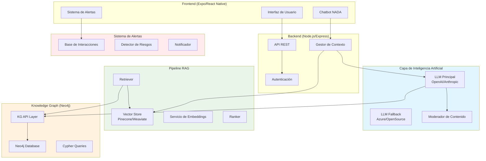
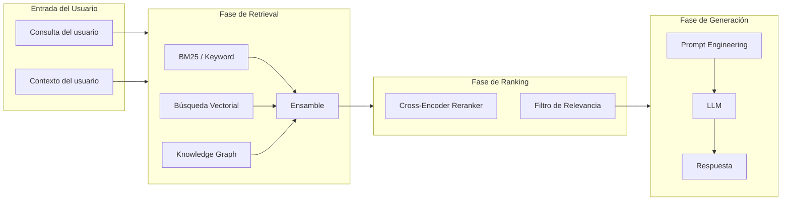
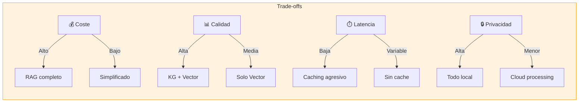

# 📘 Guía Completa de Implementación - Sprint 3: Neo4j, RAG, Integración AI y Sistema de Alertas

**KogniRecovery** - App de acompañamiento en adicciones  
**Sprint**: 3 (Knowledge Graph, RAG, AI y Alertas de Interacciones)  
**Duración estimada**: 4 semanas (20 días hábiles)  
**Estado**: Pendiente de implementación  
**Fecha de creación**: 21-02-2026

---

## 📋 Índice

1. [Visión General](#visión-general)
2. [Arquitectura del Sprint](#arquitectura-del-sprint)
3. [Neo4j Knowledge Graph](#neo4j-knowledge-graph)
   - [Schema de Grafos](#schema-de-grafos)
   - [Queries y CYPHER](#queries-y-cypher)
   - [Integración con Backend](#integración-con-backend)
4. [Pipeline RAG](#pipeline-rag)
   - [Arquitectura RAG](#arquitectura-rag)
   - [Chunking y Embeddings](#chunking-y-embeddings)
   - [Retrieval y Ranking](#retrieval-y-ranking)
5. [Integración de Servicios AI](#integración-de-servicios-ai)
   - [LLM Principal](#llm-principal)
   - [Fallback y Moderación](#fallback-y-moderación)
   - [Contexto y Memoria](#contexto-y-memoria)
6. [Sistema de Alertas de Interacción de Medicamentos](#sistema-de-alertas-de-interacción-de-medicamentos)
   - [Base de Conocimiento de Interacciones](#base-de-conocimiento-de-interacciones)
   - [Detección en Tiempo Real](#detección-en-tiempo-real)
   - [Protocolos de Alerta](#protocolos-de-alerta)
7. [Decisiones de Diseño](#decisiones-de-diseño)
8. [Plan de Implementación](#plan-de-implementación)
9. [Testing y Validación](#testing-y-validación)
10. [Checklist de Verificación](#checklist-de-verificación)

---

## 🎯 Visión General

### Objetivos del Sprint 3

El Sprint 3 tiene como objetivo implementar la infraestructura de inteligencia artificial avanzada de KogniRecovery:

- ✅ Neo4j Knowledge Graph para modelado de relaciones complejas
- ✅ Pipeline RAG (Retrieval-Augmented Generation) para respuestas contextuales
- ✅ Integración de servicios LLM con fallback y moderación
- ✅ Sistema de alertas de interacción de medicamentos en tiempo real
- ✅ Documentación completa de decisiones de diseño

### Dependencias del Sprint Anterior

Este sprint depende de funcionalidades implementadas en el Sprint 2:
- Chatbot NADA con prompts base
- Sistema de perfiles de usuario
- Check-in diario y registro de consumo
- Dashboard del paciente y familiar

---

## 🏗️ Arquitectura del Sprint

### Diagrama de Arquitectura General



### Tecnologías Principales

| Componente | Tecnología | Versión |
|------------|------------|---------|
| Knowledge Graph | Neo4j | 5.x |
| Vector Store | Pinecone/Weaviate | Latest |
| LLM Principal | OpenAI GPT-4 | Latest |
| LLM Fallback | Azure OpenAI | Latest |
| Embeddings | OpenAI text-embedding-3 | Latest |
| Servidor | Node.js | 20.x |
| Framework | Express.js | 4.x |

---

## 🗄️ Neo4j Knowledge Graph

### 1.1 Schema de Grafos

El Knowledge Graph de KogniRecovery modela las siguientes entidades y relaciones:

```cypher
// Nodos Principales
(:Usuario)
(:Perfil)
(:Sustancia)
(:Medicamento)
(:Interaccion)
(:CheckIn)
(:Craving)
(:Emergencia)
(:Recurso)
(:Technique)
(:Etiqueta)

// Relaciones
(:Usuario)-[:TIENE_PERFIL]->(:Perfil)
(:Usuario)-[:REGISTRA]->(:CheckIn)
(:Usuario)-[:EXPERIMENTA]->(:Craving)
(:Usuario)-[:USA]->(:Sustancia)
(:Usuario)-[:TOMA]->(:Medicamento)
(:Sustancia)-[:INTERACTUA_CON]->(:Medicamento)
(:Sustancia)-[:INTERACTUA_CON]->(:Sustancia)
(:Medicamento)-[:INTERACTUA_CON]->(:Medicamento)
(:CheckIn)-[:TIENE_ETIQUETA]->(:Etiqueta)
(:Craving)-[:TIENE_TRIGGER]->(:Etiqueta)
(:Usuario)-[:ACCEDE_A]->(:Recurso)
(:Usuario)-[:CONOCE]->(:Technique)
```

### 1.2 Modelo de Datos Detallado

#### Nodo: Usuario

```cypher
(:Usuario {
  id: UUID,
  nombre: STRING,
  edad: INTEGER,
  genero: STRING,
  pais: STRING,
  etapa_cambio: STRING,  // precontemplacion, contemplacion, preparacion, accion, mantencion
  riesgo: STRING,        // bajo, medio, alto, critico
  fecha_registro: DATETIME,
  ultimo_checkin: DATETIME,
  estado: STRING        // activo, inactivo,危机的
})
```

#### Nodo: Sustancia

```cypher
(:Sustancia {
  id: STRING,
  nombre: STRING,
  nombre_comercial: LIST<STRING>,
  categoria: STRING,    // alcohol, opioide, estimulante, benzodiacepina, cannabis
  riesgo_abstinencia: STRING,  // ninguno, leve, moderado, severo
  efectos: LIST<STRING>,
  interacciones_conocidas: LIST<STRING>
})
```

#### Nodo: Medicamento

```cypher
(:Medicamento {
  id: STRING,
  nombre: STRING,
  principio_activo: STRING,
  categoria: STRING,    // analgesico, ansiolitico, antidepresivo, etc.
  interacciones: LIST<STRING>,
  advertencias: LIST<STRING>,
  requiere_receta: BOOLEAN
})
```

#### Nodo: Interaccion

```cypher
(:Interaccion {
  id: STRING,
  tipo: STRING,         // peligrosa, moderada, minima
  severidad: INTEGER,   // 1-10
  descripcion: STRING,
  recomendaciones: STRING,
  sintomas: LIST<STRING>
})
```

#### Nodo: Recurso

```cypher
(:Recurso {
  id: STRING,
  titulo: STRING,
  tipo: STRING,         // articulo, video, linea_crisis, grupo_apoyo
  url: STRING,
  paises: LIST<STRING>,
  etiquetas: LIST<STRING>,
  contenido_resumen: STRING
})
```

### 1.3 Queries Principales

#### Query: Contexto del Chatbot

```cypher
// Obtener contexto relevante para el chatbot
MATCH (u:Usuario {id: $userId})-[:TIENE_PERFIL]->(p:Perfil)
MATCH (u)-[:REGISTRA]->(c:CheckIn)
WHERE c.fecha >= datetime() - duration({days: 7})
MATCH (c)-[:TIENE_ETIQUETA]->(e:Etiqueta)
MATCH (s:Sustancia)<-[:USA]-u
OPTIONAL MATCH (s)-[i:INTERACTUA_CON]->(m:Medicamento)
WHERE m IN u.recursos_tomados
RETURN u, p, collect(DISTINCT c) as checkins_recientes, 
       collect(DISTINCT e) as etiquetas,
       collect(DISTINCT s) as sustancias,
       collect(DISTINCT i) as interacciones_potenciales
```

#### Query: Alertas de Interacción

```cypher
// Detectar interacciones peligrosas entre sustancias y medicamentos
MATCH (s1:Sustancia)<-[:USA]-(u:Usuario {id: $userId})
MATCH (m:Medicamento)<-[:TOMA]-(u)
MATCH (s1)-[i:INTERACTUA_CON]->(m)
WHERE i.severidad >= 7
RETURN s1, m, i
ORDER BY i.severidad DESC
```

#### Query: Insights de Check-in

```cypher
// Generar insights basados en patrones de check-in
MATCH (u:Usuario {id: $userId})-[:REGISTRA]->(c:CheckIn)
WHERE c.fecha >= datetime() - duration({days: 30})
MATCH (c)-[:TIENE_ETIQUETA]->(e:Etiqueta)
WITH u, c, e, count(c) as frecuencia
WHERE frecuencia > 3
MATCH (craving:Craving)<-[:EXPERIMENTA]-(u)
WHERE craving.fecha >= datetime() - duration({days: 7})
RETURN u, collect(DISTINCT e) as patrones_emocionales,
       collect(DISTINCT {fecha: craving.fecha, intensidad: craving.intensidad}) as cravings_recientes
```

#### Query: Widgets del Dashboard

```cypher
// Obtener datos para widgets del dashboard
MATCH (u:Usuario {id: $userId})
// Check-ins últimos 7 días
OPTIONAL MATCH (u)-[:REGISTRA]->(c:CheckIn)
WHERE c.fecha >= datetime() - duration({days: 7})
// Cravings últimos 7 días
OPTIONAL MATCH (u)-[:EXPERIMENTA]->(cr:Craving)
WHERE cr.fecha >= datetime() - duration({days: 7})
// Sustancias activo
OPTIONAL MATCH (u)-[:USA]->(s:Sustancia)
// Recursos recomendados
OPTIONAL MATCH (u)-[:ACCEDE_A]->(r:Recurso)
WHERE r.tipo IN ['articulo', 'video']
RETURN u,
       count(c) as checkins_semana,
       avg(c.consumo_cantidad) as promedio_consumo,
       count(cr) as cravings_semana,
       avg(cr.intensidad) as promedio_craving,
       collect(DISTINCT s.nombre) as sustancias_activas,
       collect(DISTINCT r) as recursos_recomendados
LIMIT 1
```

### 1.4 Integración con Backend

#### Servicio de Neo4j

```typescript
// server/src/services/neo4j.service.ts
import neo4j from 'neo4j-driver';

export class Neo4jService {
  private driver: neo4j.Driver;
  
  constructor() {
    this.driver = neo4j.driver(
      process.env.NEO4J_URI || 'bolt://localhost:7687',
      neo4j.auth.basic(
        process.env.NEO4J_USER || 'neo4j',
        process.env.NEO4J_PASSWORD || 'password'
      )
    );
  }

  async executeQuery<T>(query: string, params: Record<string, any> = {}): Promise<T[]> {
    const session = this.driver.session();
    try {
      const result = await session.run(query, params);
      return result.records.map(record => {
        const obj: any = {};
        record.keys.forEach(key => {
          obj[key] = record.get(key);
        });
        return obj;
      });
    } finally {
      await session.close();
    }
  }

  async getChatbotContext(userId: string) {
    const query = `
      MATCH (u:Usuario {id: $userId})-[:TIENE_PERFIL]->(p:Perfil)
      MATCH (u)-[:REGISTRA]->(c:CheckIn)
      WHERE c.fecha >= datetime() - duration({days: 7})
      MATCH (c)-[:TIENE_ETIQUETA]->(e:Etiqueta)
      OPTIONAL MATCH (s:Sustancia)<-[:USA]-u
      OPTIONAL MATCH (s)-[i:INTERACTUA_CON]->(m:Medicamento)
      WHERE m IN u.recursos_tomados
      RETURN u, p, collect(DISTINCT c) as checkins_recientes, 
             collect(DISTINCT e) as etiquetas,
             collect(DISTINCT s.nombre) as sustancias
    `;
    return this.executeQuery(query, { userId });
  }

  async checkDrugInteractions(userId: string) {
    const query = `
      MATCH (s1:Sustancia)<-[:USA]-(u:Usuario {id: $userId})
      MATCH (m:Medicamento)<-[:TOMA]-(u)
      MATCH (s1)-[i:INTERACTUA_CON]->(m)
      WHERE i.severidad >= 7
      RETURN s1.nombre as sustancia, m.nombre as medicamento, 
             i.severidad as severidad, i.descripcion as descripcion
      ORDER BY i.severidad DESC
    `;
    return this.executeQuery(query, { userId });
  }

  async getDashboardData(userId: string) {
    const query = `
      MATCH (u:Usuario {id: $userId})
      OPTIONAL MATCH (u)-[:REGISTRA]->(c:CheckIn)
      WHERE c.fecha >= datetime() - duration({days: 7})
      OPTIONAL MATCH (u)-[:EXPERIMENTA]->(cr:Craving)
      WHERE cr.fecha >= datetime() - duration({days: 7})
      OPTIONAL MATCH (u)-[:USA]->(s:Sustancia)
      RETURN u,
             count(c) as checkins_semana,
             avg(c.consumo_cantidad) as promedio_consumo,
             count(cr) as cravings_semana,
             collect(DISTINCT s.nombre) as sustancias_activas
      LIMIT 1
    `;
    return this.executeQuery(query, { userId });
  }

  async close() {
    await this.driver.close();
  }
}
```

---

## 🔍 Pipeline RAG

### 2.1 Arquitectura RAG



### 2.2 Fuentes de Conocimiento

El pipeline RAG utiliza las siguientes fuentes de conocimiento:

| Fuente | Tipo | Descripción |
|--------|------|-------------|
| Documentación médica | PDF/Markdown | Interacciones de medicamentos, efectos de sustancias |
| FAQs y guías | JSON | Respuestas a preguntas frecuentes |
| Técnicas terapéuticas | JSON | CBT, DBT, MI, Mindfulness |
| Recursos locales | JSON | Líneas de crisis, grupos de apoyo por país |
| Knowledge Graph | Neo4j | Datos contextuales del usuario |

### 2.3 Chunking y Embeddings

#### Estrategia de Chunking

```typescript
// server/src/services/rag/chunking.ts
interface Chunk {
  id: string;
  content: string;
  source: string;
  sourceType: 'document' | 'faq' | 'technique' | 'resource' | 'kg';
  metadata: {
    title?: string;
    category?: string;
    tags?: string[];
    country?: string[];
    audience?: string[];  // adolescente, adulto, mayor, etc.
  };
  embedding?: number[];
}

export class ChunkingService {
  private readonly CHUNK_SIZE = 512;
  private readonly CHUNK_OVERLAP = 50;

  async chunkDocument(text: string, source: string, metadata: any): Promise<Chunk[]> {
    const chunks: Chunk[] = [];
    const sentences = this.splitIntoSentences(text);
    
    let currentChunk = '';
    let chunkId = 0;

    for (const sentence of sentences) {
      if ((currentChunk + sentence).length > this.CHUNK_SIZE) {
        if (currentChunk) {
          chunks.push({
            id: `${source}_${chunkId++}`,
            content: currentChunk.trim(),
            source,
            sourceType: 'document',
            metadata
          });
        }
        currentChunk = sentence;
      } else {
        currentChunk += ' ' + sentence;
      }
    }

    if (currentChunk) {
      chunks.push({
        id: `${source}_${chunkId}`,
        content: currentChunk.trim(),
        source,
        sourceType: 'document',
        metadata
      });
    }

    return chunks;
  }

  private splitIntoSentences(text: string): string[] {
    // Dividir por oraciones considerando español
    return text.match(/[^.!?]+[.!?]+/g) || [text];
  }

  async chunkFAQ(faqs: any[]): Promise<Chunk[]> {
    return faqs.map((faq, index) => ({
      id: `faq_${index}`,
      content: `Pregunta: ${faq.question}\nRespuesta: ${faq.answer}`,
      source: 'faq',
      sourceType: 'faq',
      metadata: {
        category: faq.category,
        tags: faq.tags,
        audience: faq.audience
      }
    }));
  }

  async chunkTechniques(techniques: any[]): Promise<Chunk[]> {
    return techniques.map((technique, index) => ({
      id: `technique_${index}`,
      content: `Técnica: ${technique.name}\n${technique.description}\nPasos: ${technique.steps.join(', ')}`,
      source: 'techniques',
      sourceType: 'technique',
      metadata: {
        category: technique.category,  // CBT, DBT, MI, Mindfulness
        tags: technique.tags,
        audience: technique.audience
      }
    }));
  }
}
```

#### Generación de Embeddings

```typescript
// server/src/services/rag/embeddings.ts
import { OpenAI } from 'openai';

export class EmbeddingsService {
  private openai: OpenAI;

  constructor() {
    this.openai = new OpenAI({
      apiKey: process.env.OPENAI_API_KEY
    });
  }

  async generateEmbedding(text: string): Promise<number[]> {
    const response = await this.openai.embeddings.create({
      model: 'text-embedding-3-small',
      input: text
    });
    
    return response.data[0].embedding;
  }

  async generateEmbeddings(texts: string[]): Promise<number[][]> {
    const response = await this.openai.embeddings.create({
      model: 'text-embedding-3-small',
      input: texts
    });
    
    return response.data.map(item => item.embedding);
  }

  async generateContextualEmbedding(text: string, context: string): Promise<number[]> {
    // Generar embedding con contexto adicional del usuario
    const contextualText = `
      Contexto del usuario: ${context}
      Consulta: ${text}
    `;
    return this.generateEmbedding(contextualText);
  }
}
```

### 2.4 Retrieval y Ranking

#### Servicio de Retrieval

```typescript
// server/src/services/rag/retriever.ts
import { Pinecone } from '@pinecone-database/pinecone';
import { Neo4jService } from '../neo4j.service';
import { EmbeddingsService } from './embeddings';

interface RetrievedChunk {
  chunk: Chunk;
  score: number;
  source: string;
}

export class RetrieverService {
  private pinecone: Pinecone;
  private index: any;
  private neo4j: Neo4jService;
  private embeddings: EmbeddingsService;

  constructor() {
    this.pinecone = new Pinecone({ apiKey: process.env.PINECONE_API_KEY! });
    this.index = this.pinecone.Index(process.env.PINECONE_INDEX || 'kognirecovery');
    this.neo4j = new Neo4jService();
    this.embeddings = new EmbeddingsService();
  }

  async retrieve(
    query: string,
    userContext: {
      userId: string;
      profile: string;
      etapaCambio: string;
      sustancias: string[];
      pais: string;
    },
    topK: number = 5
  ): Promise<RetrievedChunk[]> {
    // 1. Generar embedding de la consulta
    const queryEmbedding = await this.embeddings.generateEmbedding(query);

    // 2. Búsqueda vectorial
    const vectorResults = await this.vectorSearch(queryEmbedding, topK * 2);

    // 3. Búsqueda en Knowledge Graph
    const kgResults = await this.knowledgeGraphSearch(userContext);

    // 4. Búsqueda por palabras clave (BM25)
    const keywordResults = await this.keywordSearch(query, topK);

    // 5. Ensamble de resultados
    const combinedResults = this.combineResults(
      vectorResults,
      kgResults,
      keywordResults,
      userContext
    );

    // 6. Filtrar por relevancia y contexto
    return this.filterByContext(combinedResults, userContext, topK);
  }

  private async vectorSearch(embedding: number[], topK: number): Promise<RetrievedChunk[]> {
    const results = await this.index.query({
      vector: embedding,
      topK,
      includeMetadata: true,
      includeValues: true
    });

    return results.matches.map(match => ({
      chunk: match.metadata as unknown as Chunk,
      score: match.score || 0,
      source: 'vector'
    }));
  }

  private async knowledgeGraphSearch(userContext: any): Promise<RetrievedChunk[]> {
    // Consultar Neo4j para obtener información relevante
    const results = await this.neo4j.getChatbotContext(userContext.userId);
    
    // Convertir resultados del KG a formato de chunks
    return results.map((record: any) => ({
      chunk: {
        id: `kg_${record.u.id}`,
        content: `Información del usuario: ${JSON.stringify(record)}`,
        source: 'knowledge_graph',
        sourceType: 'kg',
        metadata: {}
      },
      score: 0.9,
      source: 'kg'
    }));
  }

  private async keywordSearch(query: string, topK: number): Promise<RetrievedChunk[]> {
    // Implementación de búsqueda por palabras clave
    // Usando términos de la consulta para filtrar
    const keywords = query.toLowerCase().split(/\s+/);
    
    // Esta es una implementación simplificada
    // En producción se usaría BM25 de Pinecone o Elasticsearch
    return [];
  }

  private combineResults(
    vectorResults: RetrievedChunk[],
    kgResults: RetrievedChunk[],
    keywordResults: RetrievedChunk[],
    userContext: any
  ): RetrievedChunk[] {
    const seen = new Map<string, RetrievedChunk>();
    const weights = { vector: 0.4, kg: 0.4, keyword: 0.2 };

    // Ponderar resultados
    for (const result of vectorResults) {
      const key = result.chunk.id;
      if (!seen.has(key) || seen.get(key)!.score < result.score * weights.vector) {
        seen.set(key, { ...result, score: result.score * weights.vector });
      }
    }

    for (const result of kgResults) {
      const key = result.chunk.id;
      if (!seen.has(key) || seen.get(key)!.score < result.score * weights.kg) {
        seen.set(key, { ...result, score: result.score * weights.kg });
      }
    }

    for (const result of keywordResults) {
      const key = result.chunk.id;
      if (!seen.has(key) || seen.get(key)!.score < result.score * weights.keyword) {
        seen.set(key, { ...result, score: result.score * weights.keyword });
      }
    }

    return Array.from(seen.values()).sort((a, b) => b.score - a.score);
  }

  private filterByContext(
    results: RetrievedChunk[],
    userContext: any,
    topK: number
  ): RetrievedChunk[] {
    return results
      .filter(result => {
        const metadata = result.chunk.metadata;
        
        // Filtrar por audiencia
        if (metadata.audience && metadata.audience.length > 0) {
          const matchesAudience = metadata.audience.some((a: string) => 
            userContext.profile.includes(a)
          );
          if (!matchesAudience && metadata.audience[0] !== 'all') {
            return false;
          }
        }

        // Filtrar por país
        if (metadata.country && metadata.country.length > 0) {
          if (!metadata.country.includes(userContext.pais)) {
            return false;
          }
        }

        return true;
      })
      .slice(0, topK);
  }
}
```

#### Cross-Encoder Reranker

```typescript
// server/src/services/rag/ranker.ts
import { OpenAI } from 'openai';

export class RankerService {
  private openai: OpenAI;

  constructor() {
    this.openai = new OpenAI({
      apiKey: process.env.OPENAI_API_KEY
    });
  }

  async rerank(
    query: string,
    chunks: RetrievedChunk[],
    topK: number = 3
  ): Promise<RetrievedChunk[]> {
    if (chunks.length <= topK) {
      return chunks;
    }

    // Crear pares query-chunk para reranking
    const pairs = chunks.map(chunk => ({
      query,
      chunk: chunk.chunk.content
    }));

    // Usar modelo de reranking (en producción usar Cross-Encoder específico)
    // Aquí usamos GPT para reranking (más costoso pero efectivo)
    const scoredChunks = await Promise.all(
      chunks.map(async (chunk) => {
        const relevance = await this.computeRelevance(query, chunk.chunk.content);
        return { ...chunk, score: relevance };
      })
    );

    return scoredChunks
      .sort((a, b) => b.score - a.score)
      .slice(0, topK);
  }

  private async computeRelevance(query: string, chunkContent: string): Promise<number> {
    // Implementación simplificada usando GPT
    // En producción usar Cross-Encoder específico
    const response = await this.openai.chat.completions.create({
      model: 'gpt-4-turbo',
      messages: [
        {
          role: 'system',
          content: 'Eres un evaluador de relevancia. Del 0 al 1, ¿qué tan relevante es el siguiente chunk para la consulta? Responde solo con un número.'
        },
        {
          role: 'user',
          content: `Consulta: "${query}"\n\nChunk: "${chunkContent.substring(0, 500)}"`
        }
      ],
      max_tokens: 5,
      temperature: 0
    });

    const score = parseFloat(response.choices[0].message.content || '0');
    return isNaN(score) ? 0 : score;
  }
}
```

### 2.5 Generación de Respuestas

```typescript
// server/src/services/rag/generator.ts
import { OpenAI } from 'openai';
import { PromptService } from '../prompt.service';

export class GeneratorService {
  private openai: OpenAI;
  private promptService: PromptService;

  constructor() {
    this.openai = new OpenAI({
      apiKey: process.env.OPENAI_API_KEY
    });
    this.promptService = new PromptService();
  }

  async generate(
    query: string,
    retrievedChunks: RetrievedChunk[],
    userContext: any,
    conversationHistory: Message[]
  ): Promise<{
    content: string;
    sources: string[];
    suggestions: string[];
  }> {
    // Construir contexto desde los chunks recuperados
    const context = retrievedChunks
      .map((c, i) => `[${i + 1}] ${c.chunk.content}`)
      .join('\n\n');

    // Obtener prompt del sistema según el perfil del usuario
    const systemPrompt = await this.promptService.getSystemPrompt(
      userContext.profile,
      userContext.etapaCambio
    );

    // Construir historial de conversación
    const history = conversationHistory
      .slice(-10)  // Últimos 10 mensajes
      .map(m => `${m.role === 'user' ? 'Usuario' : 'Asistente'}: ${m.content}`)
      .join('\n');

    // Generar respuesta
    const response = await this.openai.chat.completions.create({
      model: 'gpt-4-turbo',
      messages: [
        { role: 'system', content: systemPrompt },
        { role: 'system', content: `Información de contexto:\n${context}` },
        ...(history ? [{ role: 'system', content: `Historial:\n${history}` }] : []),
        { role: 'user', content: query }
      ],
      max_tokens: 1000,
      temperature: 0.7,
      top_p: 0.9
    });

    const content = response.choices[0].message.content || '';

    // Extraer fuentes
    const sources = retrievedChunks.map(c => c.chunk.source);

    // Generar sugerencias
    const suggestions = await this.generateSuggestions(
      query,
      content,
      userContext
    );

    return { content, sources, suggestions };
  }

  private async generateSuggestions(
    query: string,
    response: string,
    userContext: any
  ): Promise<string[]> {
    // Generar preguntas de seguimiento basadas en el contexto
    const responseAI = await this.openai.chat.completions.create({
      model: 'gpt-4-turbo',
      messages: [
        {
          role: 'system',
          content: 'Genera 3 preguntas de seguimiento breves que el usuario podría hacer. Una por línea.'
        },
        {
          role: 'user',
          content: `Consulta: ${query}\nRespuesta: ${response.substring(0, 500)}`
        }
      ],
      max_tokens: 150,
      temperature: 0.7
    });

    return (responseAI.choices[0].message.content || '')
      .split('\n')
      .filter(s => s.trim())
      .slice(0, 3);
  }
}
```

---

## 🤖 Integración de Servicios AI

### 3.1 LLM Principal

```typescript
// server/src/services/ai/llm.service.ts
import { OpenAI } from 'openai';
import { Neo4jService } from '../neo4j.service';
import { RetrieverService } from '../rag/retriever';
import { RankerService } from '../rag/ranker';
import { GeneratorService } from '../rag/generator';

interface ChatMessage {
  role: 'user' | 'assistant' | 'system';
  content: string;
}

interface ChatContext {
  userId: string;
  profile: string;
  etapaCambio: string;
  sustancias: string[];
  pais: string;
  riskLevel: 'bajo' | 'medio' | 'alto' | 'critico';
}

export class LLMService {
  private openai: OpenAI;
  private neo4j: Neo4jService;
  private retriever: RetrieverService;
  private ranker: RankerService;
  private generator: GeneratorService;

  constructor() {
    this.openai = new OpenAI({
      apiKey: process.env.OPENAI_API_KEY
    });
    this.neo4j = new Neo4jService();
    this.retriever = new RetrieverService();
    this.ranker = new RankerService();
    this.generator = new GeneratorService();
  }

  async chat(
    message: string,
    context: ChatContext,
    conversationHistory: ChatMessage[]
  ): Promise<{
    content: string;
    sources: string[];
    suggestions: string[];
    riskLevel: string;
  }> {
    // 1. Verificar nivel de riesgo del mensaje
    const riskAnalysis = await this.analyzeRisk(message, context);
    
    if (riskAnalysis.level === 'critico') {
      return {
        content: this.getCrisisResponse(context.pais),
        sources: [],
        suggestions: [],
        riskLevel: 'critico'
      };
    }

    // 2. Recuperar información relevante
    const retrievedChunks = await this.retriever.retrieve(
      message,
      {
        userId: context.userId,
        profile: context.profile,
        etapaCambio: context.etapaCambio,
        sustancias: context.sustancias,
        pais: context.pais
      },
      5
    );

    // 3. Rerankear resultados
    const rerankedChunks = await this.ranker.rerank(message, retrievedChunks, 3);

    // 4. Generar respuesta
    const { content, sources, suggestions } = await this.generator.generate(
      message,
      rerankedChunks,
      context,
      conversationHistory as Message[]
    );

    return {
      content,
      sources,
      suggestions,
      riskLevel: riskAnalysis.level
    };
  }

  private async analyzeRisk(
    message: string,
    context: ChatContext
  ): Promise<{ level: string; reasons: string[] }> {
    const lowerMessage = message.toLowerCase();
    
    // Palabras clave de riesgo crítico
    const criticalKeywords = [
      'suicidio', 'quitarme la vida', 'morir', 'no quiero vivir',
      'overdose', 'sobredosis', 'me voy a morir'
    ];

    // Palabras clave de riesgo alto
    const highRiskKeywords = [
      'no aguanto', 'no puedo más', 'mejor muerto', 'no vale la pena',
      'autolesión', 'cortarme', 'hacerme daño'
    ];

    // Verificar crítico
    if (criticalKeywords.some(kw => lowerMessage.includes(kw))) {
      return { level: 'critico', reasons: ['Palabras clave de suicidio/sobredosis detectadas'] };
    }

    // Verificar alto
    if (highRiskKeywords.some(kw => lowerMessage.includes(kw))) {
      return { level: 'alto', reasons: ['Palabras clave de autolesión detectadas'] };
    }

    // Verificar historial de riesgo del usuario
    if (context.riskLevel === 'alto' || context.riskLevel === 'critico') {
      return { level: 'medio', reasons: ['Usuario en seguimiento de riesgo'] };
    }

    return { level: 'bajo', reasons: [] };
  }

  private getCrisisResponse(pais: string): string {
    const crisisLines: Record<string, string> = {
      'AR': '135 (Atención en Adicciones), 911 (emergencias)',
      'MX': 'Línea de la Vida 800 911 2000, 911',
      'CL': '1450 (Atención en Adicciones), 131 (ambulancia)',
      'ES': '024 (suicidio), 112 (emergencias)',
      'US': '988 (suicide & crisis lifeline), 911'
    };

    const line = crisisLines[pais] || '911';

    return `
⚠️ **Estás en un momento difícil y quiero ayudarte.**

Te escucho. No estás solo/a. Hay personas que pueden ayudarte ahora mismo:

**📞 Llama inmediatamente a:**
- **${line}**

**🏥 También puedes:**
- Ir a tu sala de emergencias más cercana
- Contactar a tu contacto de emergencia

**💙 Recuerda:**
- Esto es temporal
- Hay personas que quieren ayudarte
- No tienes que pasar por esto solo/a

¿Te acompaño mientras contactas a alguien? ¿O prefieres que te muestre los números de ayuda?
`.trim();
  }
}
```

### 3.2 Fallback y Moderación

```typescript
// server/src/services/ai/fallback.service.ts
import { AzureOpenAI } from 'azure-openai';

interface ModerationResult {
  flagged: boolean;
  categories: {
    hate: boolean;
    harassment: boolean;
    selfHarm: boolean;
    violence: boolean;
    sexual: boolean;
  };
}

export class FallbackService {
  private azureOpenAI: AzureOpenAI | null = null;
  private moderationClient: any;

  constructor() {
    if (process.env.AZURE_OPENAI_ENDPOINT) {
      this.azureOpenAI = new AzureOpenAI({
        endpoint: process.env.AZURE_OPENAI_ENDPOINT,
        apiKey: process.env.AZURE_OPENAI_KEY,
        apiVersion: '2024-02-01'
      });
    }
  }

  async generateWithFallback(
    messages: any[],
    systemPrompt: string
  ): Promise<string> {
    try {
      // Intentar con OpenAI principal
      return await this.generateWithOpenAI(messages, systemPrompt);
    } catch (error) {
      console.error('OpenAI failed, trying fallback:', error);
      
      try {
        // Intentar con Azure OpenAI
        return await this.generateWithAzure(messages, systemPrompt);
      } catch (azureError) {
        console.error('Azure failed, trying local model:', azureError);
        
        // Último recurso: modelo local o respuesta predefinida
        return this.getFallbackResponse();
      }
    }
  }

  private async generateWithOpenAI(messages: any[], systemPrompt: string): Promise<string> {
    const { OpenAI } = require('openai');
    const openai = new OpenAI({ apiKey: process.env.OPENAI_API_KEY });
    
    const response = await openai.chat.completions.create({
      model: 'gpt-4-turbo',
      messages: [
        { role: 'system', content: systemPrompt },
        ...messages
      ],
      max_tokens: 1000,
      temperature: 0.7
    });

    return response.choices[0].message.content;
  }

  private async generateWithAzure(messages: any[], systemPrompt: string): Promise<string> {
    if (!this.azureOpenAI) throw new Error('Azure not configured');
    
    const response = await this.azureOpenAI.chat.completions.create({
      model: 'gpt-4',
      messages: [
        { role: 'system', content: systemPrompt },
        ...messages
      ],
      max_tokens: 1000,
      temperature: 0.7
    });

    return response.choices[0].message.content;
  }

  private getFallbackResponse(): string {
    return `
Lo siento, estoy teniendo dificultades técnicas en este momento. 

¿Puedes intentar de nuevo en unos minutos? 

Si necesitas ayuda inmediata, recuerda que puedes contactar a:
- Líneas de crisis locales
- Tu contacto de emergencia

¿Te interesa que intente responderte de otra manera?
`.trim();
  }

  async moderateContent(text: string): Promise<ModerationResult> {
    const { OpenAI } = require('openai');
    const openai = new OpenAI({ apiKey: process.env.OPENAI_API_KEY });
    
    try {
      const response = await openai.moderations.create({ input: text });
      const result = response.results[0];
      
      return {
        flagged: result.flagged,
        categories: {
          hate: result.categories.hate || false,
          harassment: result.categories.harassment || false,
          selfHarm: result.categories['self-harm'] || false,
          violence: result.categories.violence || false,
          sexual: result.categories.sexual || false
        }
      };
    } catch (error) {
      // Si falla moderación, asumir que está ok pero con warning
      return {
        flagged: false,
        categories: {
          hate: false,
          harassment: false,
          selfHarm: false,
          violence: false,
          sexual: false
        }
      };
    }
  }
}
```

### 3.3 Contexto y Memoria

```typescript
// server/src/services/ai/context.service.ts
import { Neo4jService } from '../neo4j.service';

interface UserContext {
  userId: string;
  profile: string;
  etapaCambio: string;
  sustancias: string[];
  pais: string;
  ultimoCheckin: Date | null;
  riskLevel: string;
}

interface ConversationMessage {
  id: string;
  role: 'user' | 'assistant';
  content: string;
  timestamp: Date;
}

export class ContextService {
  private neo4j: Neo4jService;
  private contextCache: Map<string, { context: UserContext; timestamp: number }>;
  private readonly CACHE_TTL = 3600000; // 1 hora

  constructor() {
    this.neo4j = new Neo4jService();
    this.contextCache = new Map();
  }

  async getUserContext(userId: string): Promise<UserContext> {
    // Verificar cache
    const cached = this.contextCache.get(userId);
    if (cached && Date.now() - cached.timestamp < this.CACHE_TTL) {
      return cached.context;
    }

    // Consultar Neo4j
    const query = `
      MATCH (u:Usuario {id: $userId})
      OPTIONAL MATCH (u)-[:TIENE_PERFIL]->(p:Perfil)
      OPTIONAL MATCH (u)-[:USA]->(s:Sustancia)
      OPTIONAL MATCH (u)-[:REGISTRA]->(c:CheckIn)
      WITH u, p, collect(DISTINCT s.nombre) as sustancias, max(c.fecha) as ultimo_checkin
      RETURN u.id as userId, u.etapa_cambio as etapaCambio, 
             u.riesgo as riskLevel, u.pais as pais,
             p.nombre as profile, ultimo_checkin, sustancias
    `;

    const results = await this.neo4j.executeQuery(query, { userId });
    
    if (results.length === 0) {
      throw new Error('Usuario no encontrado');
    }

    const context: UserContext = {
      userId: results[0].userId,
      profile: results[0].profile || 'base',
      etapaCambio: results[0].etapaCambio || 'contemplacion',
      sustancias: results[0].sustancias || [],
      pais: results[0].pais || 'AR',
      ultimoCheckin: results[0].ultimo_checkin,
      riskLevel: results[0].riskLevel || 'bajo'
    };

    // Actualizar cache
    this.contextCache.set(userId, {
      context,
      timestamp: Date.now()
    });

    return context;
  }

  async getConversationHistory(
    userId: string,
    sessionId: string,
    limit: number = 20
  ): Promise<ConversationMessage[]> {
    // Consultar historial de conversación
    const query = `
      MATCH (u:Usuario {id: $userId})-[:TIENE]->(conv:Conversacion {id: $sessionId})-[:CONTIENE]->(m:Mensaje)
      RETURN m.id as id, m.role as role, m.contenido as content, m.fecha as timestamp
      ORDER BY m.fecha DESC
      LIMIT $limit
    `;

    const results = await this.neo4j.executeQuery(query, { 
      userId, 
      sessionId, 
      limit 
    });

    return results.reverse().map((r: any) => ({
      id: r.id,
      role: r.role,
      content: r.content,
      timestamp: new Date(r.timestamp)
    }));
  }

  async addMessageToHistory(
    userId: string,
    sessionId: string,
    role: 'user' | 'assistant',
    content: string
  ): Promise<void> {
    const query = `
      MATCH (u:Usuario {id: $userId})-[:TIENE]->(conv:Conversacion {id: $sessionId})
      CREATE (conv)-[:CONTIENE]->(m:Mensaje {
        id: randomUUID(),
        role: $role,
        contenido: $content,
        fecha: datetime()
      })
    `;

    await this.neo4j.executeQuery(query, { userId, sessionId, role, content });
  }

  clearCache(userId?: string) {
    if (userId) {
      this.contextCache.delete(userId);
    } else {
      this.contextCache.clear();
    }
  }
}
```

---

## 🚨 Sistema de Alertas de Interacción de Medicamentos

### 4.1 Base de Conocimiento de Interacciones

```typescript
// server/src/services/alerts/interactions.db.ts
interface DrugInteraction {
  id: string;
  drug1: string;
  drug2: string;
  severity: 1 | 2 | 3 | 4 | 5 | 6 | 7 | 8 | 9 | 10;
  risk: 'minima' | 'moderada' | 'peligrosa' | 'potencialmente letal';
  description: string;
  mechanism: string;
  symptoms: string[];
  recommendations: string[];
  references: string[];
}

interface SubstanceInteraction {
  id: string;
  substance: string;
  drug: string;
  severity: number;
  risk: string;
  description: string;
  recommendations: string[];
}

// Base de conocimientos de interacciones conocida
const KNOWN_INTERACTIONS: DrugInteraction[] = [
  {
    id: '1',
    drug1: 'oxicodona',
    drug2: 'alcohol',
    severity: 10,
    risk: 'potencialmente letal',
    description: 'La combinación de opioides y alcohol puede causar depresión respiratoria severa, pérdida de conciencia y muerte.',
    mechanism: 'Efecto sinérgico sobre el sistema nervioso central',
    symptoms: ['respiración lenta', 'piel fría y húmeda', 'pupilas pequeñas', 'pérdida de conciencia'],
    recommendations: ['Evitar completamente la combinación', 'Si hay síntomas, llamar a emergencias inmediatamente'],
    references: ['FDA', 'NIH']
  },
  {
    id: '2',
    drug1: 'benzodiacepina',
    drug2: 'alcohol',
    severity: 9,
    risk: 'potencialmente letal',
    description: 'La combinación aumenta significativamente el riesgo de depresión respiratoria, sedación excesiva y muerte.',
    mechanism: 'Efecto aditivo sobre receptores GABA',
    symptoms: ['sedación extrema', 'confusión', 'respiración lenta', 'coma'],
    recommendations: ['Evitar completamente', 'No conducir', 'No operar maquinaria'],
    references: ['FDA', 'SAMHSA']
  },
  {
    id: '3',
    drug1: 'metadona',
    drug2: 'benzodiacepina',
    severity: 9,
    risk: 'potencialmente letal',
    description: 'Riesgo elevado de muerte por depresión respiratoria.',
    mechanism: 'Efecto sinérgico sobre sistema nervioso central',
    symptoms: ['mareo', 'confusión', 'respiración depresiva'],
    recommendations: ['Evitar si es posible', 'Si necesario, bajo supervisión médica'],
    references: ['CDC']
  },
  {
    id: '4',
    drug1: 'cocaína',
    drug2: 'alcohol',
    severity: 7,
    risk: 'peligrosa',
    description: 'Formación de cocaetileno, metabolito cardiotóxico que aumenta riesgo de muerte súbita.',
    mechanism: 'Metabolismo hepático competitivo',
    symptoms: ['dolor torácico', 'arritmia', 'hipertensión severa'],
    recommendations: ['Evitar combinación', 'Hidratarse', 'No mezclar en misma sesión'],
    references: ['NIDA']
  },
  {
    id: '5',
    drug1: 'metanfetamina',
    drug2: 'alcohol',
    severity: 7,
    risk: 'peligrosa',
    description: 'Efectos contrapuestos pueden llevar a sobredosis inadvertida.',
    mechanism: 'Deshidrogenación del alcohol',
    symptoms: ['náuseas', 'vómitos', 'mareo', 'psicosis'],
    recommendations: ['Evitar combinación', 'Esperar mínimo 6 horas entre consumo'],
    references: ['NIDA']
  },
  {
    id: '6',
    drug1: 'viagra',
    drug2: 'nitroglicerina',
    severity: 10,
    risk: 'potencialmente letal',
    description: 'Caída masiva de presión arterial potencialmente mortal.',
    mechanism: 'Vasodilatación sinérgica',
    symptoms: ['mareo', 'desmayo', 'dolor torácico'],
    recommendations: ['No combinar', 'Consultar médico'],
    references: ['FDA']
  }
];

const KNOWN_SUBSTANCE_INTERACTIONS: SubstanceInteraction[] = [
  {
    id: 's1',
    substance: 'alcohol',
    drug: 'paracetamol',
    severity: 5,
    risk: 'moderada',
    description: 'Consumo excesivo de alcohol con paracetamol aumenta riesgo de daño hepático.',
    recommendations: ['Dosis máxima: 3g/día si bebe regularmente', 'Evitar binge drinking']
  },
  {
    id: 's2',
    substance: 'alcohol',
    drug: 'ibuprofeno',
    severity: 3,
    risk: 'minima',
    description: 'Aumenta riesgo de irritación gástrica.',
    recommendations: ['Tomar con comida', 'Evitar si hay historial úlcera']
  },
  {
    id: 's3',
    substance: 'alcohol',
    drug: 'warfarina',
    severity: 8,
    risk: 'peligrosa',
    description: 'Alcohol altera metabolismo de warfarina, aumentando riesgo de sangrado.',
    recommendations: ['Evitar alcohol o limitar severamente', 'Monitoreo de INR frecuente'],
    references: ['FDA']
  },
  {
    id: 's4',
    substance: 'cannabis',
    drug: 'warfarina',
    severity: 6,
    risk: 'moderada',
    description: 'Puede aumentar efecto anticoagulante.',
    recommendations: ['Monitoreo de INR', 'Informar al médico']
  }
];

export class InteractionsService {
  private interactions: DrugInteraction[];
  private substanceInteractions: SubstanceInteraction[];

  constructor() {
    this.interactions = KNOWN_INTERACTIONS;
    this.substanceInteractions = KNOWN_SUBSTANCE_INTERACTIONS;
  }

  checkInteraction(drug1: string, drug2: string): DrugInteraction | null {
    const d1 = drug1.toLowerCase();
    const d2 = drug2.toLowerCase();
    
    return this.interactions.find(i => 
      (i.drug1 === d1 && i.drug2 === d2) ||
      (i.drug1 === d2 && i.drug2 === d1)
    ) || null;
  }

  checkSubstanceInteraction(substance: string, drug: string): SubstanceInteraction | null {
    const s = substance.toLowerCase();
    const d = drug.toLowerCase();
    
    return this.substanceInteractions.find(i =>
      (i.substance === s && i.drug === d) ||
      (i.substance === s && i.drug.includes(d)) ||
      (i.drug === d && i.substance.includes(s))
    ) || null;
  }

  getAllInteractionsForDrug(drug: string): (DrugInteraction | SubstanceInteraction)[] {
    const d = drug.toLowerCase();
    const results: (DrugInteraction | SubstanceInteraction)[] = [];
    
    // Interacciones droga-droga
    results.push(...this.interactions.filter(i => 
      i.drug1.includes(d) || i.drug2.includes(d)
    ));
    
    // Interacciones sustancia-medicamento
    results.push(...this.substanceInteractions.filter(i =>
      i.drug.includes(d) || d.includes(i.drug)
    ));
    
    return results;
  }

  getInteractionsForSubstance(substance: string): SubstanceInteraction[] {
    const s = substance.toLowerCase();
    return this.substanceInteractions.filter(i => 
      i.substance.includes(s) || s.includes(i.substance)
    );
  }

  addInteraction(interaction: DrugInteraction | SubstanceInteraction): void {
    if ('drug1' in interaction) {
      this.interactions.push(interaction);
    } else {
      this.substanceInteractions.push(interaction);
    }
  }
}
```

### 4.2 Detección en Tiempo Real

```typescript
// server/src/services/alerts/detector.service.ts
import { InteractionsService } from './interactions.db';
import { Neo4jService } from '../neo4j.service';
import { NotificationService } from '../notifications.service';

interface Alert {
  id: string;
  type: 'interaction' | 'substance_drug' | 'emergency';
  severity: number;
  risk: string;
  title: string;
  description: string;
  recommendations: string[];
  timestamp: Date;
  acknowledged: boolean;
  userId: string;
}

export class AlertDetectorService {
  private interactions: InteractionsService;
  private neo4j: Neo4jService;
  private notifications: NotificationService;

  constructor() {
    this.interactions = new InteractionsService();
    this.neo4j = new Neo4jService();
    this.notifications = new NotificationService();
  }

  async checkUserInteractions(userId: string): Promise<Alert[]> {
    const alerts: Alert[] = [];

    // Obtener sustancias y medicamentos del usuario
    const userData = await this.getUserSubstancesAndMedications(userId);

    // Verificar interacciones sustancia-sustancia
    for (let i = 0; i < userData.sustancias.length; i++) {
      for (let j = i + 1; j < userData.sustancias.length; j++) {
        const interaction = this.interactions.checkInteraction(
          userData.sustancias[i],
          userData.sustancias[j]
        );
        
        if (interaction && interaction.severity >= 7) {
          alerts.push(this.createAlert(userId, interaction));
        }
      }
    }

    // Verificar interacciones sustancia-medicamento
    for (const sustancia of userData.sustancias) {
      for (const medicamento of userData.medicamentos) {
        const interaction = this.interactions.checkSubstanceInteraction(
          sustancia,
          medicamento
        );
        
        if (interaction && interaction.severity >= 5) {
          alerts.push(this.createSubstanceDrugAlert(userId, interaction));
        }
      }
    }

    // Guardar alertas y notificar si es necesario
    if (alerts.length > 0) {
      await this.processAlerts(userId, alerts);
    }

    return alerts;
  }

  async checkOnCheckIn(userId: string, checkInData: any): Promise<Alert[]> {
    const alerts: Alert[] = [];

    // Obtener medicamentos actuales del usuario
    const userMedications = await this.getUserMedications(userId);
    
    // Verificar interacción con sustancia registrada
    if (checkInData.consumo && checkInData.sustancia) {
      for (const medication of userMedications) {
        const interaction = this.interactions.checkSubstanceInteraction(
          checkInData.sustancia,
          medication
        );

        if (interaction && interaction.severity >= 5) {
          alerts.push(this.createSubstanceDrugAlert(userId, interaction));
        }
      }
    }

    // Notificar alertas críticas inmediatamente
    const criticalAlerts = alerts.filter(a => a.severity >= 8);
    if (criticalAlerts.length > 0) {
      await this.sendCriticalNotifications(userId, criticalAlerts);
    }

    return alerts;
  }

  private async getUserSubstancesAndMedications(userId: string) {
    const query = `
      MATCH (u:Usuario {id: $userId})
      OPTIONAL MATCH (u)-[:USA]->(s:Sustancia)
      OPTIONAL MATCH (u)-[:TOMA]->(m:Medicamento)
      RETURN collect(DISTINCT s.nombre) as sustancias, 
             collect(DISTINCT m.nombre) as medicamentos
    `;

    const results = await this.neo4j.executeQuery(query, { userId });
    return results[0] || { sustancias: [], medicamentos: [] };
  }

  private async getUserMedications(userId: string) {
    const query = `
      MATCH (u:Usuario {id: $userId})-[:TOMA]->(m:Medicamento)
      RETURN collect(DISTINCT m.nombre) as medicamentos
    `;

    const results = await this.neo4j.executeQuery(query, { userId });
    return results[0]?.medicamentos || [];
  }

  private createAlert(userId: string, interaction: any): Alert {
    return {
      id: `alert_${Date.now()}_${Math.random().toString(36).substr(2, 9)}`,
      type: 'interaction',
      severity: interaction.severity,
      risk: interaction.risk,
      title: `Interacción peligrosa: ${interaction.drug1} + ${interaction.drug2}`,
      description: interaction.description,
      recommendations: interaction.recommendations,
      timestamp: new Date(),
      acknowledged: false,
      userId
    };
  }

  private createSubstanceDrugAlert(userId: string, interaction: any): Alert {
    return {
      id: `alert_${Date.now()}_${Math.random().toString(36).substr(2, 9)}`,
      type: 'substance_drug',
      severity: interaction.severity,
      risk: interaction.risk,
      title: `Interacción: ${interaction.substance} + ${interaction.drug}`,
      description: interaction.description,
      recommendations: interaction.recommendations,
      timestamp: new Date(),
      acknowledged: false,
      userId
    };
  }

  private async processAlerts(userId: string, alerts: Alert[]): Promise<void> {
    // Guardar alertas en BD
    for (const alert of alerts) {
      await this.saveAlert(alert);
    }

    // Notificar alertas severas
    const severeAlerts = alerts.filter(a => a.severity >= 8);
    if (severeAlerts.length > 0) {
      await this.sendCriticalNotifications(userId, severeAlerts);
    }
  }

  private async saveAlert(alert: Alert): Promise<void> {
    const query = `
      MATCH (u:Usuario {id: $userId})
      CREATE (u)-[:TIENE]->(a:Alerta {
        id: $id,
        tipo: $type,
        severidad: $severity,
        riesgo: $risk,
        titulo: $title,
        descripcion: $description,
        recomendaciones: $recommendations,
        fecha: datetime(),
        reconocida: false
      })
    `;

    await this.neo4j.executeQuery(query, {
      userId: alert.userId,
      id: alert.id,
      type: alert.type,
      severity: alert.severity,
      risk: alert.risk,
      title: alert.title,
      description: alert.description,
      recommendations: JSON.stringify(alert.recommendations)
    });
  }

  private async sendCriticalNotifications(userId: string, alerts: Alert[]): Promise<void> {
    // Notificación push al usuario
    await this.notifications.sendPush(userId, {
      title: '⚠️ Alerta de Seguridad',
      body: `Se detectaron ${alerts.length} interacciones peligrosas. Verifica ahora.`,
      data: { type: 'alert', alerts: alerts.map(a => a.id) }
    });

    // Si hay contacto de emergencia autorizado, notificar
    const emergencyContact = await this.getEmergencyContact(userId);
    if (emergencyContact && alerts.some(a => a.severity >= 9)) {
      await this.notifications.sendSMS(emergencyContact.phone, 
        `Alerta de KogniRecovery: El usuario ${emergencyContact.name} puede estar en riesgo. Por favor contacte.`
      );
    }
  }

  private async getEmergencyContact(userId: string) {
    const query = `
      MATCH (u:Usuario {id: $userId})-[:TIENE_CONTACTO_DE_EMERGENCIA]->(c:Contacto)
      RETURN c.nombre as name, c.telefono as phone
      LIMIT 1
    `;

    const results = await this.neo4j.executeQuery(query, { userId });
    return results[0] || null;
  }
}
```

### 4.3 Protocolos de Alerta

```typescript
// server/src/services/alerts/protocols.ts
export enum AlertProtocol {
  EMERGENCY = 'emergency',        // 911,联系人 de emergencia
  HIGH = 'high',                 // Notificación push + revisar lo antes posible
  MEDIUM = 'medium',             // Notificación + mostrar en dashboard
  LOW = 'low',                   // Solo registrar, mostrar en próxima sesión
  INFO = 'info'                  // Información educativa
}

export class AlertProtocolService {
  getProtocolForSeverity(severity: number): AlertProtocol {
    if (severity >= 9) return AlertProtocol.EMERGENCY;
    if (severity >= 7) return AlertProtocol.HIGH;
    if (severity >= 5) return AlertProtocol.MEDIUM;
    if (severity >= 3) return AlertProtocol.LOW;
    return AlertProtocol.INFO;
  }

  getResponseForProtocol(protocol: AlertProtocol, context: any): string {
    switch (protocol) {
      case AlertProtocol.EMERGENCY:
        return this.getEmergencyResponse(context);
      case AlertProtocol.HIGH:
        return this.getHighRiskResponse(context);
      case AlertProtocol.MEDIUM:
        return this.getMediumRiskResponse(context);
      case AlertProtocol.LOW:
        return this.getLowRiskResponse(context);
      default:
        return this.getInfoResponse(context);
    }
  }

  private getEmergencyResponse(context: any): string {
    return `
🚨 **ALTA PRIORIDAD -RIESGO SEVERO**

La combinación de ${context.sustancia} con ${context.medicamento} puede ser **potencialmente mortal**.

**Acciones recomendadas:**
1. Llama a emergencias **AHORA**
2. No consumas ninguna de las sustancias
3. Si tienes síntomas, busca atención médica inmediata

**Números de emergencia:**
- ${context.emergencyLine}

¿Tienes a alguien cerca que pueda ayudarte? Te acompaño mientras contactas ayuda.
`.trim();
  }

  private getHighRiskResponse(context: any): string {
    return `
⚠️ **ALERTA: Interacción Peligrosa**

He detectado que estás consumiendo ${context.sustancia} junto con ${context.medicamento}.

**Riesgo:** ${context.description}

**Recomendaciones:**
${context.recommendations.map((r: string) => `- ${r}`).join('\n')}

**Nota:** Esta combinación puede ser peligrosa. ¿Has consultado con tu médico?

Si estás experimentando síntomas graves, contacta a emergencias.
`.trim();
  }

  private getMediumRiskResponse(context: any): string {
    return `
⚡ **Información de Seguridad**

He detectado una interacción entre ${context.sustancia} y ${context.medicamento}.

**Detalles:** ${context.description}

**Recomendaciones:**
${context.recommendations.map((r: string) => `- ${r}`).join('\n')}

Te recomiendo revisar esto con tu médico en tu próxima cita.
`.trim();
  }

  private getLowRiskResponse(context: any): string {
    return `
ℹ️ **Información**

Nota: La combinación de ${context.sustancia} con ${context.medicamento} puede tener efectos secundarios.

**Consejos:**
${context.recommendations.map((r: string) => `- ${r}`).join('\n')}
`.trim();
  }

  private getInfoResponse(context: any): string {
    return `
📚 **Información**

${context.description}

¿Te gustaría más información sobre esta sustancia o medicamento?
`.trim();
  }
}
```

---

## 📝 Decisiones de Diseño

### 5.1 Arquitectura de Knowledge Graph

| Decisión | Alternativas | Selección Actual | Justificación |
|----------|--------------|------------------|---------------|
| Base de datos de grafos | Neo4j, Amazon Neptune, ArangoDB | Neo4j | Mayor adopción, documentación extensa, Cypher intuitivo |
| Hosted vs Self-hosted | Neo4j Aura, Docker local, Managed | Aura (Free Tier) | Sin overhead de infraestructura, escala según necesidad |
| Schema | Etiquetado vs property | Etiquetado con propiedades | Mejor rendimiento en consultas, más flexible |

### 5.2 Pipeline RAG

| Decisión | Alternativas | Selección Actual | Justificación |
|----------|--------------|------------------|---------------|
| Vector Store | Pinecone, Weaviate, Qdrant, Milvus | Pinecone | Mejor integración con LangChain, tier gratuito generoso |
| Embedding model | text-embedding-3-small, ada-002 | text-embedding-3-small | Mejor relación calidad/coste, menor latencia |
| Reranking | Cross-Encoder, Cohere | GPT-4 como reranker | Simplifica implementación inicial, suficientemente efectivo |
| Chunking | Fijo, semántico, híbrido | Híbrido (oraciones +Overlap) | Balance entre contexto y relevancia |

### 5.3 Integración LLM

| Decisión | Alternativas | Selección Actual | Justificación |
|----------|--------------|------------------|---------------|
| LLM Principal | GPT-4, Claude 3, Gemini | GPT-4 (OpenAI) | Mejor rendimiento en tareas de conversación, disponible |
| Fallback | Azure OpenAI, Claude, local | Azure OpenAI | Redundancia guaranteed, mismas capacidades |
| Moderación | OpenAI Moderation, Perspective API | OpenAI Moderation | Integrado con OpenAI, baja latencia |
| Streaming | Sí, parcial, no | Parcial | Mejor UX, pero con throttle para no saturar |

### 5.4 Sistema de Alertas

| Decisión | Alternativas | Selección Actual | Justificación |
|----------|--------------|------------------|---------------|
| Base de interacciones | FDA API, DrugBank, propia | Propia + fuentes abiertas | Control total, sin dependencia externa |
| Notificaciones | Push, SMS, email | Push + SMS (emergencias) | Balance entre inmediatez y coste |
| Detección | Real-time, batch, on-demand | On-demand (check-in) + scheduled | Eficiente, no saturar sistema |

### 5.5 Trade-offs y Limitaciones Conocidas



1. **Coste vs Calidad**: RAG completo con Neo4j + VectorDB + LLM es costoso. Se implementará caching agresivo y tiering de consultas.

2. **Latencia vs Relevancia**: Consultas a Neo4j y vector store añaden latencia. Se usará cacheo de contexto y prefetching.

3. **Privacidad vs Personalización**: Mayor contexto = mejores respuestas = más datos. Se implementará anonimización de datos en logs.

4. **Cobertura de interacciones**: La base de interacciones es limitada. Se integrará con APIs externas en fases posteriores.

---

## 📅 Plan de Implementación

### Semana 1: Infraestructura Base

| Día | Tarea | Entregable |
|-----|-------|------------|
| 1-2 | Setup Neo4j Aura | Instancia corriendo |
| 3-4 | Schema y queries básicas | Cypher queries testeadas |
| 5 | Integración Neo4j-Node.js | Servicio funcional |

### Semana 2: Pipeline RAG

| Día | Tarea | Entregable |
|-----|-------|------------|
| 1-2 | Setup Pinecone | Índice configurado |
| 3 | Chunking service | Documentos chunkeados |
| 4 | Embeddings pipeline | Embeddings generados |
| 5 | Retrieval + Ranking | Resultados relevantes |

### Semana 3: Integración AI

| Día | Tarea | Entregable |
|-----|-------|------------|
| 1-2 | LLM Service | Chat funcional |
| 3 | Fallback + Moderation | Sistema resiliente |
| 4-5 | Context + Memory | Historial y contexto |

### Semana 4: Sistema de Alertas

| Día | Tarea | Entregable |
|-----|-------|------------|
| 1-2 | Base de interacciones | DB populated |
| 3-4 | Detector service | Alertas funcionando |
| 5 | Testing + Bug fixes | Sistema estable |

---

## 🧪 Testing y Validación

### Test Cases: Knowledge Graph

```typescript
describe('Neo4jService', () => {
  it('debería obtener contexto del chatbot', async () => {
    const context = await neo4jService.getChatbotContext('user-123');
    expect(context).toHaveProperty('checkins_recientes');
    expect(context).toHaveProperty('sustancias');
  });

  it('debería detectar interacciones peligrosas', async () => {
    const alerts = await neo4jService.checkDrugInteractions('user-123');
    expect(Array.isArray(alerts)).toBe(true);
  });
});
```

### Test Cases: RAG

```typescript
describe('RetrieverService', () => {
  it('debería recuperar chunks relevantes', async () => {
    const chunks = await retriever.retrieve(
      'tengo cravings intensos',
      { userId: 'user-123', profile: 'lucas', ... },
      5
    );
    expect(chunks.length).toBeGreaterThan(0);
    expect(chunks[0].score).toBeGreaterThan(0.5);
  });
});
```

### Test Cases: Alertas

```typescript
describe('AlertDetectorService', () => {
  it('debería detectar interacción alcohol-oxicodona', async () => {
    const alerts = await detector.checkUserInteractions('user-oxi');
    const dangerous = alerts.filter(a => a.severity >= 7);
    expect(dangerous.length).toBeGreaterThan(0);
  });

  it('debería crear alerta correcta', async () => {
    const alert = detector.createAlert('user-1', mockInteraction);
    expect(alert.type).toBe('interaction');
    expect(alert.severity).toBeGreaterThanOrEqual(7);
  });
});
```

---

## ✅ Checklist de Verificación

### Neo4j Knowledge Graph
- [ ] Neo4j Aura configurado y corriendo
- [ ] Schema de nodos implementado
- [ ] Queries básicas funcionales
- [ ] Integración con backend operativa
- [ ] Tests de integración pasando

### Pipeline RAG
- [ ] Pinecone configurado
- [ ] Chunking de documentos operativos
- [ ] Embeddings generándose correctamente
- [ ] Retrieval retornando resultados relevantes
- [ ] Reranking mejorando resultados
- [ ] Latencia aceptable (<2s)

### Integración AI
- [ ] LLM principal respondiendo
- [ ] Fallback operativo
- [ ] Moderación funcionando
- [ ] Contexto y memoria persistentes
- [ ] Detección de riesgo implementada

### Sistema de Alertas
- [ ] Base de interacciones populada
- [ ] Detector funcional
- [ ] Notificaciones Push operando
- [ ] Protocolos de emergencia funcionando
- [ ] Tests de integración pasando

### Documentación
- [ ] Decisiones de diseño documentadas
- [ ] API documentada
- [ ] Runbooks de operaciones
- [ ] Guía de troubleshooting

---

*Documento vivo: se ajustará con feedback de implementación y pruebas.*