# KogniRecovery - Data Flow Diagram

## Arquitectura General

```mermaid
graph TB
    subgraph CLIENT["📱 Cliente (React Native / Expo)"]
        direction TB
        UI["Interfaz de Usuario"]
        NAV["React Navigation\n(Native Stack + Bottom Tabs)"]

        subgraph SCREENS["Pantallas"]
            AUTH_S["Login / Register"]
            DASH_S["Dashboard"]
            CHECK_S["Check-In / Bitácora"]
            CHAT_S["Chatbot (LÚA)"]
            MED_S["Medicamentos"]
            PROF_S["Perfil / Config AI"]
            FAM_S["Dashboard Familiar"]
            NOTES_S["Notas"]
            EXP_S["Gastos Sustancias"]
        end

        subgraph STATE["Estado (Zustand)"]
            AUTH_STORE["authStore\n(SecureStore)"]
            CHECK_STORE["checkinStore"]
            UI_STORE["uiStore"]
        end

        API_CLIENT["API Client\n(fetch wrapper)\n- JWT injection\n- Token refresh\n- Retry logic"]
    end

    subgraph SERVER["🖥️ Backend (Node.js / Express)"]
        direction TB
        MW["Middleware\n- Auth (JWT)\n- CORS\n- Helmet\n- Validation"]

        subgraph ROUTES["Rutas API (/api/v1/)"]
            AUTH_R["/auth/*"]
            CHECK_R["/checkins/*"]
            CRAVE_R["/cravings/*"]
            CHAT_R["/chatbot/*"]
            MED_R["/medications/*"]
            PROF_R["/profiles/*"]
            FAM_R["/family/*"]
            JOURNAL_R["/journal/*"]
            NOTES_R["/notes/*"]
            DOSE_R["/substance-doses/*"]
            EXP_R["/substance-expenses/*"]
            PRIV_R["/privacy/*"]
            DASH_R["/dashboard/*"]
        end

        subgraph CONTROLLERS["Controladores"]
            AUTH_C["auth.controller"]
            CHECK_C["checkin.controller"]
            CRAVE_C["craving.controller"]
            CHAT_C["chatbot.controller"]
            MED_C["medication.controller"]
            PROF_C["profile.controller"]
            JOURNAL_C["journal.controller"]
            NOTE_C["note.controller"]
            DOSE_C["substance_dose.controller"]
        end

        subgraph SERVICES["Servicios"]
            AUTH_SVC["auth.service\n- bcrypt hash\n- JWT generation"]
            LANGGRAPH["langgraph.service\n(LangGraph StateGraph)"]
            RAG["rag.service\n(RAG Pipeline)"]
            EMBED["embedding.service\n(Xenova/all-MiniLM-L6-v2)"]
            NEO4J_SVC["neo4j.service"]
            ALERT["alert.service"]
            NOTIF["notification.service"]
            TTS["tts.service\n(Coqui XTTS)"]
            PRIVACY["privacy.service"]
            SEARCH["search.service"]
        end

        subgraph AGENT["🤖 Agente LÚA (LangGraph)"]
            direction LR
            MEMORY_IN["Memory Node\n(lectura contexto)"]
            AGENT_N["Agent Node\n(LLM + tools)"]
            TOOLS_N["Tools Node\n(ejecución)"]
            MEMORY_OUT["Memory Node\n(extract insights)"]

            MEMORY_IN --> AGENT_N
            AGENT_N -->|"decide usar tool"| TOOLS_N
            TOOLS_N -->|"resultado"| AGENT_N
            AGENT_N -->|"respuesta"| MEMORY_OUT
        end

        subgraph SKILLS["Herramientas del Agente"]
            KG_TOOL["knowledgeGraphSearchTool"]
            RAG_TOOL["ragSearchTool"]
            LIST_DOC["listDocumentsTool"]
            GET_DOC["getDocumentContentTool"]
            DOSE_TOOL["substanceDoseTool"]
            SAVE_NOTE["saveNoteTool"]
            LIST_NOTE["listNotesTool"]
            DEL_NOTE["deleteNoteTool"]
        end
    end

    subgraph DATA["💾 Capa de Datos"]
        direction TB

        subgraph POSTGRES["🐘 PostgreSQL"]
            PG_USERS["users"]
            PG_PROFILES["profiles"]
            PG_CHECKINS["checkins"]
            PG_STREAKS["checkin_streaks"]
            PG_CRAVINGS["cravings"]
            PG_MEDS["medications"]
            PG_CONVOS["conversations"]
            PG_MSGS["messages"]
            PG_CTX["context_history"]
            PG_TOKENS["refresh_tokens"]
            PG_WALL["wall_messages"]
            PG_NOTIFS["notifications"]
            PG_DOSES["substance_doses"]
            PG_EXPENSES["substance_expenses"]
            PG_HABITS["habits"]
            PG_CONTACTS["emergency_contacts"]
            PG_INVITES["sharing_invitations"]
            PG_NOTES["notes"]
        end

        subgraph NEO4J["🔗 Neo4j (Knowledge Graph)"]
            NEO_USER["Usuario"]
            NEO_CHECKIN["CheckIn + Etiquetas"]
            NEO_CRAVING["Craving + Triggers"]
            NEO_SUBSTANCE["Sustancia"]
            NEO_MED["Medicamento"]
            NEO_RESOURCE["Recurso"]
            NEO_ALERT["Alerta"]
            NEO_VINDEX["chunk_vector_index\n(Embeddings RAG)"]
        end

        subgraph REDIS["⚡ Redis"]
            REDIS_CACHE["Cache Layer"]
        end

        subgraph KNOWLEDGE["📚 Base de Conocimiento"]
            KB_MARCO["MARCO_TEÓRICO.md"]
            KB_PERSONAS["PERSONAS.md"]
            KB_PROMPT["PROMPT_SISTEMA_BASE.md"]
            KB_PERFIL["PROMPTS_POR_PERFIL.md"]
            KB_ESCEN["ESCENARIOS_CONVERSACIONALES.md"]
            KB_PSI["psicoeducacion/"]
            KB_TEC["tecnicas/"]
            KB_FAQS["faqs/CRAFFT"]
            KB_LOCALES["recursos_locales/cl/"]
        end
    end

    subgraph EXTERNAL["🌐 Servicios Externos"]
        OPENAI["OpenAI / OpenRouter\n(LLM Provider)"]
        XTTS["Coqui XTTS\n(Text-to-Speech)"]
        EXPO_NOTIF["Expo Notifications\n(Push)"]
    end

    %% Client → Server
    UI --> NAV
    NAV --> SCREENS
    SCREENS --> API_CLIENT
    API_CLIENT -->|"HTTPS / JWT"| MW

    %% Server routing
    MW --> ROUTES
    ROUTES --> CONTROLLERS
    CONTROLLERS --> SERVICES

    %% Services → Data
    AUTH_SVC -->|"SQL"| POSTGRES
    LANGGRAPH -->|"cypher queries"| NEO4J_SVC
    LANGGRAPH -->|"rag retrieval"| RAG
    RAG --> EMBED
    NEO4J_SVC -->|"bolt protocol"| NEO4J
    ALERT -->|"SQL"| POSTGRES
    NOTIF --> EXPO_NOTIF
    TTS --> XTTS
    LANGGRAPH --> OPENAI

    %% Agent tools
    AGENT_N --> TOOLS_N
    TOOLS_N --> KG_TOOL
    TOOLS_N --> RAG_TOOL
    TOOLS_N --> LIST_DOC
    TOOLS_N --> GET_DOC
    TOOLS_N --> DOSE_TOOL
    TOOLS_N --> SAVE_NOTE
    TOOLS_N --> LIST_NOTE
    TOOLS_N --> DEL_NOTE

    KG_TOOL --> NEO4J_SVC
    RAG_TOOL --> RAG
    LIST_DOC --> KNOWLEDGE
    GET_DOC --> KNOWLEDGE
    DOSE_TOOL --> PG_DOSES
    SAVE_NOTE --> PG_NOTES
    LIST_NOTE --> PG_NOTES
    DEL_NOTE --> PG_NOTES

    %% Embeddings pipeline
    EMBED -->|"vector storage"| NEO_VINDEX
    KNOWLEDGE -->|"ingest"| EMBED

    %% Redis
    SERVICES --> REDIS_CACHE

    %% Models → PostgreSQL
    CONTROLLERS -->|"via models (SQL)"| POSTGRES
    SERVICES -->|"SQL queries"| POSTGRES

    %% Auth flow
    AUTH_STORE -->|"credentials"| API_CLIENT

    %% Check-in dual write
    CHECK_C -->|"SQL insert"| PG_CHECKINS
    CHECK_C -->|"graph create"| NEO4J_SVC

    %% Context extraction
    MEMORY_OUT -->|"persist context"| PG_CTX
    MEMORY_OUT -->|"persist preferences"| NEO_USER
```

---

## Flujos Detallados

### 1. Flujo de Autenticación

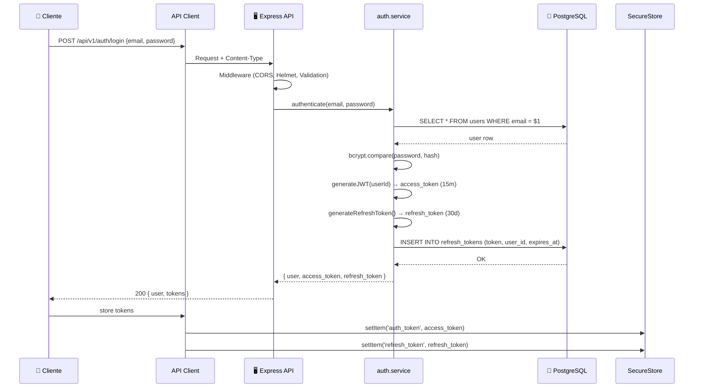

### 2. Flujo del Chatbot (LÚA)

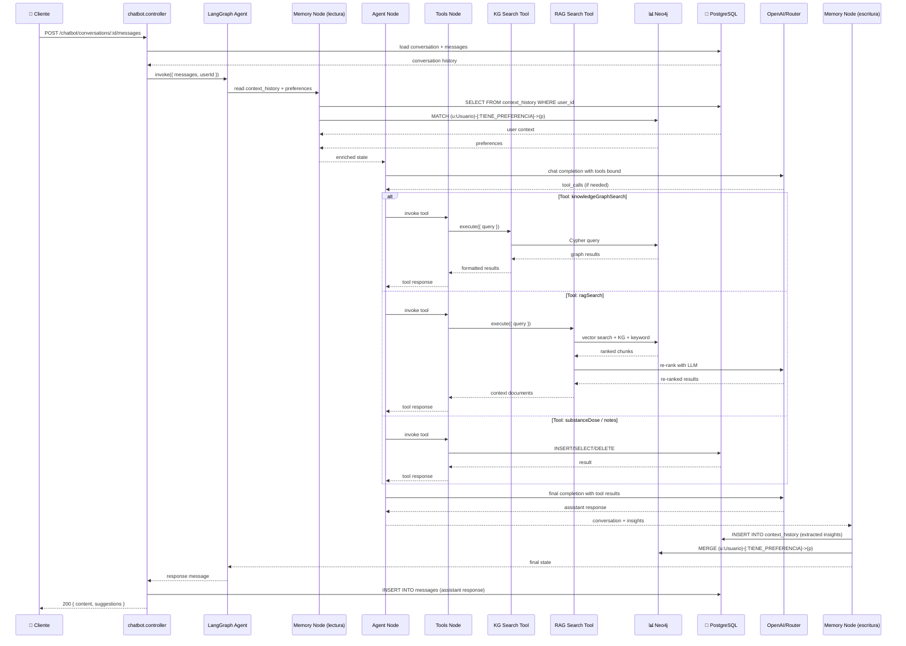

### 3. Flujo de Streaming del Chatbot

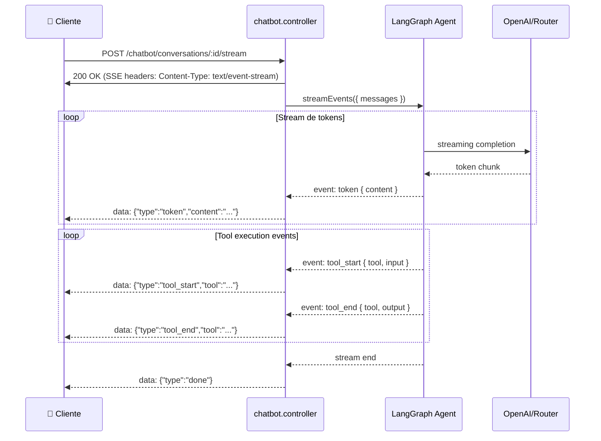

### 4. Flujo de Check-In

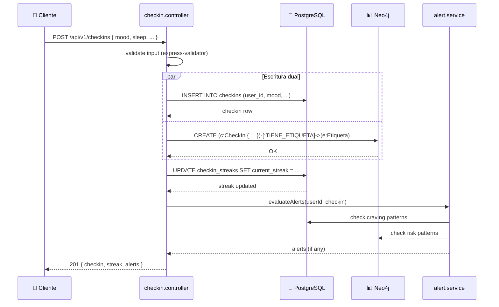

### 5. Pipeline RAG (Ingesta y Recuperación)

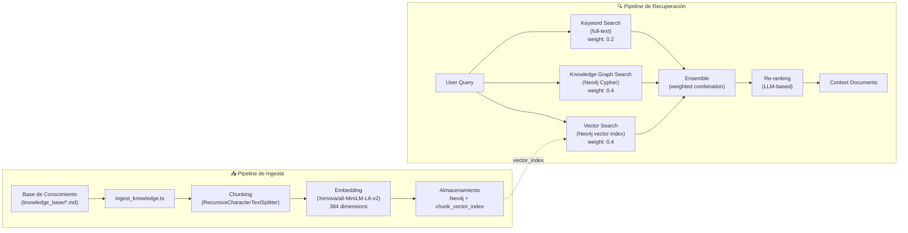

### 6. Flujo del Dashboard Familiar

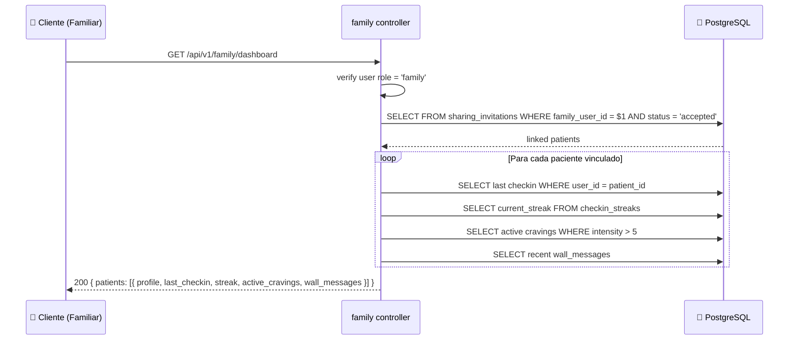

### 7. Flujo de Tracking de Dosis de Sustancias

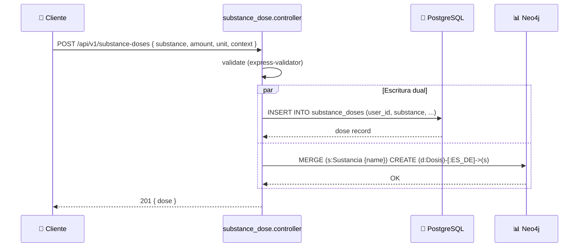

### 8. Flujo de Perfil de Inteligencia (LÚA Memory)

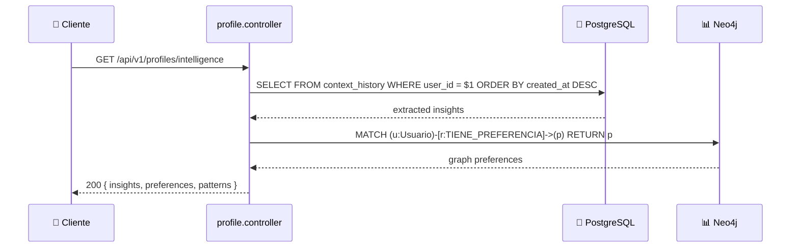

---

## Diagrama de Componentes - Agente LÚA

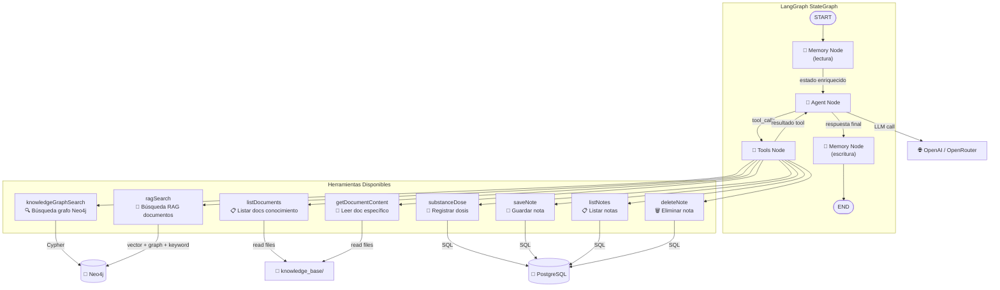

---

## Diagrama de Infraestructura

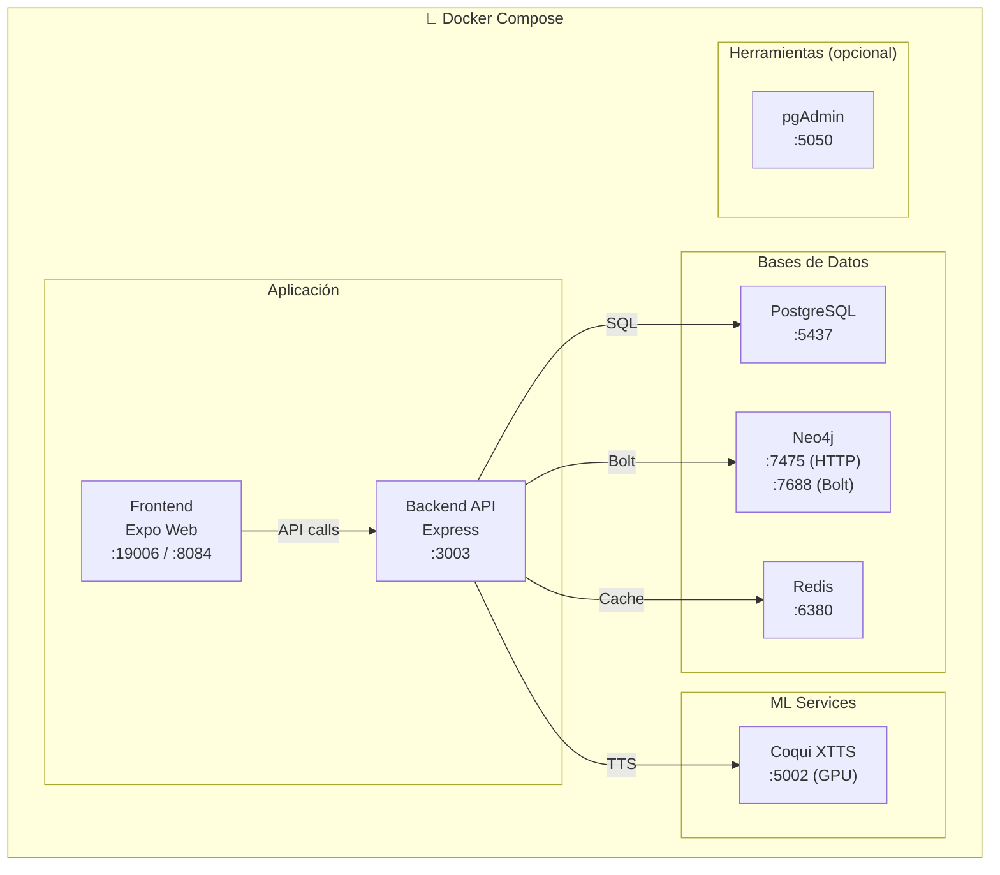

---

## Tablas PostgreSQL y sus Relaciones con Funcionalidades

| Tabla                 | Funcionalidad Principal  | Escritura                    | Lectura                  |
| --------------------- | ------------------------ | ---------------------------- | ------------------------ |
| `users`               | Autenticación, config AI | auth.service                 | auth middleware          |
| `profiles`            | Perfil usuario           | auth.service                 | profile.controller       |
| `checkins`            | Check-in diario          | checkin.controller           | dashboard, family        |
| `checkin_streaks`     | Rachas de check-in       | checkin.controller           | dashboard, family        |
| `cravings`            | Registro antojos         | craving.controller           | dashboard, family, alert |
| `medications`         | Medicamentos             | medication.controller        | medication.controller    |
| `conversations`       | Chat historial           | chatbot.controller           | chatbot.controller       |
| `messages`            | Mensajes chat            | chatbot.controller           | chatbot.controller       |
| `context_history`     | Memoria LÚA              | langgraph (memory node)      | langgraph (memory node)  |
| `refresh_tokens`      | JWT refresh              | auth.service                 | auth.service             |
| `wall_messages`       | Muro familiar            | family controller            | family controller        |
| `notifications`       | Notificaciones push      | notification.service         | notification.service     |
| `substance_doses`     | Dosis sustancias         | substance_dose.controller    | dashboard, family        |
| `substance_expenses`  | Gastos sustancias        | substance_expense.controller | dashboard                |
| `habits`              | Hábitos                  | journal.controller           | journal.controller       |
| `notes`               | Notas (agente/usuario)   | note.controller              | note.controller, agent   |
| `sharing_invitations` | Vínculos familiares      | family controller            | family controller        |
| `emergency_contacts`  | Contactos emergencia     | profile controller           | profile controller       |
