# Plan de Desarrollo de KogniRecovery
## Estrategia por Fases para la Implementación de un Sistema de Acompañamiento en Adicciones con IA Aumentada

---

## 📋 Resumen Ejecutivo

KogniRecovery es una plataforma de acompañamiento continuo y personalizado para personas en recuperación de adicciones y sus familiares. El sistema implementa una **arquitectura de IA aumentada transversal** basada en RAG (Retrieval-Augmented Generation) + Knowledge Graph (Neo4j) + Orchestrator, donde la IA actúa como amplificador de la mente humana, no como reemplazo.

**Equipo típico**: 1-2 desarrolladores full-stack, 1 diseñador UX/UI, 1 Project Manager, validadores clínicos externos.

**Duración total estimada**: 24-30 meses (incluyendo validación clínica y despliegue progresivo).

---

## 🎯 Fase 1: MVP (Months 1-4)

### Objetivos de la Fase
- Establecer la infraestructura base de la aplicación
- Implementar funcionalidades esenciales de registro, autenticación y comunicación básica
- Validar la aceptación del producto con usuarios reales
- Generar métricas de retención y engagement iniciales

### Alcance Funcional
- Registro y autenticación de pacientes y familiares
- Vinculación paciente-familiar (invitación por paciente)
- Chatbot NADA básico con 10-15 escenarios predefinidos + IA simple
- Dashboard emocional simple (paciente)
- Pared compartida 1:1 (mensajes de texto + emojis)
- Botón de emergencia con recursos locales
- Check-in diario emocional básico (escala 1-5 + palabras clave)

### Tareas Técnicas Detalladas

#### Sprint 1-2: Infraestructura y Autenticación (Semanas 1-4)
- [ ] **Configuración de entorno de desarrollo**
  - Inicialización de repositorios (frontend, backend, BD)
  - Configuración de CI/CD básico (GitHub Actions)
  - Setup de bases de datos: PostgreSQL (relacional) + Redis (caché)
  - Configuración de certificados SSL y dominio de staging

- [ ] **Diseño e implementación del modelo de datos relacional**
  - Tablas: usuarios, roles (paciente/familiar), vinculaciones, checkins, mensajes
  - Relaciones y constraints
  - Migraciones iniciales con Knex.js o similar

- [ ] **Sistema de autenticación y autorización**
  - Registro/login con email + contraseña
  - OAuth 2.0 opcional (Google, Apple)
  - 2FA opcional
  - Middleware de autenticación JWT
  - Roles y permisos (RBAC básico)

- [ ] **API REST base**
  - Endpoints de auth (login, register, refresh)
  - Endpoints de usuario (perfil, actualización)
  - Endpoints de vinculación familiar (invitar, aceptar, rechazar)
  - Documentación con Swagger/OpenAPI

#### Sprint 3-4: Funcionalidades Core (Semanas 5-8)
- [ ] **Frontend - Estructura base y navegación**
  - React Native (Expo) o Flutter
  - Navegación entre pantallas (stack, tabs)
  - Gestión de estado (Redux/MobX/Provider)
  - Temas y estilos base (accesibilidad WCAG 2.1)

- [ ] **Pantallas de onboarding y registro**
  - Flujo de registro por rol (paciente vs familiar)
  - Selección de idioma y preferencias
  - Validación de datos y errores
  - Pantalla de bienvenida y tutorial

- [ ] **Dashboard principal del paciente**
  - Widget de estado emocional actual
  - Acceso rápido a check-in diario
  - Preview de pared compartida
  - Acceso a chatbot
  - Notificaciones no leídas

- [ ] **Sistema de check-in diario**
  - Formulario simple: escala emocional (1-5), palabras clave, notas libres
  - Guardado en BD con timestamp
  - Historial de check-ins (últimos 7 días)
  - Recordatorio diario push

- [ ] **Pared compartida 1:1**
  - Lista de mensajes entre paciente y familiar vinculado
  - Envío de texto + emojis predefinidos
  - Sincronización en tiempo real (WebSocket o polling)
  - Notificaciones de nuevos mensajes

- [ ] **Chatbot NADA básico**
  - Integración con LLM (OpenAI GPT-4o mini, Claude Haiku, o similar)
  - Prompt base con identidad y límites éticos
  - 10-15 escenarios predefinidos (bienvenida, craving, crisis leve, motivación)
  - Historial de conversación por usuario
  - Detección de palabras clave de riesgo (suicidio, autolesión)

- [ ] **Sistema de emergencia**
  - Botón "Pedir ayuda ahora" visible en todas las pantallas
  - Pantalla de emergencia con:
    - Líneas de crisis locales (configurables por país)
    - Contactos de emergencia del usuario
    - Protocolos de grounding y respiración
  - Notificación a contacto de emergencia (SMS via Twilio) si el usuario autorizó

#### Sprint 5-6: Testing y Despliegue (Semanas 9-12)
- [ ] **Testing interno y QA**
  - Pruebas unitarias (Jest, React Native Testing Library)
  - Pruebas de integración (API endpoints)
  - Pruebas E2E (Detox o Appium)
  - Accesibilidad (lectores de pantalla, contraste)

- [ ] **Beta cerrada con usuarios reales**
  - Reclutamiento de 10-15 usuarios (5-7 pacientes, 5-7 familiares)
  - Onboarding y capacitación
  - Recopilación de feedback estructurado
  - Iteraciones rápidas basadas en feedback

- [ ] **Despliegue en stores**
  - Build de iOS (TestFlight) y Android (Internal Testing)
  - Preparación de metadata, screenshots, descripciones
  - Envío a Apple App Store y Google Play Store
  - Aprobación y publicación (puede tomar 2-4 semanas)

### Dependencias Críticas
- **API de LLM**: Dependencia de proveedor externo (OpenAI, Anthropic, etc.). Tener fallback a modelo local pequeño (Llama 3.2 1B) si es necesario.
- **Servicios de SMS**: Twilio para notificaciones de emergencia. Requiere verificación de cuenta y número trial.
- **Stores**: Procesos de revisión de Apple/Google pueden retrasar el despliegue.
- **Validación clínica**: Se recomienda tener al menos 1-2 profesionales (psicólogo/psiquiatra) revisando prompts y flujos antes del beta testing.

### Riesgos y Mitigaciones

| Riesgo | Impacto | Probabilidad | Mitigación |
|--------|---------|--------------|------------|
| **Responsabilidad legal por consejo de IA** | Alto | Media | Advertencias claras: "No soy un terapeuta". Límites bien definidos en prompts. Redirección a profesionales. Seguro de responsabilidad profesional. |
| **Brechas de privacidad/fuga de datos** | Crítico | Baja | Cifrado E2E. Almacenamiento local cuando sea posible. Auditorías de seguridad. Bug bounty. Cumplimiento HIPAA/GDPR desde MVP. |
| **Baja retención de usuarios** | Alto | Alta | Onboarding optimizado. Notificaciones inteligentes. Gamificación ligera. Soporte humano real (email/chat). |
| **Rechazo de stores por contenido de salud mental** | Medio | Media | Revisión de guidelines de Apple/Google. Contenido no diagnóstico. Enfoque en "wellness" y "support". |
| **Dependencia emocional no saludable** | Medio | Media | Límites de uso (notificaciones nocturnas desactivadas). Promoción de actividades offline. Recursos de educación sobre uso saludable. |

### Métricas de Éxito (KPIs)
- **Retención**: ≥40% de usuarios activos a 30 días
- **Engagement**: ≥3 sesiones/semana por usuario activo
- **Onboarding**: ≥80% completan registro hasta vincular familiar (si aplica)
- **Emergencia**: ≤5% de usuarios usan botón de emergencia (idealmente menos, indica que se previenen crisis)
- **Satisfacción**: NPS ≥30 en pacientes, ≥20 en familiares
- **Performance**: Tiempo de carga <2s, crash rate <0.5%

### Recursos Necesarios
- **Infraestructura**: 
  - Backend: AWS/GCP/Azure (EC2/Compute Engine + RDS/Cloud SQL) ~$200-400/mes
  - CDN: CloudFront/Cloud CDN ~$50-100/mes
  - Dominio y SSL: ~$50/año
- **APIs externas**:
  - LLM API: ~$0.50-2.00/1M tokens (presupuesto $500-1000/mes)
  - Twilio SMS: ~$0.0075-0.015/mensaje (presupuesto $100-200/mes)
- **Herramientas**:
  - Figma (diseño): $15/mes
  - GitHub/GitLab: gratuito o $20-50/mes
  - Sentry/LogRocket (monitoreo): $50-200/mes
  - TestFlight/Google Play Console: $99/año (Apple) + $25 one-time (Google)
- **Presupuesto total Fase 1**: $15,000-25,000 (incluyendo salarios prorrateados)

---

## 🧠 Fase 2: Inteligencia Aumentada (Months 5-10)

### Objetivos de la Fase
- Implementar la arquitectura de IA aumentada transversal (RAG + Knowledge Graph)
- Desplegar el pipeline de ingestión de datos farmacológicos
- Habilitar la sección de gestión de medicamentos
- Mejorar significativamente la calidad y personalización de las respuestas del chatbot
- Introducir análisis de patrones y detección proactiva de riesgos

### Alcance Funcional
- **Arquitectura de IA aumentada completa**:
  - Neo4j Knowledge Graph con schema definido
  - Vector Store (Pinecone, Weaviate, o PGVector) para RAG
  - Pipeline de embeddings (OpenAI text-embedding-3-small o similar)
  - Orchestrator que combina Graph + RAG + LLM
- **Sección de medicamentos**:
  - Catálogo offline de medicamentos (FDA, AEMPS, ANMAT)
  - Registro de medicamentos personales del paciente
  - Dashboard de adherencia y educación
  - Alertas de interacciones en tiempo real
  - Información de efectos secundarios y precauciones
- **Chatbot NADA avanzado**:
  - Contexto enriquecido con Knowledge Graph
  - Búsqueda semántica en psicoeducación y protocolos
  - Personalidad consistente y memoria a largo plazo
  - 50+ escenarios conversacionales
- **Análisis de patrones**:
  - Detección de cravings por día/hora/trigger
  - Correlaciones emocionales
  - Alertas predictivas (ej: "Lunes a las 5pm sueles tener cravings fuertes")
- **Dashboard familiar mejorado**:
  - Vista agregada anónima del paciente (estadísticas)
  - Señales de apoyo inteligentes (sugerencias contextuales)

### Tareas Técnicas Detalladas

#### Sprint 7-9: Knowledge Graph y RAG (Semanas 13-24)
- [ ] **Diseño e implementación del schema de Knowledge Graph**
  - Nodos: Paciente, Familiar, Medicamento, Interaccion, Condicion, Sintoma, Emocion, Cita, GrupoApoyo, Recurso, etc.
  - Relaciones: TOMA_MEDICAMENTO, PRESCRIBE, INTERACTUA_CON, EXPERIMENTA, PERTENECE_A, etc.
  - Constraints e índices en Neo4j
  - Migración de datos existentes (si hay) a KG

- [ ] **Configuración y despliegue de Neo4j**
  - Neo4j Aura (cloud) o auto-hosted (EC2)
  - Configuración de replicación y backups
  - Ajuste de memoria y performance
  - Seguridad: cifrado en tránsito, autenticación, firewall

- [ ] **Pipeline de ingestión de datos farmacológicos**
  - Scripts de descarga de APIs públicas (FDA OpenAPI, AEMPS, ANMAT)
  - Transformación y normalización de datos
  - Generación de embeddings para búsqueda semántica
  - Carga en Neo4j (nodos Medicamento, relaciones INTERACTUA_CON)
  - Actualización mensual automática (cron job)

- [ ] **Implementación de Vector Store**
  - Elección: Pinecone, Weaviate, o PGVector (más económico)
  - Creación de colecciones: psicoeducacion, protocolos, escenarios_conversacionales
  - Pipeline de embedding generation (batch + real-time)
  - Sincronización con actualizaciones de contenido

- [ ] **Desarrollo del Orchestrator**
  - Servicio Node.js/Python que orquesta:
    1. Query a Neo4j para contexto estructurado
    2. Búsqueda en Vector Store para contexto semántico
    3. Composición de prompt enriquecido
    4. Llamada a LLM con contexto
    5. Post-procesamiento y validación de respuesta
  - Caching de consultas frecuentes (Redis)
  - Logging y tracing (OpenTelemetry)

- [ ] **Integración de chatbot con arquitectura**
  - Modificar chatbot NADA para usar Orchestrator
  - Herramientas específicas: `query_kg`, `rag_search`, `enhanceWithKnowledge`
  - Memoria de conversación en Graph (nodos Conversacion, Mensaje)
  - Evaluación de calidad de respuestas (human eval + métricas automáticas)

#### Sprint 10-11: Sección de Medicamentos (Semanas 25-32)
- [ ] **Diseño UI/UX para sección de medicamentos**
  - Pantallas: catálogo, mi lista, dashboard de adherencia, detalles de medicamento
  - Flujos de usuario: agregar medicamento, editar dosis, marcar como tomado
  - Accesibilidad y legibilidad de información farmacológica
  - Validación con farmacéutico

- [ ] **Backend - API de medicamentos**
  - CRUD de medicamentos personales
  - Endpoints de búsqueda en catálogo
  - Cálculo de interacciones (query a Neo4j)
  - Alertas de interacciones graves/moderadas
  - Logging de tomas para historial

- [ ] **Frontend - Implementación de sección de medicamentos**
  - Pantalla de catálogo (búsqueda, filtros por categoría)
  - Pantalla "Mis medicamentos" (lista, dosis, horarios)
  - Dashboard de adherencia (gráficos de % tomado en últimos 7/30 días)
  - Pantalla de detalle de medicamento (info, efectos secundarios, interacciones)
  - Modo offline: cache local de medicamentos

- [ ] **Sistema de recordatorios y adherencia**
  - Notificaciones push programadas por horario
  - Confirmación de toma (sí/no/omitir)
  - Sincronización con calendario nativo
  - Reporte semanal de adherencia (compartible con médico)

- [ ] **Validación clínica de contenido farmacológico**
  - Revisión por farmacéutico de:
    - Exactitud de información
    - Interacciones detectadas
    - Precisión de efectos secundarios
  - Ajustes basados en feedback
  - Documentación de fuentes para cada dato

#### Sprint 12-13: Mejoras de Chatbot y Análisis (Semanas 33-36)
- [ ] **Expansión de escenarios conversacionales**
  - 50+ escenarios cubriendo:
    - Craving management (20 escenarios)
    - Crisis emocional (10 escenarios)
    - Motivación y celebración (10 escenarios)
    - Educación sobre adicción (10 escenarios)
  - Diálogos de ejemplo para cada escenario
  - Prompts específicos por perfil (edad, género, sustancia)

- [ ] **Implementación de detección de patrones**
  - Análisis de check-ins históricos
  - Identificación de triggers comunes (horario, día, emoción previa)
  - Generación de insights automáticos (ej: "Tu craving más común es el estrés laboral los martes")
  - Dashboard de patrones para paciente (gráficos)

- [ ] **Alertas predictivas y proactivas**
  - Sistema de alertas basado en patrones detectados
  - Niveles de severidad (baja, media, alta)
  - Notificaciones push con sugerencias de acción
  - Registro de alertas en timeline del paciente

- [ ] **Dashboard familiar mejorado**
  - Vista agregada anónima: "Esta semana hubo 12 cravings, el 60% relacionados con estrés"
  - Sugerencias de apoyo contextual ("Hoy podría preguntarle cómo se siente sin juzgar")
  - Límites de privacidad estrictos (paciente controla qué compartir)

- [ ] **Testing integral y validación**
  - Testing de integración entre módulos (KG, RAG, chatbot, medicamentos)
  - Validación con 20-30 usuarios beta (pacientes + familiares)
  - Sesiones de usabilidad con profesionales clínicos
  - Iteraciones basadas en feedback

### Dependencias Críticas
- **Neo4j Aura/Enterprise**: Costos de licencia si se requiere alta disponibilidad.
- **API de embeddings**: Dependencia de OpenAI o similar. Tener modelo local de respaldo (all-MiniLM-L6-v2).
- **Fuentes de datos farmacológicas**: Calidad y completitud de APIs públicas. Puede requerir limpieza manual inicial.
- **Validación clínica**: Necesidad de farmacéutico y psicólogo/psiquiatra disponibles para revisiones periódicas.
- **Cumplimiento regulatorio**: HIPAA (EEUU), GDPR (Europa), leyes locales. Requiere asesoría legal.

### Riesgos y Mitigaciones

| Riesgo | Impacto | Probabilidad | Mitigación |
|--------|---------|--------------|------------|
| **Complejidad técnica de arquitectura aumentada** | Alto | Alta | Fases de implementación incremental. MVP de cada componente por separado antes de integrar. Documentación exhaustiva. Capacitación del equipo. |
| **Calidad de datos farmacológicos** | Alto | Media | Validación multi-fuente. Revisión clínica manual inicial. Marcado de confianza en UI. Actualizaciones controladas. |
| **Performance del sistema (latencia)** | Alto | Media | Caching agresivo (Redis). Optimización de queries Cypher. Pre-computación de interacciones frecuentes. CDN para assets estáticos. |
| **Errores en alertas de interacciones medicamentosas** | Crítico | Baja | Múltiples fuentes de validación. Niveles de confianza claros. Siempre incluir advertencia "Consulta a tu médico". |
| **Sobrecarga de información al paciente** | Medio | Media | UI simple y progresiva. Explicabilidad de alertas ("Porque tomas X e Y"). Opción de "modo simple" sin detalles técnicos. |
| **Costos de LLM y embeddings** | Medio | Alta | Optimización de tokens (contexto limitado, compresión). Modelos más económicos (Claude Haiku, GPT-4o mini). Caching de embeddings. Límites de uso por usuario. |

### Métricas de Éxito (KPIs)
- **Calidad de respuestas chatbot**: ≥85% de respuestas útiles (human eval)
- **Precisión de interacciones medicamentosas**: ≥95% (validado por farmacéutico)
- **Uso de medicamentos**: ≥60% de pacientes registran ≥1 medicamento
- **Adherencia a medicamentos**: ≥70% promedio de dosis tomadas (pacientes con medicación crónica)
- **Retención**: ≥50% a 90 días (mejora vs MVP)
- **Satisfacción**: NPS ≥40 en pacientes, ≥30 en familiares
- **Performance**: Latencia P95 <1.5s para consultas con KG+RAG

### Recursos Necesarios
- **Infraestructura**:
  - Neo4j Aura: ~$500-2000/mes (dependiendo de tamaño)
  - Vector Store (Pinecone/Weaviate): ~$300-800/mes
  - Backend/API: ~$400-800/mes (más que MVP por procesamiento)
  - CDN + Storage: ~$100-200/mes
- **APIs externas**:
  - LLM: ~$2000-5000/mes (mayor uso por contexto enriquecido)
  - Embeddings: ~$200-500/mes
  - Twilio: ~$200-400/mes
- **Herramientas**:
  - Mismas que MVP + herramientas de monitoreo avanzado (Datadog, New Relic): ~$300-600/mes
- **Personal**:
  - Farmacéutico consultor (part-time): ~$2000-4000/mes
  - Psicólogo/psiquiatra consultor (part-time): ~$3000-6000/mes
- **Presupuesto total Fase 2**: $80,000-150,000

---

## 📈 Fase 3: Escalabilidad (Months 11-22)

### Objetivos de la Fase
- Optimizar performance y escalabilidad del sistema para miles de usuarios concurrentes
- Implementar módulo completo para familiares (educación, guías, herramientas de comunicación)
- Integración con grupos de apoyo externos (AA, NA, SMART Recovery)
- Reportes para terapeutas externos (con consentimiento del paciente)
- Modo de baja tecnología (SMS/call) para usuarios sin smartphone
- Mejoras de seguridad, compliance y auditoría

### Alcance Funcional
- **Escalabilidad técnica**:
  - Microservicios o modularización de backend
  - Auto-scaling de infraestructura
  - CDN global, replicación de BD multi-región
  - Rate limiting, DDoS protection
- **Módulo familiar completo**:
  - Biblioteca de educación para familiares (50+ artículos/videos)
  - Guías interactivas: "Cómo comunicarme", "Cómo establecer límites", "Cómo manejar mi ansiedad"
  - Herramientas de autoevaluación para familiares
  - Foro privado moderado (opcional, por grupo familiar)
- **Integración con grupos de apoyo**:
  - Directorio de reuniones locales (AA, NA, SMART) con geolocalización
  - Calendario de eventos de recuperación
  - Posibilidad de "check-in" en reuniones (opcional)
- **Reportes para terapeutas**:
  - Generación automática de resúmenes semanales/mensuales (con consentimiento)
  - Exportación en PDF/JSON
  - Portal web para terapeutas (lectura-only)
- **Modo sin app (SMS/call)**:
  - Número de teléfono dedicado para check-ins via SMS
  - IVR (Interactive Voice Response) para pacientes sin smartphone
  - Sincronización de datos entre canales
- **Mejoras de seguridad y compliance**:
  - Auditorías de seguridad periódicas (penetration testing)
  - Certificaciones (HIPAA, GDPR)
  - Data Loss Prevention (DLP)
  - Logging y monitoring avanzado (SIEM)

### Tareas Técnicas Detalladas

#### Sprint 14-17: Escalabilidad y Microservicios (Semanas 37-52)
- [ ] **Análisis de cuellos de botella y optimización**
  - Profiling de aplicación (APM)
  - Identificación de queries lentas en PostgreSQL y Neo4j
  - Optimización de índices
  - Refactoring de código ineficiente

- [ ] **Modularización o migración a microservicios**
  - Separación de dominios: auth, chatbot, medicamentos, notificaciones, KG
  - API Gateway (Kong, AWS API Gateway)
  - Comunicación entre servicios (gRPC o REST)
  - Service discovery y configuración centralizada

- [ ] **Auto-scaling y alta disponibilidad**
  - Kubernetes o ECS/EKS para orquestación
  - Auto-scaling groups basado en CPU/memoria/requests
  - Load balancers (ALB, Nginx)
  - Multi-AZ deployment
  - Failover automático

- [ ] **Replicación y sharding de bases de datos**
  - PostgreSQL read replicas
  - Neo4j causal clustering (si escala horizontal)
  - Sharding strategy por usuario/región
  - Backup automatizado y restore testing

- [ ] **CDN y optimización de assets**
  - CloudFront/Cloud CDN para imágenes, JS, CSS
  - Compresión (Brotli, Gzip)
  - Lazy loading de imágenes
  - Service workers para offline-first

- [ ] **Rate limiting y protección DDoS**
  - Rate limiting por IP/usuario (Redis + token bucket)
  - WAF (AWS WAF, Cloudflare)
  - DDoS protection (Cloudflare, AWS Shield)
  - Bot detection

#### Sprint 18-20: Módulo Familiar Completo (Semanas 53-60)
- [ ] **Diseño UX/UI para módulo familiar**
  - Investigación con familiares (entrevistas, encuestas)
  - Flujos de onboarding específicos para familiar
  - Pantallas: dashboard familiar, biblioteca, guías, foro
  - Accesibilidad y lectura simple

- [ ] **Backend - API de educación y guías**
  - CRUD de contenido educativo (artículos, videos, quizzes)
  - Categorización por tema (comunicación, límites, autocuidado)
  - Tracking de progreso (visto, completado)
  - Recomendaciones personalizadas

- [ ] **Frontend - Implementación de módulo familiar**
  - Dashboard familiar: resumen del paciente (con consentimiento)
  - Biblioteca de educación (búsqueda, filtros, favoritos)
  - Guías interactivas paso a paso
  - Herramientas de autoevaluación (cuestionarios)
  - Foro privado (opcional, moderado)

- [ ] **Sistema de recomendaciones**
  - Algoritmo basado en perfil del familiar + comportamiento
  - Recomendaciones "siguiente paso"
  - Notificaciones de nuevo contenido relevante

- [ ] **Testing con familiares**
  - Beta testing con 30-50 familiares
  - Sesiones de usabilidad
  - Iteraciones basadas en feedback

#### Sprint 21-22: Integración con Grupos de Apoyo (Semanas 61-68)
- [ ] **Integración de APIs de directorios de reuniones**
  - AA/NA/SMART APIs o scraping de sitios públicos
  - Geocodificación y mapas (Google Maps/Mapbox)
  - Filtros: día, hora, tipo de reunión, accesibilidad
  - Actualización diaria automática

- [ ] **Pantalla de directorio de reuniones**
  - Mapa interactivo
  - Lista con filtros
  - Detalles de cada reunión (dirección, horario, contacto)
  - "Check-in" en reunión (opcional, para tracking)

- [ ] **Calendario de eventos de recuperación**
  - Integración con Google Calendar/Apple Calendar
  - Eventos: reuniones, talleres, conferencias
  - Notificaciones de recordatorio

- [ ] **Comunidad segura (foros moderados)**
  - Foros por tema (craving, motivación, familia)
  - Moderación automática (IA) + humana
  - Sistema de reportes
  - Anonimato opcional

#### Sprint 23-24: Reportes para Terapeutas (Semanas 69-76)
- [ ] **Diseño de reportes clínicos**
  - Colaboración con terapeutas para definir contenido útil
  - Formatos: semanal, mensual, por tema
  - Incluir: check-ins, patrones, medicamentos, crisis, progreso
  - Explicabilidad: datos con contexto

- [ ] **Backend - Generación de reportes**
  - Agregación de datos del KG
  - Templates en PDF/HTML
  - Exportación en múltiples formatos
  - Envío automático por email (con consentimiento)

- [ ] **Portal web para terapeutas**
  - Autenticación separada (SSO institucional posible)
  - Dashboard de pacientes asignados
  - Vista de reportes históricos
  - Notas propias del terapeuta (privadas)

- [ ] **Consentimiento y privacidad**
  - Flujo de autorización del paciente para compartir con terapeuta
  - Revocación de consentimiento en cualquier momento
  - Audit log de acceso a reportes

#### Sprint 25-26: Modo Sin App y Mejoras de Accesibilidad (Semanas 77-84)
- [ ] **Diseño de flujos SMS/IVR**
  - Números de teléfono dedicados (toll-free o local)
  - Menús de IVR simples
  - Comandos SMS: CHECKIN, HELP, EMERGENCY
  - Confirmación por SMS/voice

- [ ] **Backend - API de telecomunicaciones**
  - Integración con Twilio (SMS, Voice)
  - Webhook handlers para incoming messages/calls
  - Sesiones de usuario por teléfono
  - Sincronización con datos de app

- [ ] **Implementación de IVR y SMS bot**
  - Flujos de check-in por teléfono
  - Respuestas automáticas a preguntas frecuentes
  - Escalación a operador humano (limitado)

- [ ] **Testing de modo sin app**
  - Pruebas con usuarios sin smartphone
  - Optimización de costos de SMS/llamadas
  - Accesibilidad para personas con discapacidades

#### Sprint 27-28: Seguridad, Compliance y Auditoría (Semanas 85-88)
- [ ] **Auditoría de seguridad externa**
  - Penetration testing (contratar firma especializada)
  - Vulnerability assessment
  - Remediation de hallazgos críticos/altos

- [ ] **Implementación de DLP y logging avanzado**
  - Data Loss Prevention (prevent exfiltration)
  - SIEM (Splunk, Datadog Security)
  - Alertas de seguridad 24/7
  - Retención de logs según compliance (6-7 años para HIPAA)

- [ ] **Certificaciones de compliance**
  - Preparación para HIPAA (EEUU) o ISO 27001
  - Documentación de políticas de seguridad
  - Procesos de incident response
  - Entrenamiento del equipo en compliance

- [ ] **Bug bounty y programa de recompensas**
  - Plataforma (HackerOne, Bugcrowd)
  - Scope y reglas
  - Triaging y respuesta

### Dependencias Críticas
- **Escalabilidad**: Necesidad de ingenieros DevOps/SRE especializados.
- **Grupos de apoyo**: APIs no estandarizadas; puede requerir web scraping manual.
- **Terapeutas**: Adopción por parte de clínicas/terapeutas requiere ventas y partnership.
- **Modo SMS/IVR**: Costos operativos altos si se usa masivamente; limitar a casos necesarios.
- **Compliance**: Requiere asesoría legal especializada en salud digital.

### Riesgos y Mitigaciones

| Riesgo | Impacto | Probabilidad | Mitigación |
|--------|---------|--------------|------------|
| **Escalabilidad técnica insuficiente** | Crítico | Media | Load testing temprano. Arquitectura modular. Auto-scaling. Equipo DevOps dedicado. |
| **Baja adopción por terapeutas** | Alto | Media | Incentivos (gratis para terapeutas). Integración con EHRs existentes (Epic, Cerner). Ventas B2B. |
| **Costos operativos descontrolados** | Alto | Alta | Monitoring de costos en tiempo real. Límites de uso por usuario. Optimización de queries. |
| **Moderación de contenido comunitario** | Alto | Media | IA + humanos. Reportes de usuarios. Términos de servicio claros. Ban de usuarios tóxicos. |
| **Cumplimiento regulatorio complejo** | Crítico | Media | Asesoría legal continua. Designated Privacy Officer. Procesos documentados. |
| **Fragmentación de experiencia (app vs SMS)** | Medio | Baja | Sincronización perfecta. Feature parity en lo esencial. Transición suave entre canales. |

### Métricas de Éxito (KPIs)
- **Escalabilidad**: Soporte ≥10,000 usuarios concurrentes, P95 latency <1s
- **Uso módulo familiar**: ≥70% de pacientes vinculan ≥1 familiar; ≥50% de familiares activos semanalmente
- **Educación**: ≥60% de familiares consumen ≥5 piezas educativas/mes
- **Grupos de apoyo**: ≥30% de usuarios buscan reuniones; ≥15% asisten a una
- **Terapeutas**: ≥50 terapeutas registrados; ≥200 reportes generados/mes
- **Modo sin app**: ≥5% de usuarios activos usan SMS/IVR como canal principal
- **Compliance**: 0 brechas de seguridad graves; 100% de solicitudes de datos respondidas en ≤30 días

### Recursos Necesarios
- **Infraestructura**:
  - Escalada a multi-región: ~$3000-8000/mes
  - Microservicios (K8s, service mesh): ~$2000-5000/mes
  - CDN global + edge computing: ~$500-1500/mes
- **Personal**:
  - DevOps/SRE (2 personas): ~$15,000-25,000/mes
  - Ingenieros backend/frontend adicionales (2-3): ~$25,000-45,000/mes
  - Soporte técnico/community manager: ~$4000-8000/mes
- **Servicios externos**:
  - Penetration testing (anual): ~$15,000-30,000
  - Asesoría legal compliance: ~$5000-10,000/mes
  - Bug bounty: ~$10,000-50,000/año (dependiendo de scope)
- **Presupuesto total Fase 3**: $300,000-600,000

---

## 🚀 Fase 4: Expansión (Months 23-30+)

### Objetivos de la Fase
- Expansión geográfica a múltiples países y idiomas
- Funcionalidades de comunidad segura a mayor escala
- Programas de patrocinio y sostenibilidad financiera
- Investigación y validación clínica formal
- Integración con sistemas de salud (EHRs, hospitales)
- IA generativa avanzada (personalidad adaptativa, generación de contenido)

### Alcance Funcional
- **Internacionalización**:
  - Soporte multi-idioma (español, inglés, portugués inicialmente)
  - Adaptación cultural y regulatoria por país
  - Fuentes de datos locales (medicamentos aprobados por agencias locales)
- **Comunidad segura escalada**:
  - Foros temáticos moderados por IA + comunidad
  - Sistema de mentoría (sponsor-padrino)
  - Eventos virtuales (webinars, grupos de apoyo online)
- **Modelos de negocio sostenible**:
  - Freemium con features premium
  - B2B: venta a clínicas, hospitales, gobiernos
  - Donaciones y patrocinios de ONGs
  - Seguros de salud (reimbursement)
- **Validación clínica formal**:
  - Estudios clínicos controlados
  - Publicación en revistas peer-reviewed
  - Registro como dispositivo médico (si aplica)
- **Integración con EHRs**:
  - FHIR API para interoperabilidad
  - Integración con Epic, Cerner, etc.
  - Interoperabilidad con wearables (Apple Health, Fitbit)
- **IA avanzada**:
  - Personalidad adaptativa del chatbot (aprende del usuario)
  - Generación de contenido personalizado (ejercicios, planes)
  - Multi-modal (imágenes, audio) para terapia

### Tareas Técnicas Detalladas

#### Sprint 29-32: Internacionalización (Semanas 89-104)
- [ ] **Arquitectura multi-idioma**
  - i18n framework (react-i18next, Flutter intl)
  - Traducción de UI y contenido
  - RTL support si es necesario
  - Gestión de traducciones (Crowdin, Transifex)

- [ ] **Adaptación regulatoria por país**
  - Análisis legal de cada mercado objetivo
  - Modificaciones de TOS y privacidad
  - Configuración de data residency (datos almacenados en país)
  - Certificaciones locales

- [ ] **Fuentes de datos farmacológicas locales**
  - Integración de ANMAT (Argentina), AEMPS (España), etc.
  - Normalización a schema común
  - Catálogos específicos por país

- [ ] **Localización de recursos de emergencia**
  - Directorio de líneas de crisis por país
  - Traducción de protocolos
  - Números de emergencia locales

- [ ] **Testing internacional**
  - Usuarios beta en cada país
  - Validación cultural
  - Performance testing desde diferentes regiones

#### Sprint 33-35: Comunidad Segura Escalada (Semanas 105-112)
- [ ] **Foros temáticos avanzados**
  - Subforos por tema, etapa de recuperación
  - Sistema de votación y reputación
  - Moderación automática mejorada (toxicity detection)
  - Moderadores humanos (contratados o voluntarios)

- [ ] **Sistema de mentoría (sponsor-padrino)**
  - Matching algorithm (experiencia, sustancia, ubicación)
  - Herramientas de comunicación 1:1
  - Tracking de progreso conjunto
  - Screening de mentores

- [ ] **Eventos virtuales**
  - Plataforma de webinars (Zoom, Jitsi integrado)
  - Calendario de eventos
  - Grabación y archivo
  - Certificados de asistencia

#### Sprint 36-38: Modelos de Negocio Sostenible (Semanas 113-120)
- [ ] **Desarrollo de features premium**
  - Identificación de features de alto valor
  - Implementación de paywall/subscriptions
  - Stripe/Adyen/Braintree integración
  - Gestión de suscripciones (renovación, cancelación)

- [ ] **Portal B2B para clínicas**
  - Dashboard administrativo para organizaciones
  - Gestión de múltiples pacientes
  - Facturación y contratos
  - SLA y soporte prioritario

- [ ] **Integración con seguros de salud**
  - Investigación de códigos CPT/CPT para reembolso
  - Documentación clínica para insurers
  - Procesos de billing con aseguradoras

- [ ] **Programa de donaciones y patrocinios**
  - Landing page de donaciones
  - Integración con plataformas de crowdfunding
  - Reportes de impacto para donantes
  - Relaciones con ONGs

#### Sprint 39-41: Validación Clínica Formal (Semanas 121-128)
- [ ] **Diseño de estudios clínicos**
  - Colaboración con universidades/hospitales
  - Protocolos de investigación (IRB approval)
  - Grupos control y experimental
  - Métricas clínicas validadas (PHQ-9, GAD-7, etc.)

- [ ] **Recopilación de datos para investigación**
  - Consentimiento informado específico para investigación
  - Anonimización de datos
  - Dataset de uso clínico
  - Longitudinal tracking

- [ ] **Análisis estadístico y resultados**
  - Estadísticos contratados o internos
  - Análisis de eficacia (reducción de recaídas, mejora de salud mental)
  - Publicación de resultados

- [ ] **Registro como dispositivo médico (si aplica)**
  - Evaluación de clasificación (FDA Class I/II, CE Mark)
  - Documentación técnica
  - Auditorías de calidad (ISO 13485)
  - Proceso de registro ante autoridades

#### Sprint 42-44: Integración con EHRs y Wearables (Semanas 129-136)
- [ ] **Implementación de FHIR API**
  - Servidor FHIR R4
  - Resources: Patient, Observation, MedicationStatement, Condition
  - SMART on FHIR apps
  - Testing con EHR sandboxes

- [ ] **Integraciones específicas con EHRs**
  - Epic (MyChart) integration
  - Cerner integration
  - Allscripts, Athenahealth, etc.
  - Certificaciones de partners

- [ ] **Integración con wearables y health data**
  - Apple HealthKit
  - Google Fit
  - Fitbit, Oura Ring, Whoop
  - Sincronización de: sueño, actividad, frecuencia cardíaca, estrés

- [ ] **Dashboard de datos de salud integrados**
  - Visualización de datos de wearables
  - Correlaciones con estado emocional y cravings
  - Insights multi-modal

#### Sprint 45-46: IA Avanzada y Futuro (Semanas 137-144)
- [ ] **Personalidad adaptativa del chatbot**
  - Modelo de personalidad que se ajusta al usuario
  - Aprendizaje de preferencias (tono, estilo)
  - Memoria a largo plazo mejorada
  - Empatía dinámica

- [ ] **Generación de contenido personalizado**
  - Ejercicios de CBT generados a medida
  - Planes de acción personalizados
  - Resúmenes automáticos de progreso
  - Poemas/mensajes motivacionales personalizados

- [ ] **Multi-modal AI (imágenes, audio)**
  - Análisis de imágenes (ej: fotos de comida para dieta)
  - Generación de audio (meditaciones guiadas personalizadas)
  - Speech-to-text para check-in por voz

- [ ] **Roadmap de largo plazo (Fase 5+)**
  - Planificación de features futuras
  - Investigación de tecnologías emergentes (AGI, neurociencia)
  - Alianzas estratégicas

### Dependencias Críticas
- **Internacionalización**: Traducciones de calidad requieren traductores nativos especializados en salud mental.
- **EHR integrations**: Procesos de certificación largos (6-12 meses). Requiere dedicación full-time de ingenieros de integración.
- **Validación clínica**: IRB approval puede tomar 6-12 meses. Reclutamiento de pacientes para estudios.
- **Registro como dispositivo médico**: Proceso regulatorio de 1-3 años, costos $100,000-500,000.
- **IA avanzada**: Dependencia de modelos de última generación (GPT-5, Claude 4, etc.) que pueden no estar disponibles.

### Riesgos y Mitigaciones

| Riesgo | Impacto | Probabilidad | Mitigación |
|--------|---------|--------------|------------|
| **Expansión internacional costosa** | Alto | Alta | Validación de mercado previa. Start con 2-3 países. Partnerships locales. |
| **Regulatorio: dispositivo médico** | Crítico | Media | Consultoría regulatoria temprana. Decisión: ¿registro como dispositivo o software de bienestar? |
| **Competencia de apps grandes (Headspace, Calm)** | Alto | Alta | Diferenciación: enfoque en adicciones (nicho). Comunidad y familiares. Integración clínica. |
| **Sostenibilidad financiera** | Crítico | Media | Diversificación de ingresos. B2B early. Donaciones. Cost control estricto. |
| **Burnout del equipo** | Alto | Alta | Rotación de personal. Contratación proactiva. Cultura de bienestar laboral. |
| **Ética: manipulación emocional con IA** | Crítico | Baja | Ethics board externo. Transparencia total. Opt-in para features avanzadas. |

### Métricas de Éxito (KPIs)
- **Internacionalización**: ≥3 países operativos; ≥20% usuarios no hispanohablantes
- **Comunidad**: ≥50% de usuarios participan en foros/eventos; ≥10% son mentores
- **B2B**: ≥50 clínicas/organizaciones clientes; ≥20% de ingresos vía B2B
- **Validación clínica**: ≥1 estudio publicado en revista peer-reviewed; reducción de recaídas ≥30% vs control
- **EHR integrations**: ≥5 hospitales/clínicas integradas; ≥1000 pacientes vía EHR
- **Sostenibilidad**: Ingresos ≥ gastos operativos; ≥6 meses de runway
- **IA avanzada**: ≥90% satisfacción con personalidad del chatbot; ≥70% usan features multi-modal

### Recursos Necesarios
- **Infraestructura global**:
  - Multi-región (US, EU, LATAM): ~$10,000-25,000/mes
  - CDN global + edge computing: ~$2000-5000/mes
  - Data residency (cloud regions locales): ~$5000-15,000/mes
- **Personal**:
  - Ingenieros (8-12 personas): ~$150,000-300,000/mes
  - Equipo comercial/B2B (3-5 personas): ~$30,000-60,000/mes
  - Investigadores clínicos (2-3): ~$20,000-40,000/mes
  - Community/Support (5-10): ~$30,000-60,000/mes
- **Servicios externos**:
  - Registro regulatorio (FDA, CE): ~$200,000-500,000 (único)
  - Estudios clínicos: ~$500,000-2,000,000 (dependiendo del tamaño)
  - Traducciones profesionales: ~$50,000-100,000
  - Asesoría legal internacional: ~$20,000-50,000/mes
- **Presupuesto total Fase 4**: $2,000,000-5,000,000+ (dependiendo de alcance regulatorio)

---

## 🔄 Diagrama de Flujo de Fases y Dependencias

```mermaid
graph TD
    A[Fase 1: MVP] --> B[Fase 2: Inteligencia Aumentada]
    B --> C[Fase 3: Escalabilidad]
    C --> D[Fase 4: Expansión]
    
    A --> A1[Infraestructura Base]
    A --> A2[Autenticación]
    A --> A3[Chatbot Básico]
    A --> A4[Check-in Diario]
    A --> A5[Pared Compartida]
    A --> A6[Emergencia]
    
    B --> B1[Neo4j Knowledge Graph]
    B --> B2[Vector Store RAG]
    B --> B3[Orchestrator]
    B --> B4[Catálogo Medicamentos]
    B --> B5[Sección Medicamentos]
    B --> B6[Chatbot Avanzado]
    B --> B7[Detección Patrones]
    
    C --> C1[Microservicios]
    C --> C2[Auto-scaling]
    C --> C3[Módulo Familiar]
    C --> C4[Grupos de Apoyo]
    C --> C5[Reportes Terapeutas]
    C --> C6[Modo Sin App]
    C --> C7[Seguridad/Compliance]
    
    D --> D1[Internacionalización]
    D --> D2[Comunidad Escalada]
    D --> D3[Modelos de Negocio]
    D --> D4[Validación Clínica]
    D --> D5[EHR/Wearables]
    D --> D6[IA Avanzada]
    
    A1 --> B1
    A2 --> B1
    A3 --> B3
    A4 --> B7
    A5 --> C3
    A6 --> C7
    
    B1 --> C1
    B2 --> C1
    B3 --> C1
    B5 --> C5
    
    C1 --> D1
    C3 --> D2
    C7 --> D3
    C5 --> D4
    C6 --> D5
    
    style A fill:#e1f5fe
    style B fill:#f3e5f5
    style C fill:#e8f5e8
    style D fill:#fff3e0
    
    classDef phase1 fill:#e1f5fe,stroke:#01579b,stroke-width:2px
    classDef phase2 fill:#f3e5f5,stroke:#4a148c,stroke-width:2px
    classDef phase3 fill:#e8f5e8,stroke:#1b5e20,stroke-width:2px
    classDef phase4 fill:#fff3e0,stroke:#e65100,stroke-width:2px
    
    class A,A1,A2,A3,A4,A5,A6 phase1
    class B,B1,B2,B3,B4,B5,B6,B7 phase2
    class C,C1,C2,C3,C4,C5,C6,C7 phase3
    class D,D1,D2,D3,D4,D5,D6 phase4
```

---

## 📊 Tabla Resumen de Fases

| Fase | Duración | Objetivo Principal | Entregables Clave | Equipo Estimado | Costo Estimado |
|------|----------|-------------------|-------------------|-----------------|----------------|
| **1: MVP** | 4 meses | Validar mercado y retención | App funcional básica, 1,000 usuarios beta, NPS ≥30 | 1 PM, 2 devs, 1 designer | $15K-25K |
| **2: IA Aumentada** | 6 meses | Implementar arquitectura RAG+KG, sección medicamentos | Neo4j + Vector Store, chatbot avanzado, 20K usuarios | +1 dev, consultores clínicos | $80K-150K |
| **3: Escalabilidad** | 12 meses | Escalar a 100K usuarios, módulo familiar completo | Microservicios, portal B2B, modo SMS, compliance | +2 devs, 1 SRE, 1 community manager | $300K-600K |
| **4: Expansión** | 8+ meses | Internacionalización, validación clínica, sostenibilidad | 3+ países, estudios publicados, ingresos recurrentes | +3 devs, equipo comercial, investigadores | $2M-5M+ |

**Total estimado**: 30 meses, ~$2.4-6.8 millones (dependiendo de alcance regulatorio y velocidad de crecimiento)

---

## 🎯 Consideraciones Finales

### Filosofía de IA Aumentada Transversal
El plan mantiene la filosofía central: la IA es un **amplificador de la mente humana**, no un reemplazo. Se implementa como infraestructura transversal (RAG + Knowledge Graph + Orchestrator) que potencia cada funcionalidad:
- **Chatbot**: Contexto enriquecido con memoria y conocimiento estructurado
- **Medicamentos**: Búsqueda semántica + relaciones en grafo para interacciones
- **Patrones**: Análisis de datos históricos para insights personales
- **Educación**: Recomendaciones basadas en perfil y contexto

### Enfoque Ético y de Seguridad
- **Privacidad por diseño**: Cifrado E2E, minimización de datos, control total del usuario
- **Transparencia**: Explicabilidad de decisiones de IA, fuentes citadas
- **Límites claros**: La IA no diagnostica, no prescribe, no reemplaza profesionales
- **Accesibilidad**: WCAG 2.1 AA, modo low-tech, soporte multi-idioma

### Validación Clínica Continua
- Revisión de prompts y flujos por profesionales en cada fase
- Beta testing con usuarios reales antes de despliegues mayores
- Estudios formales en Fase 4 para evidencia de eficacia
- Comité ético asesor externo

### Sostenibilidad Financiera
- Modelo híbrido: freemium + B2B + donaciones
- Costos operativos optimizados (caching, auto-scaling)
- Diversificación de ingresos para reducir dependencia de una fuente
- Plan de contingencia para fundraising adicional si es necesario

---

## 📝 Próximos Pasos Inmediatos (Pre-Fase 1)

1. **Validación de supuestos con usuarios reales** (2-3 semanas)
   - Entrevistas con 5-10 pacientes en recuperación
   - Entrevistas con 5-7 familiares
   - Testeo de prototipos de UI (Figma)
   - Feedback sobre funcionalidades prioritarias

2. **Revisión clínica de prompts y escenarios** (2-3 semanas)
   - Contratación de psicólogo/psiquiatra consultor
   - Revisión de identidad NADA y límites éticos
   - Validación de escenarios conversacionales
   - Ajustes basados en feedback

3. **Setup de infraestructura de desarrollo** (1-2 semanas)
   - Repositorios, CI/CD, entornos de staging
   - Configuración de bases de datos
   - Cuentas de servicios externos (LLM, Twilio, etc.)
   - Documentación de desarrollo

4. **Diseño detallado de arquitectura técnica** (2-3 semanas)
   - Diagramas de arquitectura (C4 model)
   - Especificación de APIs (OpenAPI)
   - Diseño de base de datos (ER diagrams)
   - Plan de migraciones y versionado

5. **Plan de fundraising** (concurrente)
   - Preparación de pitch deck
   - Identificación de inversores/grants
   - Presupuesto detallado por fase
   - Modelo financiero proforma

---

*Documento vivo. Actualizado: 17 de febrero de 2025*
